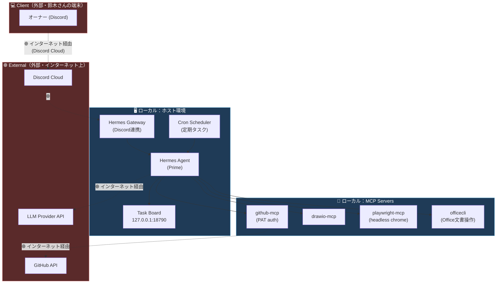

# Prime — Hermes Agent 上の AI アシスタント（個人開発ポートフォリオ、旧称 Optimus）

**Prime**（旧称 Optimus）は、[Hermes Agent](https://hermes-agent.nousresearch.com/)（Nous Research 製のオープンソース自己改善型 AI エージェント）を土台に個人開発した AI アシスタントです。Discord チャットから指示すると、タスク管理・調査・ドキュメント生成・サーバ運用などを実行します。本リポジトリは、その公開ドキュメント（構築手順・調査ノート）をまとめたものです。

---

## ✨ 主な機能・特徴

Hermes Agent 自体が備える機能を土台に、以下のような運用を組んでいます。

| 機能 | 内容 |
|---|---|
| 💬 **メッセージングゲートウェイ** | Discord から会話・指示が可能（Hermes Agent はこの他 Telegram / Slack / WhatsApp / Signal にも対応）。 |
| 🧠 **学習ループ（Hermes Agent 標準機能）** | 複雑なタスク完了後にスキルを自動生成し、使うたびに自己改善。会話履歴の全文検索（FTS5）＋要約によるセッション横断の想起。 |
| ⏰ **cron スケジューリング** | 定期実行タスク（本リポジトリのタスクボード・ポーラー等）を自然言語で組み、結果を Discord に配信。 |
| 🔌 **MCP（Model Context Protocol）連携** | GitHub 操作・Office ファイル操作・ブラウザ自動操作・図解生成など、外部 MCP サーバをツールとして接続。 |
| 🗂 **タスクボード（自前実装）** | Discord から起票した作業依頼を「承認待ち→承認済み→実行中→完了待ち」のステータスで管理する軽量 Web アプリ。ポーラーが定期的に承認済みタスクを1件ずつ取得し処理する設計（原子クレームで多重実行を防止）。 |
| 🎙 **音声対話（スマートフォン連携）** | Discord ボイスチャンネル経由、および Home Assistant（オンデバイスウェイクワード起動）経由の2系統で、スマートフォン + Bluetoothイヤホンからのハンズフリー音声対話に対応（STT: faster-whisper ローカル、TTS: Edge TTS）。 |
| 🛡 **HITL（Human-in-the-Loop）運用** | 書き込み系操作（ファイル変更・外部送信・コミット等）は必ず事前確認。承認ゲートを飛ばして自律的にタスクを作らない運用ルールを明文化。 |

---

## 🏗 アーキテクチャ

> 🌐 の点線＝インターネットを経由する通信（外部との境界）。実線＝ホスト内部のローカル通信（127.0.0.1 / プロセス間）。青枠＝ローカル（自宅サーバ内）、赤枠＝外部（インターネット越し）。

---

## 📁 リポジトリ構成

| パス | 用途 |
|---|---|
| `docs/hermes/` | Hermes Agent 移行・運用に関する構築手順書（連番管理） |
| `docs/info/` | 調査・ニュース・セキュリティ等の情報ノート（`research` / `news` / `security` / `reference`） |

> **方針:** ホスト名・内部 IP・OS ユーザ名等の固有情報は全て placeholder（`<your-user>` 等）に伏字化。

### 命名規則

- **`docs/hermes/`**: `NNN_STATUS_CATEGORY_name.md`（push 時刻の古い順に連番）
  - STATUS = `DONE` / `TODO` / `INFO`、CATEGORY = `SETUP` / `GUIDE` / `REF` / `PLAN` / `SEC`
- **`docs/info/`**: `YYYYMMDD_STATUS_TOPIC_title.md`
  - STATUS = `INFO` / `WIP` / `DONE` / `TODO`（security は `OPEN` / `FIXED` も可）

### 主な構築ドキュメント（抜粋）

| # | ドキュメント | 概要 |
|---|---|---|
| 001 | [nexus-to-optimus-taskboard-migration](docs/hermes/001_DONE_SETUP_nexus-to-optimus-taskboard-migration.md) | 旧エージェント（NEXUS/OpenClaw）からタスクボードを Hermes Agent（Prime）へ移行 |
| 002 | [sysfile-versioning-and-locking](docs/hermes/002_DONE_SETUP_sysfile-versioning-and-locking.md) | SOUL.md/AGENTS.md 等システムプロンプト関連ファイルの独自バージョン管理・排他制御 |
| 003 | [taskboard-poller-and-atomic-claim](docs/hermes/003_DONE_SETUP_taskboard-poller-and-atomic-claim.md) | タスクボード・ポーラーと原子クレームによる多重実行防止 |
| 004 | [pixelwatch-voice-command-route](docs/hermes/004_INFO_GUIDE_pixelwatch-voice-command-route.md) | スマートウォッチからの音声コマンド経路の調査ガイド |
| 005 | [ccproxy-api-pro-max-billing-workaround](docs/hermes/005_DONE_SETUP_ccproxy-api-pro-max-billing-workaround.md) | API 課金プランの制約に対するプロキシ経由の回避策 |
| 006 | [info-hermes-category-sync-fix](docs/hermes/006_DONE_SETUP_info-hermes-category-sync-fix.md) | ドキュメント一覧画面のカテゴリ表示バグ修正 |
| 007 | [microsoft365-outlook-integration-research](docs/hermes/007_INFO_GUIDE_microsoft365-outlook-integration-research.md) | Microsoft 365 / Outlook 連携（読み取り専用）の調査・検討記録（着手は保留） |
| 008 | [aws-bedrock-guardrails-pii-masking-research](docs/hermes/008_INFO_GUIDE_aws-bedrock-guardrails-pii-masking-research.md) | AWS Bedrock Guardrails APIによる機密情報マスキングの技術調査（RAG構築における課題整理） |
| 009 | [ai-agent-guardrail-design-lessons](docs/hermes/009_INFO_GUIDE_ai-agent-guardrail-design-lessons.md) | AIエージェント運用時のネットワーク障害から学んだ、権限設計・ガードレール設計の教訓 |
| 010 | [ai-diagram-tools-evaluation](docs/hermes/010_INFO_GUIDE_ai-diagram-tools-evaluation.md) | AI作図スキル・ツール(Mermaid/D2/diagram-design)の信頼性チェックと比較検証 |

---

## 🔗 関連

- [Hermes Agent 公式ドキュメント](https://hermes-agent.nousresearch.com/docs/)
- [Hermes Agent GitHub](https://github.com/NousResearch/hermes-agent)
- [Nous Research](https://nousresearch.com)

## Author and Ownership / 著作権と所属について

This project was created as a personal initiative and is not connected to any organization or group.
It is published as an individual creative work.

本プロジェクトは個人の活動として作成したものであり、特定の組織や団体の業務とは関係ありません。
個人の創作物として公開しています。

## 📜 License

[MIT License](LICENSE)
