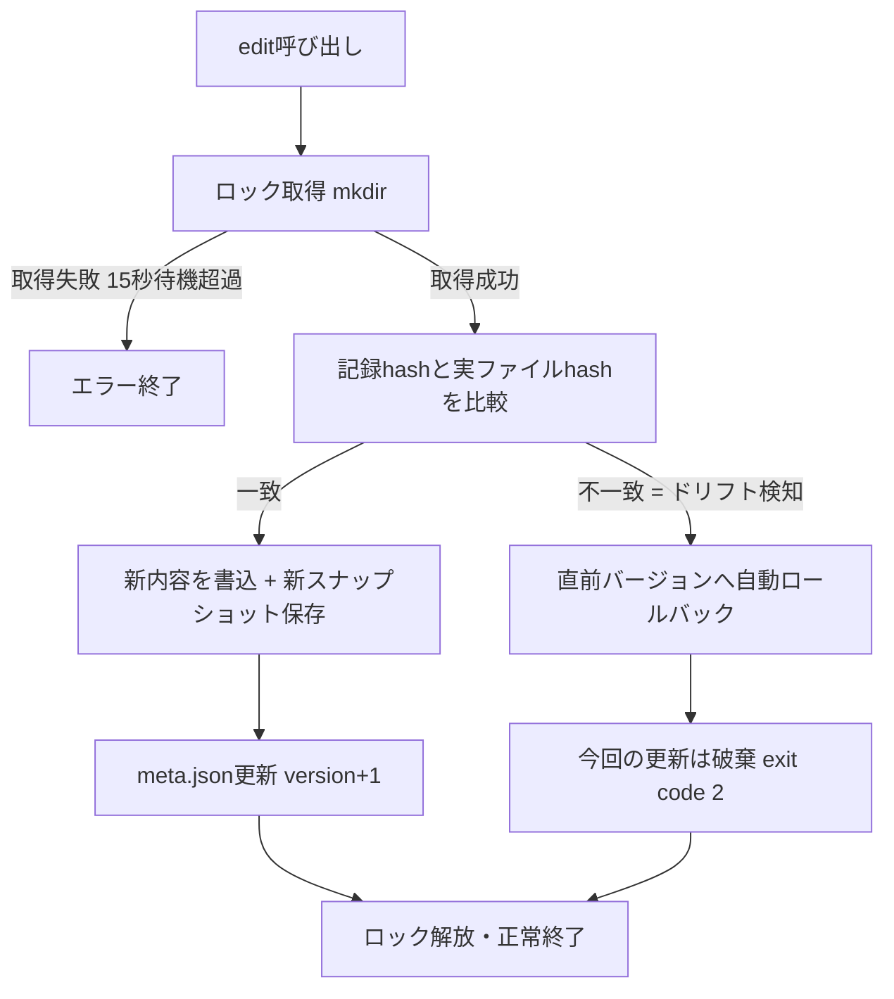

# システムプロンプト関連ファイルのバージョン管理・排他制御

> ステータス: DONE / カテゴリ: SETUP / 実施日 2026-08-09
> ⚠️ マスキング規約準拠。秘密（トークン/鍵）は一切記載しない。ホスト名/ユーザー名/IP 等は placeholder。

## 0. 背景・目的

`SOUL.md`（人格）・`USER.md`（ユーザープロファイル）・`MEMORY.md`（長期記憶）・`AGENTS.md`（運用ルール）・`config.yaml`（モデル/MCP設定）は、エージェントの挙動を左右する「システムプロンプト相当」の重要ファイル。複数の並行タスク（cronジョブ、サブエージェント等）が同時にこれらを更新すると、書き込みの競合で内容が壊れるリスクがある。

結果整合性の考え方に基づき、以下を実現する軽量な仕組みを実装した:
- 正常な更新は必ずバージョンが1つずつ進む
- 並行タスクの競合や、スクリプトを経由しない直接編集（＝記録との不整合＝バージョンが2以上飛ぶ状態に相当）を検知したら、その更新を自動的に直前バージョンへロールバックする

## 1. 方式選定

- **依存ゼロ方針**を優先し、git等の外部ツールは使わず、bash + coreutils（`sha256sum`/`mkdir`/`cp`）のみで実装。
- バージョンは **連番スナップショットファイル**（`v1`, `v2`, ...）として平文コピーを保存。
- 排他制御は **`mkdir` の atomic性**を利用したロックファイル方式（`mkdir` は同時に1プロセスしか成功しない、というPOSIXの性質を利用）。

## 2. 対象ファイル（5件）

意図的に「システムプロンプト・人格・運用ルール」に絞り込み、DB・秘密情報・キャッシュ・ロック等は対象外とした。

| key | 実ファイル | 役割 |
|---|---|---|
| `soul` | `~/.hermes/SOUL.md` | 人格・トーン定義 |
| `user` | `~/.hermes/memories/USER.md` | ユーザープロファイル |
| `memory` | `~/.hermes/memories/MEMORY.md` | 長期記憶 |
| `agents` | `~/optimus/AGENTS.md` | 運用ルール（セキュリティ・HITL等） |
| `config` | `~/.hermes/config.yaml` | モデル・MCP・プラットフォーム設定 |

**除外したもの**（理由）:
- `.env` / `auth.json` — 秘密情報を含むため、スナップショット保存自体がセキュリティ原則に抵触
- `*.db` / `*.db-wal` / `*.db-shm` — データベース。専用のトランザクション機構で管理されるべき
- `*.lock` / `*.pid` / キャッシュ系JSON — 一時ファイル
- `config.yaml.bak*` — Hermes自体が既に自動バックアップ済み

## 3. スクリプト: `versioned_edit.sh`

配置: `~/.hermes/scripts/versioned_edit.sh`

保存構造:
```
~/.hermes/sysfile-versions/
  soul/
    meta.json   # {"version": N, "path": "...", "hash": "sha256..."}
    v1
    v2
    ...
  soul.lock/    # 更新中のみ存在（mkdir式ロック）
  user/ ...
  memory/ ...
  agents/ ...
  config/ ...
```

### コマンド一覧

```bash
versioned_edit.sh init  <key> <path>              # 初回登録・v1作成
versioned_edit.sh edit  <key> <newcontent-file>    # 安全に更新
versioned_edit.sh check <key>                       # ドリフト検知のみ（変更しない）
versioned_edit.sh rollback <key> [version]          # 直前(または指定)バージョンへ復元
versioned_edit.sh log   <key>                        # バージョン履歴表示
versioned_edit.sh status                             # 全ファイルの状態一覧
```

### 更新フロー（`edit`）



### 整合性ルール

- `edit` 実行時、`meta.json` に記録された `hash` と実ファイルの現在の `sha256` を比較。
- 不一致（＝スクリプトを経由しない外部編集や、他プロセスの割り込み更新）を検知した場合、**直近の正しいスナップショットで実ファイルを復元し、今回の更新内容は反映しない**（exit code 2）。
- ロック取得中は他プロセスの `edit` を待機させる（最大15秒）ため、正常系では常にバージョンが1つずつ進む。

## 4. 動作検証

- **正常系**: `edit` で v1→v2 に正しく進行することを確認。
- **競合検知**: スクリプトを経由しない直接編集（`echo >> file`）を行った後に `check`/`edit` を実行し、`DRIFT`検知・自動ロールバックが正しく動作することを確認。
- **並行実行**: 2プロセスを同時に `edit` 実行し、ロックにより直列化され、v2→v3→v4のように1件ずつ正しく進行することを確認（バージョンが飛ばないことを実証）。
- 検証後、テストデータは削除し `rollback` で元の状態（v1）に復元済み。

## 5. 運用ルールへの反映

`~/optimus/AGENTS.md` に運用ルールのセクションを追記（このAGENTS.md自体も対象ファイルのため、`versioned_edit.sh edit agents` 経由でv1→v2に更新）。今後、上記5ファイルを編集する際はこのスクリプト経由を基本とする。

## 6. 制約・今後の課題

- ロックのstale検知（プロセスクラッシュ時の残留ロック解除）は未実装。長時間ロックが残った場合は `~/.hermes/sysfile-versions/<key>.lock` を手動削除する必要がある。
- `node:sqlite`のようなDBレベルのトランザクションではなく、あくまでファイルシステムレベルの簡易排他制御。大量の同時書き込みが発生する用途には不向き（本用途＝低頻度のシステムファイル更新には十分）。

## Author and Ownership / 著作権と所属について

This project was created as a personal initiative and is not connected to any organization or group.
It is published as an individual creative work.

本プロジェクトは個人の活動として作成したものであり、特定の組織や団体の業務とは関係ありません。
個人の創作物として公開しています。
