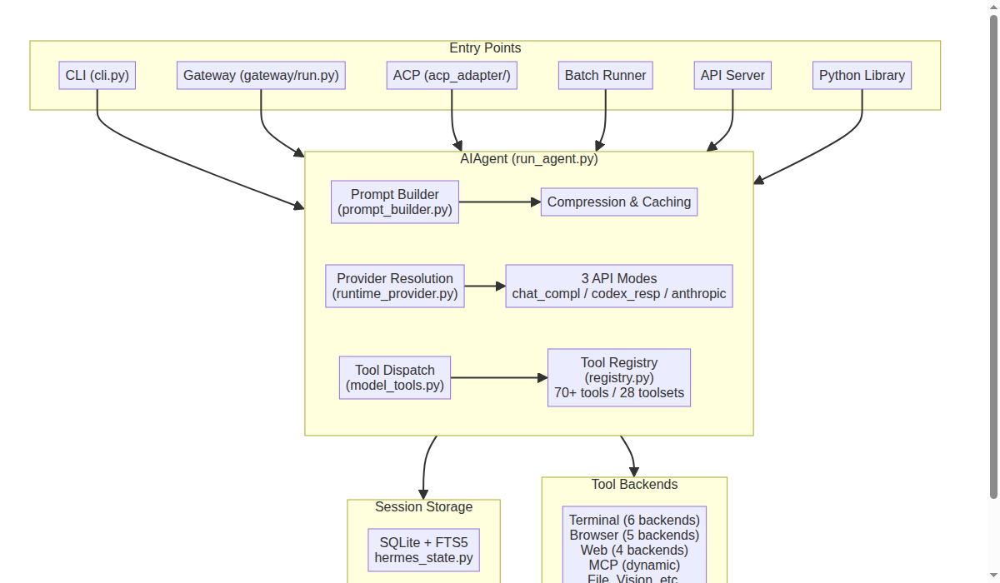
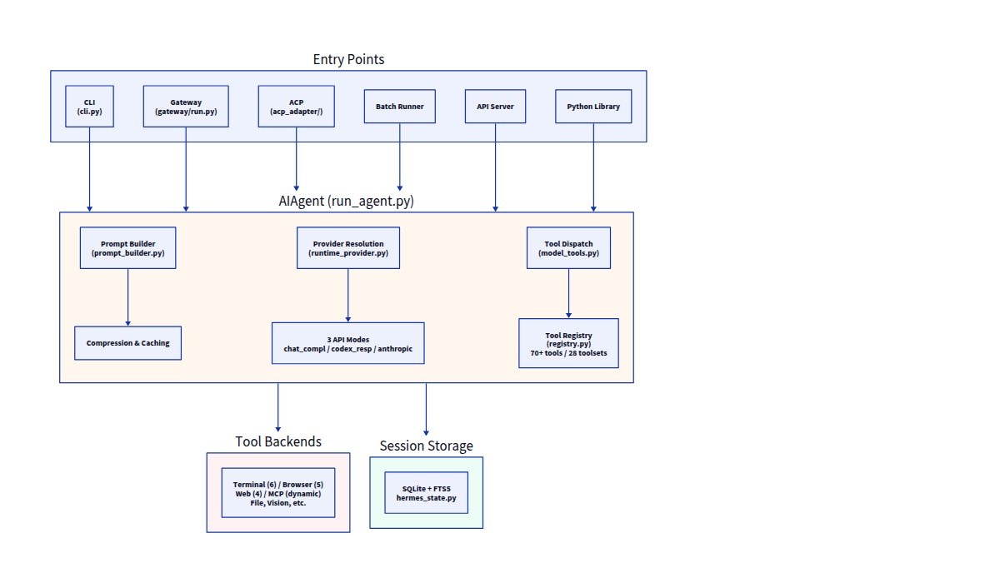
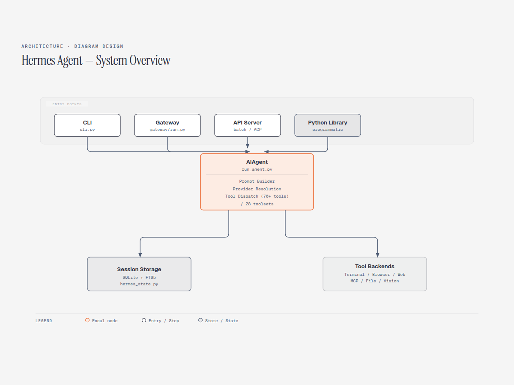
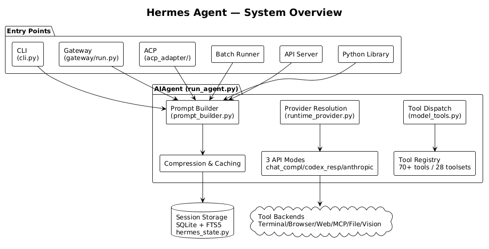
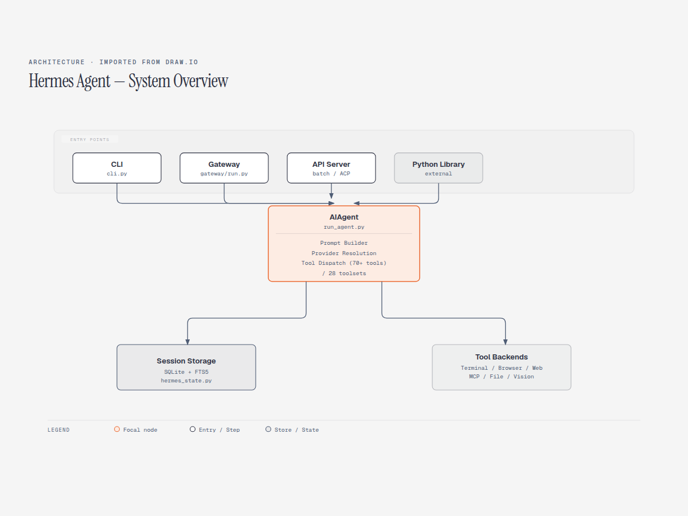

# AI作図スキル・ツールの導入検討と比較 — Mermaid / D2 / diagram-design

- **記録日:** 2026-08-30
- **位置づけ:** AIエージェント(Hermes Agent)の作図機能を拡張する過程で、外部スキル・ツールの信頼性チェック方法と、実際の比較検証結果を整理した技術ノート。専門用語は都度、噛み砕いて補足する。

## きっかけ

X(旧Twitter)で「Claude Codeで使えるアーキテクチャ図・シーケンス図の作図スキルが公開された」という投稿を見かけたことから、AIエージェントに新しい作図スキルを追加できないか検討した。その過程で、外部スキルを導入する際の「信頼できるソースかどうかの見極め方」と、複数の作図ツールの比較検証を行ったので、その内容をまとめる。

## 1. 外部スキル・ツール導入前の信頼性チェック

AIエージェントの世界では、GitHub上に公開されている「スキル」(AIエージェントに特定の作業手順やノウハウを教える追加パッケージ)を後から組み込むことができる。便利な一方、**誰が作ったか分からない「野良スキル」をそのまま導入すると、悪意あるコードが混入しているリスク**がある(例: 見た目は便利な機能でも、裏側でAPIキーなどの秘密情報を外部に送信するコードが仕込まれている、といったケース)。

そのため、導入前には以下の観点でチェックすることにしている。

| チェック項目 | 確認内容 |
|---|---|
| Star数・Fork数 | GitHub上での支持の多さ(数十未満などは要注意) |
| 作者情報 | 匿名・使い捨てアカウントでないか(実名、フォロワー数、活動履歴) |
| メンテナンス状況 | 放置されていないか(直近の更新日時、アーカイブ状態) |
| ライセンス | MIT等のオープンソースライセンスが明記されているか |
| コード内容 | 難読化されたコードや、不審な外部通信がないか目視確認 |

今回検討した「diagram-design」というスキルは、Star数28,000超、実名の開発者(個人事業の創業者)、本日も更新があるなど、いずれの項目も問題なく、信頼できると判断した。

## 2. 比較検証: 3つの作図手段

Hermes Agent自体のアーキテクチャ図(下記の構成)を共通の題材として、3つの手段で実際に作図し、比較した。

- 入口(CLI・Gateway・API Server等) → 中核処理(AIAgent) → 保存先(セッションストレージ)・実行基盤(各種ツール群)、という構成

### 比較対象

1. **Mermaid** — テキストで図の構造を書くと自動でレンダリングされる、最も普及している記法。GitHubのMarkdown上でそのまま描画される。
2. **D2**(`terrastruct/d2`、Star数25,000超) — Mermaidと同様の「テキストで書いて図にする」ツールだが、より洗練された見た目を目指して設計されている。CLIツールとして動作。
3. **diagram-design** — 今回検討した新しいスキル。39種類の図を、HTML+SVG形式の単体ファイルとして生成する。サイトの配色・フォントを読み取ってブランドに合わせる機能もある。
4. **PlantUML** — 古くからある「diagram as code」の代表格。UML記法が中心。ローカルにJavaをインストールしなくても、無料の変換API(Kroki)を使えば、コマンド一つで画像化できる。
5. **draw.io(diagrams.net)** — GUIで有名な作図ツールだが、XML形式でテキストとしても記述できる。ただし今回検証した時点では、無料の変換API(Kroki・公式APIとも)が利用できず、直接の画像化はできなかった。代わりに、diagram-designスキルの「draw.io形式を読み込んで再描画する」機能を使い、内容を抽出したうえで統一感のあるデザインに描き直した。

### 導入コストの検討(PlantUML・draw.io)

PlantUMLはJavaのインストールが必要になる場合が多いが、**Kroki(無料の変換APIサービス)を使えば、ローカルへの追加インストールなしで画像化できる**ことを確認した。draw.ioはGUIアプリが前提のツールで、CLI化するには200MB超のインストールが必要になるため、今回は変換APIの利用を優先した。

新しいツールを導入する際は、**まずインストール不要な軽量な手段(API等)がないかを確認してから、重量級のインストールに進むかどうかを判断する**、という順序が有効だと分かった。

### 比較結果

| 観点 | Mermaid | D2 | diagram-design | PlantUML | draw.io |
|---|---|---|---|---|---|
| 見た目の洗練度 | 標準的 | やや上品 | 最も洗練(タイポグラフィ・凡例にこだわりあり) | 標準的(手書き風フォントがやや非公式な印象) | (diagram-design経由の再描画のため、diagram-designと同等の見た目) |
| GitHub上でそのまま描画できるか | ◎できる | ✕別途画像化が必要 | ✕別途画像化が必要 | ✕別途画像化が必要(Kroki等のAPI経由) | ✕別途画像化が必要、かつ無料APIが不安定 |
| 記法の書きやすさ | 非常に簡単 | シンプル | HTML+SVGを直接扱うため学習コストは高いが、詳細なルールにより一貫した品質が出やすい | UML記法の学習が必要、やや冗長 | GUI操作が前提、XML直書きは可能だが手間が大きい |
| カスタマイズ性 | 低い | 中程度 | 高い(ブランドカラー等を自動で取り込める) | 低い(テーマ限定) | 高い(GUIでは自由度が高いが、コードとしての柔軟性は低い) |
| 導入コスト | 追加インストール不要 | CLIツールの導入が必要(軽量) | スキルとして導入(軽量) | 追加インストール不要(API利用時) | GUIアプリ前提で重量級、または無料APIが不安定 |

### 実際の出力(同一題材で作図)

**① Mermaid**

**② D2**

**③ diagram-design**

**④ PlantUML**(Kroki API経由、追加インストールなし)

**⑤ draw.io形式(diagram-designでインポート・再描画)**

見比べると、③のdiagram-designと⑤(draw.ioソースをdiagram-designの流儀で再描画したもの)が最もタイポグラフィ・凡例・余白にこだわりがあり、洗練された見た目になっていることが分かる。④のPlantUMLは実用十分だが、標準的なUMLツール特有のやや簡素な見た目にとどまる。GitHub上にそのまま埋め込める手軽さでは①のMermaidに軍配が上がる。

## 3. 結論・使い分けの方針

- **GitHubのREADME等、公開ドキュメントに直接埋め込みたい場合 → Mermaid**(今回の検証でも、この用途における優位性は変わらないと確認できた)
- **社内資料や、見た目重視の1枚絵が必要な場合 → diagram-design**(洗練された見た目が得られる。ただし画像として書き出す一手間が必要)
- **CLIでサッと図を試したい場合 → D2**(必要に応じて併用)
- **UML記法に慣れている、または既存のPlantUML資産がある場合 → PlantUML**(Kroki経由でローカルインストール不要)
- **draw.ioは既存の`.drawio`ファイル資産がある場合の「取り込み元」として有効**(ネイティブな画像化手段が現状不安定なため、diagram-designで読み込んで再描画する運用が現実的)

用途に応じて使い分ける、という結論に至った。特定のツール1つに一本化するのではなく、**目的(公開ドキュメントか、社内向け資料か)に応じて最適な手段を選ぶ**ことが重要という学びを得た。

## 4. AIエージェント運用における学び

今回の一連の作業で得られた、より一般的な教訓は以下の2点である。

1. **新しい技術情報(SNSでの言及等)を鵜呑みにせず、必ず一次情報(GitHubリポジトリそのもの)にあたって信頼性を検証してから導入する**、という手順を明文化できたこと
2. **「良さそう」という評判だけで飛びつかず、実際に同じ題材で複数の選択肢を試作・比較してから判断する**という進め方が、ツール選定の精度を上げること

これらは作図ツールに限らず、AIエージェントに新しい機能や外部リソースを組み込む際の一般的な判断基準として活用できる。
