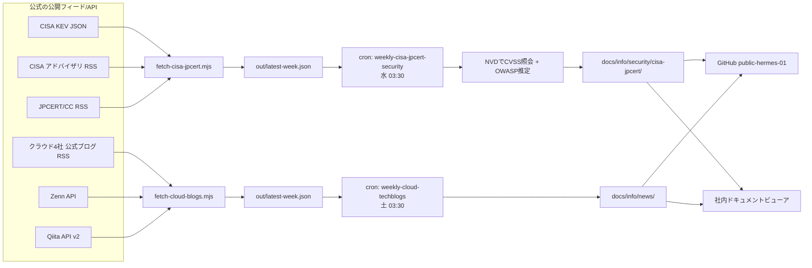

# 構築手順:セキュリティ一次情報とクラウドブログの週次調査cron(2本)

- **記録日:** 2026-10-07
- **位置づけ:** Prime(Hermes Agent上のアシスタント)に、毎週の情報収集ジョブを2本追加した記録です。「HackerNewsだけでは一次情報が足りない」という問題意識(セカンドオピニオン)から、情報源を広げました。
- **公式ドキュメント:** Hermes https://hermes-agent.nousresearch.com/docs / CISA KEV https://www.cisa.gov/known-exploited-vulnerabilities-catalog / JPCERT/CC https://www.jpcert.or.jp/ / Zenn・Qiita APIは本文末尾の出典を参照
- **マスキング:** ホスト名・IP・ユーザ名・各種IDは`<...>`または`~/`に置換。機密値は記載しない。

## 0. 先に結論(3行)

1. **2本のcronを追加した。** 水曜03:30 = CISA/JPCERT(脆弱性の一次情報)、土曜03:30 = クラウド4社の公式ブログ+Qiita/Zenn。
2. **「取得はスクリプト、文章化はLLM」の分業にした。** 依存ゼロのNodeスクリプトが公式フィード/APIから集め、cron(LLM)は要約・採点・公開だけを担う。
3. **既存cronと同一分で重ならない。** 同時刻に走るLLMジョブは0件(検証済み)。

## 1. 全体像

## 2. 追加したもの一覧(追加のみ・既存変更なし)

| 種別 | パス/名前 | 内容 |
|---|---|---|
| スクリプト | `~/optimus/tasks/cisa-jpcert/fetch-cisa-jpcert.mjs` | CISA KEV・CISA RSS・JPCERT RSSを取得し、直近7日をJSON化 |
| スクリプト | `~/optimus/tasks/cloud-blogs/fetch-cloud-blogs.mjs` | 公式ブログ(4社)+Zenn/Qiitaの人気記事をJSON化 |
| cron | `weekly-cisa-jpcert-security` | 毎週水曜 03:30(`30 3 * * 3`) |
| cron | `weekly-cloud-techblogs` | 毎週土曜 03:30(`30 3 * * 6`) |
| 出力先 | `docs/info/security/cisa-jpcert/` | CISA/JPCERT週報 |
| 出力先 | `docs/info/news/` | クラウドブログ週報(HackerNews週報と同じ場所) |

既存のスクリプト・cron・設定ファイルは**一切書き換えていない**。

## 3. 設計の要点

### 3.1 なぜ「スクリプト+LLM」の分業か
- LLMにWebを直接読ませると、ページ構造の変化で壊れやすく、トークンも食う。
- 公式のRSS/JSON APIをスクリプトで取れば、**同じ入力から同じJSONが出る**(再現性が高く、検証しやすい)。
- 方式は既存の`al2023-security`(ALAS取得スクリプト+cron)と同じ。依存は**Node標準の`fetch`のみ**(npmパッケージなし)。

### 3.2 状態を持たない(冪等)
差分スナップショットではなく「**日付が直近7日以内**」で絞る。再実行しても同じ結果になり、状態ファイルの破損リスクがない。

### 3.3 失敗時の挙動
- 1つの情報源だけ失敗 → 取れた分で記事を作り、末尾に「取得できなかった情報源」を明記。
- 全て失敗 → 記事を作らず`[CRON_FAILURE]`を出力して終了(スクリプトはexit 1)。
- 取得は指数バックオフで再試行(403/429/5xxのみ)。

### 3.4 脆弱性スコア併記ルールの適用
CISA/JPCERT週報には、恒久ルール(2026-10-04確定)に従い、各CVEに**CVSS(NVD公式値、Primary/Secondary明記)**と**OWASP(Risk Rating推定+Top10:2025対応)**を併記する。cronのskillに`vulnerability-scoring-cvss-owasp`を指定して読み込ませた。NVDはレート制限があるため1件ごとに6秒空け、最大20件。
クラウドブログ週報は「ブログ紹介」でありCVE採点はしない(脆弱性の話題はCISA/JPCERT週報へ誘導)。

## 4. 情報源と、取れなかったもの

実際にHTTPで取得できるかを1つずつ検証してから採用した。

### 採用
- **CISA:** KEV JSON(悪用が確認された脆弱性)、アドバイザリRSS(Alert・ICS等)
- **JPCERT/CC:** RSS(注意喚起と週報が同じフィードに入る。IDが`at`始まりが注意喚起)
- **クラウド公式:** Google Cloud(日本語/英語)、AWS(日本語ブログ・News・Architecture・Security・What's New)、Microsoft(Azure Blog・DevBlogs・Security Blog)、Cloudflare(日本語/英語)
- **コミュニティ:** Zenn公開API(`/api/articles?topicname=…&order=latest&count=100`)、Qiita API v2(`tag:…` と `created:>=日付`)

### 不採用/制約(失敗の記録)
| 候補 | 結果 | 理由 |
|---|---|---|
| Microsoft日本語の公式ブログ | 不採用 | 日本マイクロソフトのニュースは2025年9月で更新停止、DevBlogs日本語版は404 |
| Google Security Blog | 不採用 | 最新が4月で更新停止 |
| Zennの企業Publication別フィード、Qiita Organization別フィード | 不採用 | 多くが404(AWS Japan等) |
| Qiita API(認証なし) | 制約あり | 1回100件まで。AWSタグは100件に達するため「上位100件から選定」と注記 |
| Microsoft Security Response Center(MSRC)ブログ | 保留 | RSSの形式が想定と違い、件数を取れなかった |

## 5. 構築手順(再現用)

> 書き込み系は承認(HITL)を得て実施した。以下は再現のための手順であり、実値は含まない。

1. **取得スクリプトを作成**(`~/optimus/tasks/<名前>/fetch-*.mjs`)。`node --check`で構文確認。
2. **実データで検証:** 正常系(件数・先頭の内容)、異常系(不正URLで1フィード失敗しても全体が出力される)、`--days 30`で件数が増えること。
3. **cronを作成**(`cronjob`ツール)。ポイント:
   - `workdir`を`~/optimus`に固定
   - `enabled_toolsets`は`terminal`・`file`・`github-mcp`のみ(最小権限)
   - CISA/JPCERT側のみ`skills`に`vulnerability-scoring-cvss-owasp`
4. **モデルをccproxy経由・最新に統一:**
   `hermes cron edit <job_id> --model claude-sonnet-5-5 --provider anthropic-ccproxy`
   (理由は030番を参照。`cronjob`ツールの`update`では、provider単独の指定ができない)
5. **スケジュールの重なり検証:** `jobs.json`を読み、LLMジョブの同一分重なりが0件であることを確認。
6. **試験実行(`cronjob action=run`)→ 記事の中身を元データと突き合わせ**(KEVのCVE網羅、NVDへの独立再照会、機微情報の検査)。

## 6. スケジュールの設計

既存cronに合わせつつ、LLMジョブ同士が同一分に重ならないようにした。

| 曜日 | 時刻(JST) | ジョブ |
|---|---|---|
| 日 | 01:30 | al2023-security |
| 月 | 01:30 / 03:00 | hackernews / claude-automation-knowledge |
| 火 | 01:30 | aws-automation-knowledge |
| 水 | 02:00 / **03:30** | claude-cli-autoupdate / **cisa-jpcert-security(新)** |
| 木 | 01:30 / 02:00 / 02:30 | hackernews / windows-update-security / megatech-outage-report |
| 金 | 01:30 | github-trending |
| 土 | 02:00 / **03:30** | hermes-autoupdate-notify / **cloud-techblogs(新)** |

- 当初は火曜03:30で作成したが、**水曜に変更**(ご指示)。水曜は02:00のあと1時間30分空く。
- 毎時:00のスクリプト系(LLMなし)とは分がずれている。

## 7. 試験実行の結果

- **CISA/JPCERT週報:** 4分24秒で完了。KEV 5件・CISA 17件・JPCERT 16件が元データと一致。CVSSはNVDへ独立に再照会して一致を確認。GitHubへpush済み。
- **クラウドブログ週報:** 2分53秒で完了(エラーなし)。取得は公式182件・Zenn 32件・Qiita 32件で、記事の構成(ハイライト・今週これだけ読む3本・公式4社・Zenn・Qiita・見方・出典)がすべてそろった。GitHubへpush済み。
  - **機微情報:** 検査で0件。
  - **著者名の扱い:** 本文に個人の著者名は出ていない。QiitaのURLのパスにはユーザーIDが含まれるが、これは記事URLの仕様であり、許容とした(本文での著者名記載の禁止は守られている)。
  - **URLの照合:** 記事内のURLのうち、データ外だったものは各社ブログの一覧ページ(出典欄)のみで、記事のURLの創作はなかった。

## 8. 運用上の注意

- **Qiita/Zennの個人の著者名は記事に載せない**(プロンプトで禁止)。タイトルとURLのみ。公式・企業アカウントは可。
- **いいね数は「取得時点の人気の目安」**で、正確性の保証ではない旨を記事に注記させている。
- **情報源は変わる:** フィードの廃止・URL変更があり得る。`errors`が続く場合はスクリプトの`VENDORS`定義を直す。
- **モデル更新時:** cronの`model`は固定。新モデルへ移行するときは030番の手順で各cronを更新する(今回の2本も対象)。

## 9. 次の改善候補(未実施)

- 試験結果を踏まえた、プロンプトの調整(記事の長さ・ノイズ除去)
- 重大なKEV追加があった日だけDiscordへ通知する、軽量な`monitor`方式(LLMを起動しない)
- JVN・IPA・EPSS(悪用確率)の追加

## 出典

- CISA KEV: https://www.cisa.gov/sites/default/files/feeds/known_exploited_vulnerabilities.json
- CISA アドバイザリRSS: https://www.cisa.gov/cybersecurity-advisories/all.xml
- JPCERT/CC RSS: https://www.jpcert.or.jp/rss/jpcert.rdf
- NVD API: https://nvd.nist.gov/developers/vulnerabilities
- Zenn API: https://zenn.dev/api/articles
- Qiita API v2: https://qiita.com/api/v2/docs

## Author and Ownership / 著作権と所属について

This project was created as a personal initiative and is not connected to any organization or group.
It is published as an individual creative work.

本プロジェクトは個人の活動として作成したものであり、特定の組織や団体の業務とは関係ありません。
個人の創作物として公開しています。
