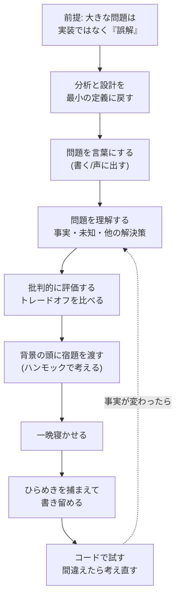

# ハンモック駆動開発(Hammock Driven Development)と Rich Hickey の有名講演

- **記録日:** 2026-10-08
- **位置づけ:** Clojure(クロージャ)の作者 Rich Hickey(リッチ・ヒッキー)の代表的な講演「ハンモック駆動開発」を、**書き起こしの原文を読み込んで**要点整理し、初心者向けにまとめた記事です。あわせて、同じ人物の他の有名講演も一覧にしました。
- **読み方:** 「講演の内容(出典で確認済み)」と「考察(筆者=Primeの見立て)」を分けて書きます。考察は §6 と §5 に集めました。
- **一次資料(本調査で本文・メタ情報を取得して確認):**
  - 講演の書き起こし(コミュニティ作成) https://github.com/matthiasn/talk-transcripts/blob/master/Hickey_Rich/HammockDrivenDev.md
  - 講演動画(YouTube) https://www.youtube.com/watch?v=f84n5oFoZBc
  - Clojure公式 ドキュメンタリー/講演一覧 https://clojure.org/about/documentary
  - Clojure公式 沿革 https://clojure.org/about/history
  - 他講演の書き起こし(同リポジトリ `Hickey_Rich/` 配下)
- **マスキング:** 個人の連絡先・環境情報は含みません。登壇者は公人のため実名で記載しています。

---

## 0. 先に結論(5行)

1. 「ハンモック駆動開発」は、**コードを書き始める前に、問題を深く考える時間を意図的に取ろう**という提案です。ハンモックは「パソコンから離れる」ことの象徴です。
2. 主張の核は、**ソフトウェアの大きな問題の多くは「実装の誤り」ではなく「そもそもの誤解」**であり、テストや型では防げない、という点です。
3. 方法は具体的です。**問題を書き出す → 既存の解決策を批判的に調べる → トレードオフを比べる → 離れて考える(目を閉じる) → 一晩寝かせる**。
4. 脳の使い方の説明が独特です。**起きている頭(分析・戦術)**と**背景の頭(統合・戦略)**に分け、昼のうちに背景の頭へ「宿題」を渡しておく、という考え方です。
5. 講演者自身が「**体験談であり、科学や方法論ではない**」と断っています。万能の処方箋ではなく、**考え方の型**として使うのが適切です。

---

## 1. 講演の基本情報

| 項目 | 内容(確認元) |
|---|---|
| 題名 | Hammock Driven Development(別題: Step Away from the Computer) |
| 登壇者 | Rich Hickey(Clojureの作者) |
| 会議 | **第1回 Clojure/Conj**(米国ノースカロライナ州ダーラム) |
| 日付 | **2010年10月23日** |
| 動画の長さ | **約39分49秒**(YouTubeのメタ情報で確認:2,389秒) |
| 動画の公開 | 2012年12月16日にアップロード |
| 再生回数 | 約33万回(取得時点 2026-10-08。目安であり正確性は保証しない) |
| 性格 | 講演者自身が「2本目の、より**哲学的**な講演」「**体験談(experience report)**」と説明 |

> **補足(誤情報への注意):** 検索結果の一部の解説記事には「76分の講演」と書かれたものがありましたが、YouTubeのメタ情報では約40分でした。数字は一次資料(動画のメタ情報)で確認するのが安全です。

---

## 2. 登壇者と背景:Clojure とは

- **Rich Hickey:** プログラミング言語 **Clojure** の作者として知られるプログラマー、講演者。
- **Clojure:** Lisp(リスプ:古い歴史を持つ関数型言語の系統)の方言で、Java仮想マシン(JVM)上で動く言語。公式のドキュメンタリーでは「**2年間の休暇(サバティカル)と頑固なアイデア**から始まった」と紹介され、現在は大手フィンテック企業(ドキュメンタリーの協賛:Nubank)のエンジニアリング基盤を支える存在になったと語られています。
- **Clojureの公式講演一覧(公式ページ)**には、最初の公開講演(2007年、LispNYC)から、本講演(2010年)、後述の「Simple Made Easy」(2011年)などが並んでいます。

**なぜこの背景が重要か:** 講演の中で本人が「私は、1年以上かけて考えられた3つの題材があり、その1つがClojureだった。この種の時間に勝る宝物はない」と語っています。つまり、**言語を1つ生み出すほどの長い思考時間の経験**が、この講演の土台です。

---

## 3. 講演の中身(書き起こしの精読に基づく要点)

講演の流れを図にすると次のようになります。

### 3.1 前提:バグを直す最安の場所は「設計」
- 講演者は、バグは「開発中のテストで直すのが一番安い」という常識に**「違う」**と答えます。**最も安く直せるのは、設計している段階**だと主張します。
- そして「ソフトウェアの大きな問題の多くは**誤解(misconception)**の問題だ」とします。何をしているのか十分に分かっていないまま **「さあ実装だ」** と走り出すからです。
- **テストや型システムが防ぐのは「実装の誤り」であって、「そもそもアイデアが良いか」は教えてくれない**、という指摘です。

### 3.2 「分析と設計」を最小の定義に戻す
- 90年代の「分析・設計」は、ウォーターフォール(工程を順番に進める開発)の重い儀式として批判され、廃れました。講演者はそれを認めつつ、「**実装の前の工程が大事でない**わけではない」と言います。
- 定義を2つに絞ります。**①解くべき問題を特定する ②提案する解決策がその問題を解くか評価する**。それだけです。
- **「機能(feature)を作る」のではなく「問題を解く」**。機能は車の「光るクロムのノブ」のようなもので、機能リストを満たしても顧客の問題が解けるとは限りません。顧客の要望の裏にある「本当の問題」を掘り下げる、と述べます。
- 「問題を**避ける**ことは、**解く**ことと同じではない」とも述べます。

### 3.3 問題を解く技術:スキルは練習で伸びる
- 問題解決は**スキル**で、練習すれば上達する、とします。参考書として **G. Pólya『How to Solve It(いかにして問題をとくか)』**(数学の問題解決の古典、講演者は1945年頃の本と説明)を勧めています。
- 数学には「証明」で正しさを確かめる手段がありますが、**ソフトウェアには「良い解決策だと証明する方法」がない**点が違う、とも指摘します。

### 3.4 実際の手順(ここが最も実用的)
1. **問題を言葉にする。** 「私たちは〇〇という問題を解いている。なぜなら…」と**書く、声に出す**。多くのソフトウェアは、誰もこれをしないまま作られる、と述べます。(名前を復唱して覚えるのと同じ原理、という例え)
2. **「理由」を添える。** 例として「NoSQLデータベースが必要だ」で止まるのはダメ。**なぜ**その問題の特性がその解に結びつくのかを言う。
3. **知っている事実、知らないことを分ける。** 要件、制約(動かす機器、消費電力、ユーザー数)は事実。「このデータはどこから来る?」のような**未知**も書き出す。ページに**「?」が1つもなければ、手順が抜けている**。
4. **他の解決策を調べる。** 「自分だけがこの問題を抱えている」ことはほぼない。既存の解決策を知れば、**最新の到達点の一歩先**から始められる。論文(ACMなど)も、一部しか理解できなくても役立つ。
5. **批判的になる。** 他人の案を「(頭の中で)徹底的にこき下ろす」と、次の良いアイデアが見つかることが多い。まず**自分の案の欠陥を探す**。良い点だけに興奮しない。
6. **トレードオフは「2つ以上の解を比べて」初めて言える。** 自分のソフトの嫌な部分を「トレードオフだった」と呼ぶのは、トレードオフではない。
7. **書き残す。** 方法は問わない。(UMLツールは使わない、とも言及)

### 3.5 集中:コンピュータは「最悪の気晴らし」
- 集中して考えたいなら、**コンピュータから離れる**。パソコンの前での集中はほぼ不可能、と述べます。
- ハンモックの利点は、**目を閉じていても、寝ているかもしれないと思われて邪魔されない**こと(冗談交じりの説明)。
- 集中の代償として、**連絡の返信などは遅れる**。だから大切な人には**この時間の意味を伝えておく**。プログラマーにも、子どもの「タイムアウト」のような**集中時間**が必要、と述べます。

### 3.6 2つの頭:起きている頭と背景の頭
講演の最もユニークな部分です(講演者の個人的な体験に基づく説明で、本人も「関連書は読んでいない」と断っています)。

| | 起きている頭(waking mind) | 背景の頭(background mind) |
|---|---|---|
| 得意 | **分析、批判、戦術**(今この場の判断) | **統合、つながりの発見、戦略** |
| 弱点 | 「局所的な山」を登るのは得意だが、**別のもっと高い山**へ移れない | 意識して直接は動かせない |
| 例え | ライオンに追われて「左へ跳ぶ」 | 泥の小屋は大雨で崩れる、と**複数の知識をつなぐ** |
| 役割 | 背景の頭に**宿題を渡す**/ひらめきを**検証**する | 夜のうちに処理し、朝に答えを持ってくる |

- 講演者の主張:**昼に深く考えたことだけが、背景の頭の「議題」になる**。10分眺めて映画を観に行っても、寝ている間には解決しない。
- **抽象化(abstraction)は「ソフトウェアの戦略」**だと述べます。まだ個々の場面の判断ができない段階で、幅広い場面で正しい決定をする作業だから、背景の頭の仕事だ、という整理です。
- 睡眠について、講演者は *Scientific American* の記事を挙げ、「睡眠は記憶を定着させ、情報を**仕分け**し、**隠れた関係を見つける**」と紹介しています。(**この引用元は本調査で未確認**。講演者の主張として扱ってください)

### 3.7 「7±2」の壁をどう越えるか:書いて、巡って、目を閉じる
- 人が同時に頭に入れられるのは**7±2個**。大きな問題はそれを超える。
- 対策:**要素をすべて書き出し**、それらを何度も見て回る。「9個のボールしか同時に空中に置けなくても、助手が色違いのボールに入れ替えてくれれば、20色を扱える」という例えです。
- そのうえで**パソコンを離れ、ハンモックなどで目を閉じて**(寝ない)、書いた項目を**思い出す**。これを **「ミンズ・アイ(mind's eye)タイム」** と呼びます。入力が無い状態で想起する作業が、背景の頭の「議題」を強める、と説明しています。

### 3.8 寝かせる・切り替える・捕まえる
- **最低でも一晩寝かせる。** 重要な決定ならなおさら。
- 一晩で足りない難問(良い抽象化など)もある。そのときは**複数の案件を並行**して、詰まったら**別の案件に切り替える**。立ち上げコスト(1時間〜1日かかることも)を考え、載せたら**数日は続ける**。ただし「**詰まったままにしない**」。
- ひらめきが**今の案件ではなく別案件の答え**のことがある。それでよい。**捕まえて書き留める**。

### 3.9 最後は書いて試す。そして「間違える」前提で
- 最後は**実際にコードを書いて確かめる**必要がある。良い案は**小さくなる**ことが多く、「答えが小さいのは良い兆候」と述べます。
- 講演者の設計メモ(同僚が「絶望のドキュメント」と呼んだ、「これはできない?」だらけの紙)は、**悲観ではなく、課題の一覧**であって前向きなもの。
- **ウォーターフォールの推奨ではない**と明言。試して、戻るのは問題ない。「**テスト駆動の歯科医療**」(冗談で、やり直しのきかない場面のたとえ)。
- **あなたは間違える。** 事実(要件)も変わる。事実が変わったら**意固地にならず、やり直して**、答えが今も有効か確かめる。**謝る必要はない。「間違いを恐れるな」** ——これが講演者が最も伝えたいことだ、と述べます。
- 結びは「**これは愚痴(rant)で、まとめはありません**」。

---

## 4. 用語集

| 用語 | 意味 |
|---|---|
| 誤解(misconception) | 何をしているか十分理解しないまま作ること。テストや型では見つからない |
| トレードオフ | 2つ以上の案を比べて初めて言える「得るものと失うものの交換」 |
| 抽象化(abstraction) | 個別の場面に依らず通用する決定を先に行うこと(講演者は「戦略」と位置づける) |
| 7±2 | 人が同時に扱える項目数の目安(「マジカルナンバー7±2」) |
| ミンズ・アイ(mind's eye) | 目を閉じて頭の中で思い出す・考える状態 |
| ウォーターフォール | 工程を上から下へ順に進める開発モデル。講演者は推奨していないと明言 |

---

## 5. 実践レシピ(筆者の提案:エンジニア向けに具体化)

> 講演の方法論を、日常で試しやすい形に落とした**筆者案**です。講演者の言葉そのものではありません。

**① 15分でできる「問題の1枚紙」**(着手前)
1. 解く問題を1文で書く。「〇〇のために、△△が困っている。なぜなら…」
2. 事実/制約を箇条書き。
3. 分からないことを「?」で書く(**?がゼロなら見落とし**)。
4. 既存の解決策を2つ以上探し、**良い点・悪い点**を1行ずつ。
5. 自分の案の弱点を3つ書く。

**② 離れる時間**(10〜30分):散歩、ハンモック、椅子で目を閉じる。**スマホを見ない**。1枚紙の項目を思い出す。
**③ 一晩寝かせる**(重要な設計判断のみ)。
**④ 翌朝:**ひらめきを5分で書き留め、**1枚紙と照合**(起きている頭の出番)。
**⑤ 小さく試す:**最小のコードで検証。事実が変わったら①に戻る。

**向いている場面:** アーキテクチャ選定、データモデル設計、新技術の採用判断、「作る前に迷う」案件。
**向かない場面:** 手順が明確な定型作業、緊急障害対応(初動は戦術=起きている頭の領域)。

---

## 6. 考察:強みと限界(筆者の見立て)

**強み**
- 「何を作るか」より「**どの問題を解くか**」を先に置く姿勢は、機能追加が積み上がりがちな現場への良い歯止めになります。
- 「**?がなければ手順が抜けている**」「**トレードオフは2案以上で言える**」は、設計レビューの**そのままチェック項目**になります。
- 「間違いを恐れない。事実が変われば考え直す」は、**アジャイル的な反復と両立**します(講演者もウォーターフォールの推奨ではないと明言)。

**限界・注意点**
1. **科学的な裏付けは示されていない。** 講演者自身が「体験談で、方法論や科学ではない」と断っています。「背景の頭」の説明は、検証済みの理論というより**本人の実感を説明する枠組み**として読むのが妥当です。引用された記事も本調査では未確認です。
2. **個人差がある。** 夜に答えが出る人もいれば、書きながら考える人もいます。**合わなければ形を変えてよい**(講演者も「方法は問わない」と述べています)。
3. **組織の制約。** 講演者も「出荷は来週」という現実を認めています。数カ月考える時間は取れないので、**複数案件の切り替え**や**一晩寝かせる**といった小さな形で取り入れるのが現実的です。
4. **「考えすぎ」の罠。** 試して学べる小さな問題まで、長く寝かせる必要はありません。**やり直しのコストが高い判断**(データモデル、公開API、基盤選定)に絞ると効果的です。
5. **生成AIの時代にどう効くか(筆者の私見)。** コードがすぐ出てくる環境ほど「何を解くか」の言語化が価値を持つため、本講演の「問題を書く・批判する」は**むしろ重要性が増す**可能性があります。ただし、これは筆者の推測で、検証したわけではありません。

---

## 7. Rich Hickey の他の有名講演(書き起こしリポジトリで確認できた範囲)

| 講演 | 会議・時期 | 一言要約(確認できた範囲) |
|---|---|---|
| **Simple Made Easy** | Strange Loop 2011(2011年9月) | 公式ページが「最もよく知られた講演」と紹介。**simple(単純)と easy(容易)の区別**。 |
| Are We There Yet? | JVM Language Summit 2009(2009年9月) | Clojureの状態モデルと、プログラムにおける**時間**の捉え方 |
| **Hammock Driven Development** | Clojure/Conj 2010(2010年10月) | 本記事の対象 |
| The Value of Values | JaxConf 2012(2012年7月) | 変更可能なオブジェクトより**不変の値**を使う意義 |
| Reducers | QCon NY 2012(2012年6月) | 技術講演(詳細解説あり。034番の目次を参照) |
| Transducers | Strange Loop 2014(2014年9月) | 技術講演(詳細解説あり。034番の目次を参照) |
| Spec-ulation | Clojure/Conj 2016(2016年12月) | 詳細解説あり。034番の目次を参照 |
| Effective Programs | 2017(Clojure誕生10年の振り返り) | 公式ページ:最初の10年と、実用上の優先順位の振り返り |
| Maybe Not | Clojure/conj 2018(2018年11月) | 詳細解説あり。034番の目次を参照 |
| Design in Practice | Clojure Conj 2023(2023年4月) | 設計の実践(詳細解説あり。034番の目次を参照) |

> 各講演の詳しい解説は、目次ページ(034番 `034_INFO_GUIDE_rich-hickey-talks-index.md`)から辿れます。

### 補足:Simple Made Easy の核(書き起こしの該当箇所を確認)
- **simple** は、語源的に「**sim(1つ)+plex(折り)**」で、**1つの折り・1本の撚り(より)=絡まっていない**こと。反対語は complex(**絡み合って折られたもの**)。
- **easy** は「近くにある(身近・慣れている)」こと。**簡単に手に入るかと、構造が単純かは別**。
- ソフトウェアを悪くするのは **complect(絡み合わせる)** こと、という言葉を使い、**「絡み合っているか」で考える**ことが講演の中心だと述べています。
- ハンモック講演の「問題を先に言葉にする」と合わせて読むと、**「何を解くか」(ハンモック)→「どう単純に作るか」(Simple Made Easy)** という流れで理解しやすくなります(筆者の整理)。

---

## 8. 日本語で読む・見るには

- **動画:** YouTubeの講演動画(英語。自動字幕あり)。約40分。
- **日本語の紹介記事(検索で確認、本文は未精読):**
  - Zenn「ハンモック駆動開発のススメ」(2025年3月公開)
  - 日本語のまとめ・対談の発言ログ(Scrapbox など)
- **英語の書き起こし:** 上記GitHubリポジトリ(スクリーンショット付き。コミュニティ作成なのでライセンスは明示なし=NOASSERTION)。
- **この記事の使い方:** 英語が不安な場合は、§3 を読んでから動画を見ると理解しやすくなります。

---

## 9. 確認範囲と限界

- **確認したこと:** 講演の書き起こし(約34,000文字)の全文、YouTubeのメタ情報(長さ・公開日・再生回数)、Clojure公式の講演一覧と沿革ページ、他講演の会議名・時期(書き起こしの見出し)、Simple Made Easy の用語定義の該当箇所。
- **確認していないこと:** 動画の映像・音声そのもの(書き起こしで代替)、講演で引用された *Scientific American* の記事、各国語の紹介記事の本文。他の講演の要点は、034番の目次から辿れる各解説で扱っています。§7 の表の各講演は、034番の目次から詳細解説に進めます。
- **書き起こしについて:** コミュニティ作成のため、誤記が含まれる可能性があります(例:本文中に「[tbd]」の欠落箇所あり)。引用は、全文転載を避け、要約と短い言及にとどめました。
- **人気の数値:** 再生回数などは取得時点の値で、人気の目安です。

## 10. 参考リンク

- 書き起こし(Hammock Driven Development): https://github.com/matthiasn/talk-transcripts/blob/master/Hickey_Rich/HammockDrivenDev.md
- 動画: https://www.youtube.com/watch?v=f84n5oFoZBc
- Clojure公式 ドキュメンタリー・講演一覧: https://clojure.org/about/documentary
- Clojure公式 沿革(HOPL IV の論文リンクあり): https://clojure.org/about/history
- Simple Made Easy の書き起こし: https://github.com/matthiasn/talk-transcripts/blob/master/Hickey_Rich/SimpleMadeEasy.md
- 参考書: G. Pólya, *How to Solve It*(講演中で推奨)
