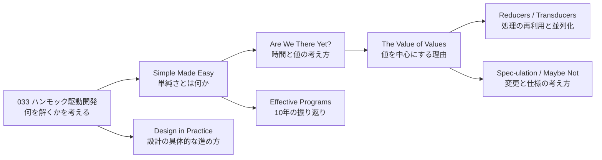

# Rich Hickey の有名講演ガイド(目次・読む順番)

- **記録日:** 2026-10-09
- **位置づけ:** Clojure(クロージャ)の作者 Rich Hickey(リッチ・ヒッキー)の代表的な講演を、書き起こし全文に基づき1本ずつ解説した文書群の**入口ページ**です。
- **前提記事:** 033番「ハンモック駆動開発」(2010年)。
- **一次資料:** コミュニティ作成の書き起こし https://github.com/matthiasn/talk-transcripts/tree/master/Hickey_Rich と、各講演の公開動画。
- **注意:** 各文書は『講演者の主張』と『筆者の考察』を分けて書いています。書き起こしは動画そのものではないため、聞き取り違いの可能性があります。動画本編は未視聴です。

## 1. 講演一覧(古い順)

| 講演 | 会議 | 一言 | 解説文書 |
|---|---|---|---|
| Simple Made Easy | Strange Loop 2011 | simple(絡み合いがない)とeasy(手近)の区別 | `035_INFO_REF_hickey-simple-made-easy.md` |
| Are We There Yet? | JVM Language Summit 2009 | 『変化するオブジェクト』は存在しないという時間モデル | `036_INFO_REF_hickey-are-we-there-yet.md` |
| The Value of Values | JaxConf 2012 | 場所を書き換える設計をやめ、不変の値を中心に据える | `037_INFO_REF_hickey-value-of-values.md` |
| Reducers | QCon NY 2012 | map/filterを並列化しやすい形に分解する | `038_INFO_REF_hickey-reducers.md` |
| Transducers | Strange Loop 2014 | 処理の本質(ステップ)を入れ物から切り離す | `039_INFO_REF_hickey-transducers.md` |
| Spec-ulation | Clojure/Conj 2016 | 変更を成長と破壊に分け、破壊的変更を避ける | `040_INFO_REF_hickey-spec-ulation.md` |
| Effective Programs - 10 Years of Clojure | Clojure/Conj 2017 | Clojure誕生10年の振り返りと設計判断の理由 | `041_INFO_REF_hickey-effective-programs.md` |
| Maybe Not | Clojure/conj 2018 | Maybe型の問題と、仕様(spec)で任意性を表す考え方 | `042_INFO_REF_hickey-maybe-not.md` |
| Design in Practice | Clojure Conj 2023 | 設計を書く・問う・表にする具体作業に分解する | `043_INFO_REF_hickey-design-in-practice.md` |

## 2. 読む順番の提案(筆者案)

- **まず考え方を知りたい人:** Simple Made Easy → The Value of Values。
- **設計の進め方を知りたい人:** ハンモック駆動開発 → Design in Practice。
- **API・互換性・型に関心がある人:** Spec-ulation → Maybe Not。
- **Clojureの技術に関心がある人:** Reducers → Transducers。
- **全体像:** Effective Programs(Clojure誕生10年の振り返り)。

## 3. 共通する主題(筆者の整理・考察)

- **値と不変性:** 場所を書き換えず、事実を積み上げる考え方が複数の講演で繰り返し登場します(Are We There Yet?、The Value of Values、Spec-ulation)。
- **絡み合いを避ける:** Simple Made Easy の中心概念が、Transducers(入れ物からの分離)や Spec-ulation(破壊の回避)にも現れます。
- **注意:** 上記は筆者が複数の解説を読み比べた見立てで、講演者自身がこの順で語っているわけではありません。

## 4. 確認範囲と限界

- 各文書は書き起こし全文を読んで作成し、主要な主張を書き起こしと照合しました。照合の過程で、書き起こしに無い数値(性能の割合)を1件修正しています。
- 動画本編・スライド画像は未確認です。講演者が引用した外部の論文・事例は『講演者の主張(未確認)』として扱っています。
- 再生回数などは取得時点の目安です。
