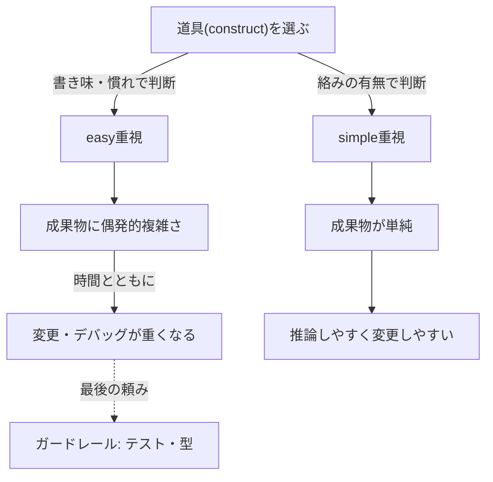
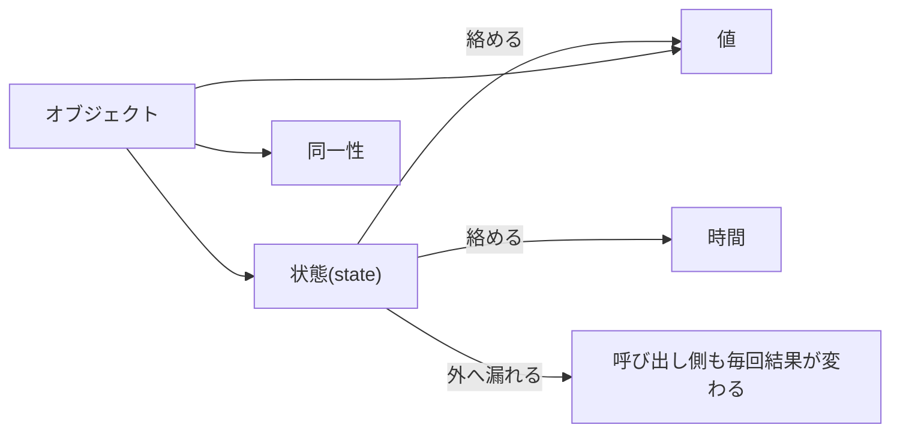

# Simple Made Easy（シンプルとイージーは別物）— Rich Hickey 講演の解説

- **記録日:** 2026-10-08
- **位置づけ:** Rich Hickey（プログラミング言語 Clojure の作者）が Strange Loop 2011 で行った講演の、初心者向け日本語解説。講演の主張と、筆者の考察・提案を分けて書く。
- **一次資料:** 書き起こし https://github.com/matthiasn/talk-transcripts/blob/master/Hickey_Rich/SimpleMadeEasy.md ／ 動画 https://www.youtube.com/watch?v=SxdOUGdseq4

## 0. 先に結論（5行）

1. 「simple（単純）」は *絡み合いがないこと*（客観的に確認できる）。「easy（容易）」は *手近・慣れている・自分の能力で届くこと*（人によって変わる）。この2語を混同するな、というのが核心。
2. ソフトウェアで長期的に効くのは、書き心地（construct＝書くための道具の使い心地）ではなく、動かし続ける成果物（artifact）の性質。
3. 複雑さの正体は、本来別々のものを絡める（complect）こと。状態・オブジェクト・継承などは、何かと何かを絡める。
4. テストや型検査は「ガードレール」であり、進む方向は教えない。最後は頭でプログラムを推論できることが要る。
5. 単純さは選択であり、責任は自分にある。値・関数・データ・キューなど、より単純な道具に置き換えられる。

## 1. 講演の基本情報

| 項目 | 内容 |
|---|---|
| 題名 | Simple Made Easy |
| 会議 | Strange Loop 2011（書き起こしの表記は 2011年9月） |
| 時期 | 2011年9月 |
| 長さ | 約3698秒（約62分） |
| 再生回数（目安） | 約21.6万回（取得時点の目安。YouTube上の公開日は2021年で、再アップロード日の可能性がある） |
| 性格 | 設計思想を語る基調寄りの講演。コードは出てこず、言葉の定義と例えで論を進める |

## 2. 背景（なぜこの講演か）

聴衆は新しい技術や関数型プログラミングを採り入れている層で、冒頭で Hickey は「内容は一見当たり前に思えるかもしれない」と述べる。狙いは、同じ話を *まだ納得していない他の人に説明するための道具* を持ち帰ってもらうこと。つまり新発見というより、議論の語彙を整えるための講演である。Hickey は C++、Java、C# で大規模システムを作った経験があると語り（講演者自身の発言）、そこから「これらの複雑さは不要だった」と主張する。

## 3. 講演の中身（流れ順）

### 3.1 言葉の語源：simple と easy

- **simple** は語源が sim（一つ）＋ plex（折り・より）で「一重」。反対語 **complex** は「編み込まれた・折り重なった」。
- **easy** は「近くに横たわる（adjacent と同じ語根）」に由来し、反対の hard は「近い／遠い」ではなく「強い・厳しい」が語源。Hickey は、この語源の最終段は推測だが講演に都合が良いので採ると断っている。
- simple は「一つの役割・一つの課題・一つの概念・問題の一つの次元」に集中している状態。ただし「一つしかない」ことではなく、数（cardinality）と *絡み合い（interleaving）* は別。操作が複数ある interface も、絡んでいなければ simple。
- simple は絡み合いを見れば判定できる **客観的** な概念。

### 3.2 easy の三つの意味と相対性

easy の「近さ」には三種ある。(1) 手元にある（インストールですぐ入手できる）、(2) 既に知っているものに近い＝慣れ、(3) 自分の能力の範囲内。Hickey は業界が(1)と(2)に取り憑かれていると言う。例として「ドイツ語が読めないからドイツ語は読めない言語だ、とは言わない」。慣れだけを基準にすると、既知から離れた新しいことを学べなくなる。(3)の能力は、知的作業ではプライドに触れるため話題にされにくいと述べる。easy は「誰にとって？」が必ず付く **相対的** な概念で、simple とは違う。

### 3.3 construct（構成要素）と artifact（成果物）

私たちは言語やライブラリ（construct）で書くが、売るのは動き続ける artifact。性能・変更のしやすさは artifact の属性である。「16文字で書けた」「セミコロンがない」といった書き手の都合に偏るのは、利用者にとって意味が薄い。また雇用側が(1)(2)の easy を好むのは、プログラマを入れ替えやすくするためだ、とも述べる（講演者の見立て）。評価すべきは長期運用で「正しく動くか、直せるか、新要件に変えられるか」。

### 3.4 理解の限界と「推論」

人が同時に頭に置ける数は少なく、部品が絡んでいると一つだけ取り出して考えられない。絡みごとに負荷が組み合わせ的に増え、複雑さが理解力の上限を決める。ここで Hickey は、リファクタリングとテストで変更の影響をゼロにできるという主張を「knowable ではない」と退ける。変更には影響範囲の分析が要り、それは推論である。ただし推論と言っても *証明* ではなく、日常的な非形式の推論だと明言し、証明を目標とする立場は取らないと述べる。

### 3.5 ガードレール・プログラミングと短距離走の例え

- 現場で見つかったバグは、全部型検査もテストも通っている。これを Hickey は **guardrail programming（ガードレール頼みの開発）** と呼ぶ。ガードレールにぶつかりながら運転して「あって助かる」と言う人はいないし、ガードレールは行き先を示さない。
- 速度の話：最初から全力で走れるのは短距離走者だけ。スプリントごとに号砲を鳴らし直しても、複雑さを無視すれば長期では遅くなる、と Hickey は主張する。本人が「縦軸横軸に数値がない、経験に基づくグラフ」と断った図で、easy を優先すると序盤は速いが失速し、simple を優先すると先に「考える」仕事が要るので立ち上がりは遅いが、複雑さによる失速を避けられる、という趣旨。実測データではない。

### 3.6 偶発的複雑さと「編み物の城」

easy で慣れた道具でも、複雑な成果物を生むものがある（オブジェクト指向の慣れた構成要素など）。道具が持ち込み、問題そのものとは関係のない複雑さを **incidental complexity（偶発的複雑さ）** と呼ぶ（語源の冗談として「あなたのせい」と言う）。織機で楽しく織り上げたものが結び目だらけの「編み物の城」では困る。単純さの利得は、理解しやすさ、変更・デバッグのしやすさ、判断の独立性（配置の決定と性能の決定が絡まない等）。テストスイートとリファクタリングツールがあっても、編み物の城をレゴの城より速く変更できるわけではない、と述べる。

また、人の能力は大差ない（ジャグラーなら平均3個、トップでも9〜12個程度）ので、複雑さに頭を近づけるのではなく、**道具を単純にして近づける** しかない。手元に置く・慣れるは自分で動けば解決できるが、能力の側は動かせない。

### 3.7 「Lisp の括弧」で見る easy と simple の切り分け

括弧が難しいと言われる件を、Hickey は三点で分解する。(1)手元にない（括弧対応の編集環境を入れていない）、(2)慣れていない（動詞の前に括弧がある）。この二つは使う側の責任で解決できる。しかし(3)simple かと問うと、Common Lisp や Scheme の括弧は「呼び出し」「グルーピング」「データ構造」に使い回されており、これは言語設計者側の絡み（overloading）だという。データ構造を増やせば解消でき、それは Lisp を Lisp でなくさない、と述べる。

### 3.8 道具箱：複雑なものと、より単純な代替

Hickey は二列の表を示し、「良い・悪い」のラベルは付けず聴衆に委ねる。単純さの列は「より単純」の意味で、純粋に単純という意味ではない。続く節で個別に理由を述べる。

| 複雑なもの | より単純な代替 |
|---|---|
| オブジェクト | 値（value） |
| メソッド | 関数、名前空間 |
| var・変数 | 管理された参照（managed reference） |
| 継承・switch・パターンマッチ | 必要な分だけ選べるポリモーフィズム（a la carte） |
| 構文 | データ |
| 命令的ループ・fold | 集合関数 |
| アクター | キュー |
| ORM | 宣言的なデータ操作 |
| 条件分岐 | ルール |
| 不整合（eventual consistency 等） | 一貫性（トランザクションと値） |

プログラマはよく利点だけを見て、副作用（trade-off）を語らないと指摘する。

### 3.9 complect（絡める）という言葉

complect は「編み込む」の古語。「braid」だと良し悪しの響きがないので、悪い意味を持つこの語を使う、と述べる。複雑さの出どころは complect。同じ帯でも、ほどけていれば4本の線、絡めば結び目になる。**compose（並べて置く）** は望ましいが、「モジュールに分ければ済む」では足りない。互いを直接呼ばなくても、前提を共有していれば絡んでいる。大事なのは各部品が *何を知ってよいか* で、知ってよいのは抽象（レゴの上面のような接続面）だけにする。分割や階層化は単純さの *結果* であり、複雑なもので同じ形を作っても利点は出ない。コード整理の見た目に騙されるな、と述べる。

### 3.10 状態（state）：値と時間の絡み

Hickey は、自分も何年も状態ありのスタイルで書いて辛かったので言うのだと断る。状態は **値と時間を絡める**。同じ引数で呼んで結果が変わるメソッドは、変数が見えなくても複雑さが漏れ、外側へ「毒」のように広がる。これは並行処理の話ではなく、単一スレッドでも、障害時にその時の状態を再現する必要が出て理解を妨げる、という話。Clojure や Haskell の参照は、時間の抽象と値の取り出しを兼ねるので優れる、と述べる（ただし状態を simple にするわけではない）。可変がデフォルトでない言語では、状態の量が桁違いに減ると言う。

### 3.11 何が何を絡めるか（各論）

- オブジェクト：状態・同一性（identity）・値を絡める。
- メソッド：関数と状態（言語によっては名前空間も）を絡める。
- 構文：意味と順序を絡める。データのほうが常に優れるという立場。
- 継承：型同士を絡める。
- switch／パターンマッチ：「誰が」と「何をするか」を一箇所に閉じて絡める。
- var／変数：値と時間を絡める。メモリのアドレスから得られるのはワード（スカラ）であり、複合オブジェクトを一回の参照で復元することはできない、とも述べる。
- ループ・fold：「何をするか」と「どうやるか」を絡める。fold は左から右という順序の含意がある。
- アクター：「何をするか」と「誰がするか」を絡める。
- ORM：多くの絡みがある。
- 条件分岐：ルールがプログラム中に散らばり、構造と絡む。

### 3.12 単純なものを選ぶ具体策

値は final／val や永続コレクションで、関数は多くの言語にあり、名前空間は言語頼み。データは、マップ・集合・列という少ない概念で足りるのに、無数の独自型を作って本質を見えなくしている、と述べる。通信でもコマンド文字列や任意文字列ではなくデータを使う。ポリモーフィズムは Clojure の protocol や Haskell の type class のように、データ構造・関数の集合・それらの結び付けを独立に行えるものが望ましい（これが最も得がたく、効果が大きいと言う）。キューやルールは各言語のライブラリで、宣言的データ操作は SQL、LINQ、Datalog などで得られる。一貫性が欲しければトランザクションと値を使う。

### 3.13 環境由来の複雑さ

自分のせいではない複雑さとして、同じマシンで動く他のプログラム（や自分の他部分）とのメモリ・CPU の取り合いがある。これは問題領域ではなく実装の側の事情で、顧客に「GC があるから無理」とは言えない。静的に分割すると無駄が出、スレッドプールの大きさを各自が決めるような方針は合成できない、と述べる。解決策は持っていないと明言する。

### 3.14 抽象の作り方：who / what / how / when / where / why

abstract は「物理的な性質から引き離す」意味で、単に隠すこととは違うと述べる。設計では、who・what・when・where・why・how の観点で分けて考え、「知らない、知りたくない（I don't know; I don't want to know）」の姿勢を保つ。

- **what（何を）**: 関数の集合に名前を付けた抽象（interface／protocol／type class）。小さくする。Java の interface が巨大なのは union 型がないから、とも述べる。値と他の抽象だけを使って定義する。how と混ぜない（fold のように意味が実装を縛る例もある）。
- **who（誰が）**: 部品を小さな部品から作り、組み込む部品は引数として受け取る。部品は今より多くなるのが普通で、5つ見つかっても良い兆候だと言う。
- **how（どうやるか）**: 実装。ポリモーフィズムで接続し、実装は孤島のように独立させる。
- **when / where**: 何とも絡めない。A が B を直接呼ぶと「いつ・どこ」が絡むので、**キューを挟む**。
- **why**: 方針やルール。アプリ中に散らさず、宣言的なルール系で外に出す。顧客と見るべきはソースコードに近いもので、英語文字列のテスト記述は無意味だと述べる。
- **情報（information）**: 情報にオブジェクトを被せるのは誤り。オブジェクトは入出力デバイスの包み用に生まれたものだ、と述べる。マップや集合をそのまま使えば、汎用のデータ処理を一度作って再利用できる。

### 3.15 既存の複雑さをほどく／まとめ

他人のコードや問題空間を単純化するには、絡みを追跡してラベルを付け、ほどく作業になる（別の講演の主題として、ここでは詳述しない）。結論は、単純さは **選択** であり、単純でないシステムは自分の責任。「複雑さの文化」に自己強化されている。常に警戒し、*絡み合いを見るレーダー* を養う。信頼性ツールは単純さの核には触れない二次的な安全網。単純化すると部品の数は増えることが多いが、「結び目の少数」より「まっすぐ垂れ下がる多数」を選ぶ、と述べる。最後に、洗練された型システムを売り込まれたときの返答として、冗談めかした一言スライドで締める。

## 4. 用語集

| 用語 | 意味 |
|---|---|
| simple | 一重で絡みがない状態。客観的に判断できる |
| easy | 手近・慣れている・能力内。人により変わる |
| complex／complect | 絡み合った状態／絡めるという行為 |
| compose | 部品を並べて置くこと |
| construct／artifact | 書くための道具／動かし続ける成果物 |
| incidental complexity | 問題と無関係に道具が持ち込む複雑さ |
| value／identity／state | 値／同一性／状態（時間で変わるもの） |
| polymorphism a la carte | 型・関数集合・結び付けを別々に選べる多態性 |
| ORM | Object-Relational Mapping。DBの表とオブジェクトを対応させる仕組み |
| fold | 列を畳み込んで一つの値にする操作（reduce とも） |
| 管理された参照 | 時間の扱いを抽象化し、値を取り出せる参照（Clojure の Var・Ref 等） |

## 5. 実務での使いどころ（筆者の提案）

講演の趣旨を日々の開発に当てはめた提案であり、Hickey の主張そのものではない。

- 技術選定のレビューで「簡単そう」「知っている」と「絡みが少ない」を別の欄に書き分ける。
- 設計レビューで「この2つは互いの前提を知っているか」を問う。呼び出しの有無ではなく前提の共有を見る。
- 状態を持つ箇所を洗い出し、関数が同じ入力で同じ出力を返す境界を広げる。
- コンポーネント間の直接呼び出しをキューに置き換える余地を探す。
- 新しい情報の型を作る前に、マップ・集合・列で足りないか確認する。
- 見積もりに「単純化のための先行作業」を明示的に載せる。

## 6. 考察：強みと限界（考察・筆者の見立て）

ここは筆者の見立てであり、講演内容とは分けて読んでほしい。

**強み**
- simple と easy を分けることで、好みの争い（書き心地）と成果物の性質（保守性）を別々に論じられる。
- 「構文より絡み合いを見る」という視点は、言語を問わず使える。

**限界・批判的視点**
- 「速度のグラフ」は本人が経験に基づく図と断っており、実測の裏付けは講演内では示されない。主張の根拠は経験談が中心。
- 表の「複雑 vs 単純」は、どの文脈でも成り立つわけではない。例えば条件分岐やオブジェクトが適する場面や、型システムの価値は、この講演内では十分に論じられていない（締めの冗談は反論ではなく挑発に近い）。
- 「単純さは測れる」と言うが、絡み合いの度合いを定量化する方法は示されない。判断者の経験に依存するため、結局「誰にとって？」の問題が残りうる。
- テスト・型を「二次的」とする見方は強い言い方で、現場ではこれらが単純化の道具（リファクタリングの安全確保）にもなりうる。
- 聴衆が関数型に親和的な場での講演であり、一般のチームへそのまま持ち込めるかは別問題。

## 7. 確認範囲と限界

**確認したこと**
- 書き起こし全文（200行）を最後まで読み、主要な主張・例えを抜き出した。
- 再生回数・長さなどはメタ情報（取得時点の値）による。

**確認していないこと**
- 動画本編の視聴（スライド画像・身振りは書き起こしに含まれない。図の中身は説明文からの推定を避けた）。
- 講演者が引き合いに出した外部の話（Dijkstra の見解、他の講演での発言、Unix の通信方式の評価など）の正確性は **未確認**。講演者の主張として扱った。
- 速度グラフの内容や「Java の interface が巨大な理由」などの技術的主張は、講演者の見解で、独自に検証していない。
- 一部の語源（easy の最終段階）は、講演者自身が推測と断っている。

## 8. 参考リンク

- 書き起こし: https://github.com/matthiasn/talk-transcripts/blob/master/Hickey_Rich/SimpleMadeEasy.md
- 動画: https://www.youtube.com/watch?v=SxdOUGdseq4
- 会議サイト: http://thestrangeloop.com
