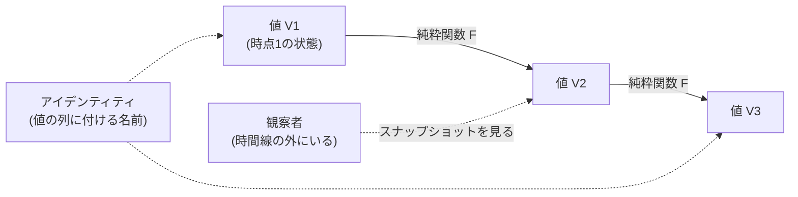

# Rich Hickey『Are We There Yet?』解説 ― 「変化するオブジェクト」は存在しない、という時間モデルの話

- **記録日:** 2026-10-08
- **位置づけ:** Clojure の作者 Rich Hickey が、オブジェクト指向(OO)言語の「時間の扱い」の誤りを論じ、代わりに「値・アイデンティティ・状態・時間」を分けて考えるモデルを提案した講演の、日本語での読み解きノート。
- **一次資料:** 書き起こし https://github.com/matthiasn/talk-transcripts/blob/master/Hickey_Rich/AreWeThereYet.md ／ 動画 http://www.infoq.com/presentations/Are-We-There-Yet-Rich-Hickey
- 注記:書き起こしはコミュニティ作成のもの。動画そのものは見ておらず、本書は書き起こし(画像除去版)のみに基づく。

## 0. 先に結論(5行)

1. Hickey は、主流のOO言語(Java・C#・Scala など)は見た目が違っても「状態を持つオブジェクトが中身を書き換える」点で同じ道を走っている、と指摘する。
2. その根本の誤りは「時間」を言語が持たないこと。「変化する値」は存在せず、あるのは「ある時点の値」の連なりだけ、というのが核心の主張。
3. 解決の方向は、不変の**値**(永続データ構造)+ 値から次の値を作る**純粋関数** + 値の継ぎ目を管理する**時間構造**(CAS・エージェント・STM など)に分解すること。
4. 観察(perception)は処理(process)を止めてはならない。そのために多版同時実行制御(MVCC)のように「読み手が書き手を妨げない」仕組みが重要になる。
5. 純粋関数型の宣伝ではなく「時間と正面から向き合う」提案。OOとどう折り合うかは、本人も未解決の問いとして残した。

## 1. 講演の基本情報

| 項目 | 内容 |
|---|---|
| 題名 | Are We There Yet?(「もう着いた?」) |
| 会議 | JVM Language Summit 2009 |
| 時期 | 2009年9月 |
| 長さ | 不明(スライド最終時刻が約1時間4分台で、その後に質疑がある。正確な総時間は未確認) |
| 性格 | 技術講演(概念・モデルの提案)。Clojure の設計背景だが、製品紹介ではなく「考え方の再検討」を促す内容。分散コンピューティングは扱わないと明言している |

## 2. 背景(なぜこの講演か)

JVM(Java Virtual Machine, Javaの実行基盤)上の言語実装者が集まる会議での講演である。Hickey は冒頭で、聴衆に「OOを愛しているなら、いったん愛していないふりをして、完璧かどうか考えてほしい」と頼む。OOを叩くのが目的ではない、とも断っている。

背景には複数のコア(CPUの計算単位)を使う並行処理の時代の到来がある。Hickey は、増え続けるプログラムの複雑さの中で、並行処理が「ラクダの背を折る最後のわら」になると述べる。つまり、今のOOの時間の扱いのまずさは、並行処理で一気に表面化する、という見立てである。

## 3. 講演の中身(流れ順)

### 3.1 問いかけ:同じ道を走る別々の車

Hickey はまず、主要言語はどれも「単一ディスパッチ(呼び出し先を1つのオブジェクトの型で決める方式)・状態を持つ・クラスと継承・GC付き」で共通していて、「違う車だが同じ道を走っている」と言う。静的型か動的型かも、共有する土台に比べれば重要ではないという立場である。言語が変わる理由は構文(セミコロンの有無)ではなく、歴史上の例を見ればもっと本質的なものだ、と話を進める。

### 3.2 偶発的複雑さと「単純さに偽装した複雑さ」

道具に由来して付いてくる複雑さを**偶発的複雑さ(incidental complexity)**と呼び、問題領域そのものの複雑さと区別する。最悪なのは、簡単そうな見た目の裏に隠れたものだという。

- **C++の例:** ポインタを返す関数は単純に見えるが、受け取った側が解放(delete)すべきか、渡してよいかが署名から分からない。標準のGC(ガベージコレクション=不要メモリの自動回収)がないため、メモリ管理の責任が「頭の中」にしか書かれていない。Hickey は、これがC++の「ライブラリ言語」という目標を阻み、JavaへのGC目的の移行を促した一因だと述べる。
- **Javaの例:** GCで改善した一方、参照先が可変(mutable=変更可能)かどうか、見ている最中に一貫した値が見えるかが分からない。Date のような可変オブジェクトを他者に渡し、後で変更すると誰に影響するか不明になる。これは並行処理以前からの問題で、可変オブジェクトを許す言語すべてに当てはまる。これを彼は「標準的な時間管理がない」と表現する。

### 3.3 部品としては純粋関数が適している

レンガ職人はレンガの内部を気にしない。同様に、気にせず使える部品の単位は、OOのオブジェクトではなく**純粋関数**(不変の値を受け取り、外界に影響せず、不変の値を返す関数)だと主張する。純粋関数は時間の概念を持たないので理解しやすく、中身を変えても外に影響しない。OO言語でもこれはできるが、人々はやっていない、とも言う。

ただし多くのプログラムは関数ではなくプロセス(動き続けるもの)である。例として、同じ語を検索するたびに同じ結果を返すだけの Google は役に立たない、と挙げる。コンパイラや定理証明器のような関数的プログラムは例外的だという。

### 3.4 OOは時間を間違えた:Whitehead の考え方

OOの本質は「世界の実体が何かをしている流れ」をモデル化することだ、と整理する。ところがOOには時間の明示的な表現がない。純粋関数は「時間はない」と割り切っているが、オブジェクトは時間を扱うふりをしているのに時間の概念を持たない。単一の実行の流れが全体を支配した時代の名残で、今はロックでその世界観を取り戻そうとしているが、そもそも正しくなかった、と述べる。

ここで哲学者 Alfred North Whitehead(『Principia Mathematica』をRussellと共著した後、哲学者になった人物)を「講演の英雄」として持ち出す。Hickey は自分は理解しきれていないと断り、大幅に単純化した形で次の考えを紹介する(書き起こし中の本人の言葉では、以下の規則は Whitehead の再説ではなく、本人の「簡略化した見方」である)。

- 実体(actual entities)は不変。未来は過去の関数である。
- 川・雲・Fred(人名の例)のような「連続した何か」は、因果的につながった値の列に人間が重ねて貼るラベルにすぎない。
- 時間は、出来事の前後関係から導かれる派生物である。
- 「川は二度と同じ川に入れない」という言葉を引き、川という固定物はなく、ある時点の水があるだけだ、と例える。

### 3.5 用語の再定義

講演の用語を整理する(この講演内での用法)。

- **値(value):** 不変のもの。42のような数も、不変な部品からなる複合物も値。日付のような型は値としての扱いが弱い。
- **アイデンティティ(identity):** 因果的につながった値の列に付ける名前(心の中の構成物)。
- **状態(state):** ある時点でそのアイデンティティが持つ値のスナップショット。変えられるものではないので「可変状態」は意味をなさない。
- **時間(time):** 前・後・同時しか言えない相対的なもの。測れる量ではない。

なぜこれが重要か:プログラムが判断(ロジック)をするには、変わってしまう川ではなく安定した値の上でなければならない。ただしアイデンティティの感覚自体はOOの魅力として正当で、世界の捉え方とプログラムが近い方が楽だ、とも認めている。

### 3.6 人間の知覚から学ぶ

講演のユーモアとして、他の講演者の助言で「ライオンのスライド」を入れたと紹介し、場を和ませた上で、人間の知覚に議論を移す。

- 私たちは世界を直接触って判断せず、感覚を通して取り込む。世界を止めて観察することもできない。しかしプログラムではつい「待て、止まれ」と世界を止めたがる。
- スタジアムの数万人の観客は互いに調整せず同時にゲームを見られる(並列で、メッセージのやり取りでもない)。
- 知覚はいつも過去を見ている(光や神経伝達の遅れ)。
- 神経は入力を離散化(とびとびの出来事にする)し、同時性を検出する。連続のままでは論理が組めないため、スナップショットを使う。
- メソッドは「読む(知覚)」と「作用させる(行為)」を一つの構文に混ぜているが、この二つは別物。行為は同じ場所に同時に作用できないので順番に行う必要がある(逐次的)が、知覚は並列でよい。

### 3.7 エポック的時間モデル(Epochal Time Model)

講演の中心モデル。点在する値(V)を、純粋関数(F)がつなぎ、次の値を生む。

ポイント:

- 関数の内部は「分割できない・見えない(atomic)」。観察者は時間線の中にはいない。
- アイデンティティも時間も、出来事の列から後付けで導かれる派生概念で、プログラム内に実体としては置かない。
- 実装に必要なのは(1) 値を効率よく作る手段と、(2) 値の継承を調整する「時間構造(time construct)」の二つ。

### 3.8 値の実装:永続データ構造

**永続データ構造(persistent data structure)** は、ディスク保存とは無関係の用語で、「更新すると新しい版ができ、古い版も使え続け、両方の性能特性が保たれる」不変のデータ構造のこと。

- 木構造で実現する。高い分岐数で木が浅く、新版は**パスコピー**(根から変更点までの経路だけ複製)で作り、残りは旧版と共有する(構造共有)。
- 不変なので、何千人が同時に見てもロック不要。新版を作っても古い版を見ている人を邪魔しない。
- 並列処理とも相性が良い(最初から分割された木、衝突なく合成できる)。

性能は正直に認めている:特に書き込み・直列では遅い。ただし読みは意外に速い、と述べる。実務的な緩和策として次を挙げる。

- 関数の内部は外から見えないので、新しい版を作る最中は配列を確保して破壊的に書き換えてよい(Fork/Join=並列分割実行の枠組みも使える)。
- 本人の4コア機で、永続ベクタへの並列 map が ArrayList に対するループと同じ速度だった、と報告している。
- 「トランジェント」という一時的に変更可能な版を開発中で、従来の可変データ構造と「ほぼ同じ速度」で、永続版との相互変換が定数時間だと述べる(具体的な割合は示していない)。

これらの数値は講演者自身の報告であり、本書では検証していない(未確認)。

### 3.9 時間構造(Time Constructs)

時間構造の役割は、(1) 値から値への原子的な(途中のない)移行、(2) アイデンティティの現在値を原子的に見せること、(3) 複数の時間線を許すこと、の3つ。それさえ満たせば意味づけは複数あり得るとし、次を挙げる。

| 構造 | 要点 |
|---|---|
| CAS(Compare-And-Swap, 比較して置換) | 1アイデンティティ=1時間線。AtomicReference のような箱に不変値を入れ、関数を適用して置換する(競合時は自動でやり直す)。複数の対象の調整はできない。 |
| エージェント(アクター風) | これも1対1だが非同期。呼び出し側は結果を待たず立ち去る。キューで順序が決まり、読み手が一人なので原子的。アクターと違い、内部では常に値の観察を可能にしたい、と述べる。 |
| STM(Software Transactional Memory) | 複数のアイデンティティの時間線を一つの取引に束ねる。それでも内部は「過去の純粋関数が未来を作る」同じモデル。 |
| ロック(将来案) | ロックを時間線を強制する手段と見て、固定領域の時間構造に包めるのではと示唆する。 |

### 3.10 STMの観察とMVCC

STMでの観察は、複数のものを同時にのぞく「一瞥(トランザクション的な参照)」と、順に見て回る「走査(非トランザクション)」の二通りがあると整理する。走査では別々の時点を見ているので、同時だと見なしてはいけない。

**MVCC(Multi-Version Concurrency Control, 多版同時実行制御)** は、履歴を少し残して読み手のために過去の版を見せる、データベース由来の技術。決定的な性質は「読み手が書き手を妨げない」で、観察が処理を止めない。Hickey は、永続データ構造がこの履歴を安く保たせてくれるのは偶然とは思えない、と述べている(理由は自分でも分からないと言う)。

さらに、STMは種類によって全然違うと強調する。MVCCがないものは走査しかできないか、読むために処理を止める羽目になる。また、一貫した値を見るためだけに取引が要るなら(オブジェクトの4つのフィールドを整合的に読むためにトランザクションが必要など)、時間を間違えていると述べる。

### 3.11 結論と未解決の問い

- 偶発的複雑さを減らす変化の実例はGC付き言語への移行。今度は「振る舞い・時間・アイデンティティ・状態」の混同を解く番だ、と主張する。
- エポック的時間モデルは試す価値がある一般モデルで、既存の基盤で実験可能。ローカルプロセスの話で分散は対象外。
- 未解決:外部世界の時間との調整、STMとトランザクションI/Oの結合、取引からの脱却(制御を手放すほど並行性が上がる)、データ構造の並列化、ロックの再解釈、そして**OOと両立できるか**(オブジェクトの「知覚」を「アイデンティティ」から分離できるか)。

### 3.12 質疑の要点

- 「関数型の講演と同じでは」との質問に、関数型は時間を排除しがちだが、自分はプログラムの大半が時間を扱う必要があるので、時間に正面から取り組む立場だと答える。純粋関数型の提唱ではない、と明言。
- 哲学史(流転と不変の統合)との類似の指摘に対し、Whitehead こそそれをやった人だと応じた。
- 1978年の論文「Time, Clocks, and the Ordering of Events in a Distributed System」との類似の指摘には、既読で近い発想だと認めた。ただし相手が指摘した差(あちらは通信を軸にし、こちらは関数の入出力で時間が進む)について、本人も「同じものかもしれない」と留保した。
- JVMへの要望は、GCへの圧力が大きいので全体を速くしてほしい、というもの。
- 関数型リアクティブプログラミング(FRP)は「偽の時間」であり、時間を関数の引数にするのは先送りだと述べた(FRP全般の評価は避けている)。
- 最後に、イベントストリームなどでもデータが全部不変なら正しい方向であり、「可変オブジェクトは存在しない」と信じられれば、より良いシステムが作れる、と締めた。

## 4. 用語集

| 用語 | 意味 |
|---|---|
| 偶発的複雑さ (incidental complexity) | 解きたい問題ではなく、道具や方法のせいで付いてくる複雑さ |
| 純粋関数 (pure function) | 不変の入力から不変の出力を作り、外部に影響しない関数 |
| 値 (value) | 不変のもの |
| アイデンティティ (identity) | 因果的につながった値の列に付ける名前 |
| 状態 (state) | ある時点での値のスナップショット |
| 永続データ構造 | 更新で新版を作り旧版も残る不変データ構造(ディスク保存の意味ではない) |
| 構造共有 / パスコピー | 新旧の版が大部分を共有し、変更経路だけを複製する実装 |
| CAS | 期待値と一致した時だけ原子的に値を置き換える命令 |
| エージェント | 非同期で、1アイデンティティを1つのキューで更新する仕組み |
| STM | 複数の対象の更新をまとめて原子的に行うメモリ上の取引機構 |
| MVCC | 履歴を残して、読み手が書き手を妨げないようにする方式 |
| GC | ガベージコレクション。不要メモリの自動回収 |

## 5. 実務での使いどころ(筆者の提案)

以下は講演の主張ではなく、筆者による応用案である。

- 共有データはまず不変にし、更新が必要な箇所だけ「現在値を指す箱(CAS相当)」に集約する。他言語でもイミュータブル(不変)コレクション+原子的な参照で近い構成が作れる。
- 他者に渡すデータは、後で誰かが書き換えても困らないよう、渡す時点で不変にする(防御的コピーの置き換え)。
- 「読むためのロック」が必要な設計に出会ったら、スナップショットを渡す設計に直せないか考える。
- 複数の対象をまたぐ更新は、一つの対象にまとめて1回の更新にできないかをまず検討し、無理な場合にトランザクションを検討する。

## 6. 考察:強みと限界(筆者の見立て)

事実(講演内容)と分けて、筆者の見立てを述べる。

**強み**
- 「状態」「振る舞い」といった曖昧語を、値・アイデンティティ・状態・時間として切り分け、議論の足場を作った点。
- 読み手が書き手を妨げないという原則は、データベースや現代の多くのシステムの設計と整合する。

**限界・批判的な視点**
- 性能の主張(並列 map が ArrayList と同速、トランジェントが「ほぼ同速」)は本人の報告で、条件が限定的。GCの負荷が増える点は本人も認めている。
- 哲学(Whitehead)は比喩として使われており、技術的根拠ではない。本人も理解が浅いと述べている。
- 「可変オブジェクトは存在しない」という断定は強い言い方で、メモリ内の実装が可変であることを否定するものではない。「外から見た契約の話」と読むのが妥当だと考える。
- 分散システムは対象外で、現実のシステムでは外部世界との調整(本人も未解決とした部分)が最も難しいと思われる。
- 質疑で出た通り、既存の時間論(例:出来事の順序づけの古典的論文)と近く、独自性は「プログラミング言語の部品に落とし込んだ点」にあると読める。

## 7. 確認範囲と限界

**確認したこと:** 書き起こし全文(最後の質疑まで)を通読し、主張・例・数値をそこから拾った。

**確認していないこと:** 動画の視聴、スライド画像、正確な講演時間、講演者が引用した Whitehead の理論・Lamport論文の内容、性能の数値の再現(いずれも「講演者の主張/引用」であり未確認)。書き起こしに不明瞭な箇所(一部聴き取り不能)がある。

## 8. 参考リンク

- 書き起こし: https://github.com/matthiasn/talk-transcripts/blob/master/Hickey_Rich/AreWeThereYet.md
- 動画(InfoQ): http://www.infoq.com/presentations/Are-We-There-Yet-Rich-Hickey
- JVM Language Summit 2009: http://openjdk.java.net/projects/mlvm/jvmlangsummit/
- 質疑で言及された論文: Time, Clocks, and the Ordering of Events in a Distributed System (1978) http://research.microsoft.com/en-us/um/people/lamport/pubs/time-clocks.pdf
