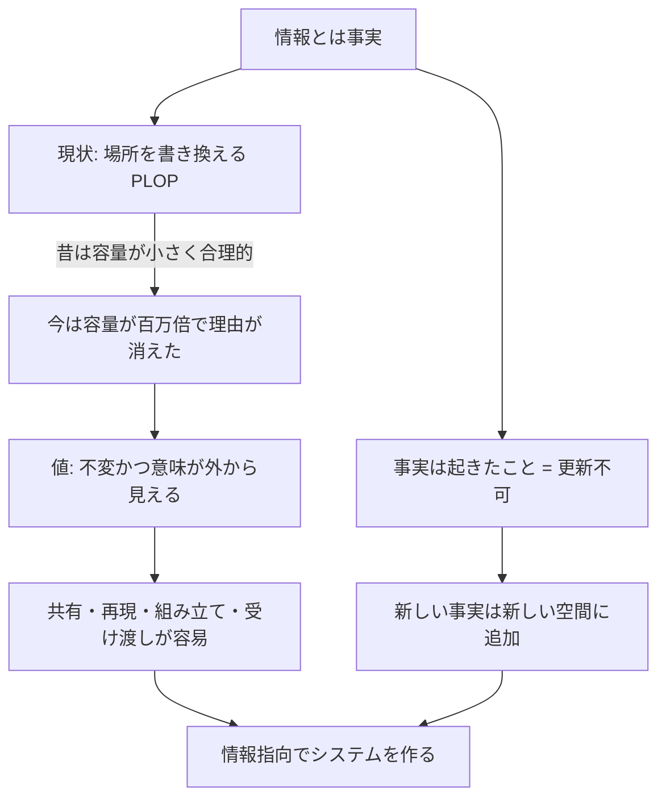
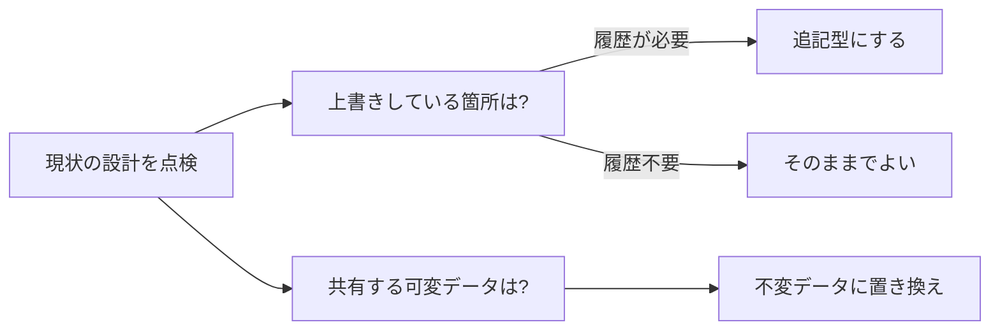

# The Value of Values(値の価値)— Rich Hickey 講演の解説

- **記録日:** 2026-10-08
- **位置づけ:** Rich Hickey(Clojure の作者)による講演「The Value of Values」の要点を、初心者向けに日本語で整理した解説。講演内容(第3章)と筆者の見立て(第5・6章)を分けて書く。
- **一次資料:** 書き起こし https://github.com/matthiasn/talk-transcripts/blob/master/Hickey_Rich/ValueOfValues.md / 動画 https://www.youtube.com/watch?v=-6BsiVyC1kM

## 0. 先に結論(5行)

1. 講演者は、情報システムが「場所(place)を書き換える」作りになっていることを **PLOP(Place-Oriented Programming、場所指向プログラミング)** と呼んで批判する。
2. 場所指向は、メモリもディスクも極小だった時代には合理的だったが、容量が百万倍になった今は理由がなくなった、というのが主張。
3. **値(value)** は「不変(immutable)で、中身が外から読める(semantically transparent)」もの。共有・再現・組み立て・受け渡しが楽になる。
4. **事実(fact)とは「起きたこと」** であり、更新できない。新しい事実は新しい領域に追加する。
5. 私たちは自分用のソース管理やログでは既にこの方式(上書きしない・時刻を付ける)を使っている。業務システムもそうすべき、という結論。

## 1. 講演の基本情報

| 項目 | 内容 |
|---|---|
| 題名 | The Value of Values(値の価値) |
| 登壇者 | Rich Hickey |
| 会議 | JaxConf 2012 |
| 時期 | 2012年7月(書き起こし記載) |
| 長さ | 約1903秒(約31分43秒、メタ情報より) |
| 再生回数(目安) | 約14万4千回(取得時点の目安。増減する) |
| 性格 | 技術カンファレンスの基調講演的な考え方の提示。コード実演ではなく、概念と例えで語る |

## 2. 背景(なぜこの講演か)

- 講演冒頭で、登壇者は元は1時間の講演だったが今回は約30分に圧縮した、と述べる。駆け足で話す前提の内容。
- 題材は「I.T.(Information Technology、情報技術)の "I" は情報のはずなのに、私たちは情報を扱う作りになっているか?」という問い。
- 近年(当時)の「ビッグデータ」「ログ解析」への関心の高まりも、論の後半の背景として使われる。
- 用語の補足: Clojure は登壇者が作ったプログラミング言語だが、この書き起こしの中では言語の紹介はほぼなく、考え方の話に徹している。

## 3. 講演の中身(流れ順)

### 3.1 つかみ:「事実は場所だ」という嘘の説明

登壇者はまず辞書を引き、information(情報)は inform(伝える)から来た語で、情報とは「事実」だと確認する。続けて「事実とは情報が保管される場所で、get と set の操作があり、場所を伝えれば事実を伝えられる」と説明し、聴衆に違和感を持たせたあとで「いま言ったことは全部間違い」と撤回する。**事実は場所ではない**、というのがこの講演の出発点。

### 3.2 場所指向(PLOP)とは何か

- 「場所」はメモリアドレスやディスクのセクタのように、番地があり、中身を別の中身で置き換えられるもの。
- 可変オブジェクト(mutable object)は場所の上の薄い抽象にすぎず、データベースの表・文書・レコードも「更新する」という発想を持つ場所だ、と指摘する。
- 新しい情報が古い情報を置き換えるなら、それは PLOP。
- 歴史的理由: 昔は4キロワード程度のメモリで、番地ごとに用途を決めて使い回すしかなかった(別の講演者の話として紹介)。当時は理にかなっていた。
- しかし登壇者の経験の間に、メモリとディスクの容量は **百万倍** になった。「車が百万倍大きくなったら、どの規則が残るか」という例えで、小さい時代の判断を引きずる不自然さを訴える。

### 3.3 「メモリ」と「レコード」という言葉の罠

- 人間の記憶は、友人のメールアドレスが変わっても脳の特定の細胞を書き換えるわけではない。記憶は開かれた連想的な仕組みで、番地方式ではない。
- 記録も同様で、石板やパピルスの時代に消して書き直すことはしなかった。会計は **複式簿記(double-entry accounting、帳簿方式)** で、間違いは訂正の記入を足して直し、消しゴムは使わなかった。
- 私たちはこれらの言葉をコンピュータ用語として奪い、自分たちの作り話を信じてしまっている、という批判。

### 3.4 「値」とは何か

- 辞書の定義から: 「相対的な価値」と「大きさ・数量(42のような数)」。比較できること(comparability)が大事で、絶対的な測定はなく、何かと比べて初めて意味を持つ。
- 「文字列は値か?」の問い。答えは「不変なら値、可変なら値ではない」。不変の文字列は比較でき、そこから「昨日と同じか」「このラベルは正しいか」といった論理と判断ができる。可変文字列の言語には戻りたくないはず、と聴衆に確認する。
- 本講演での値の定義(時間の都合で絞ったもの): **不変であること** と **意味が外から見えること(semantically transparent)**。値は「中にしまって操作する」ものではなく、「これが私の意味だ、比べてくれ」と外側に表示するもの。

### 3.5 値の利点(価値提案)

登壇者は多くの利点を挙げる。

- **共有できる:** 不変なものを渡しても、渡した側も受け取った側も心配しなくてよい。
- **再現できる結果:** 値から定義した関数は同じ入力で同じ答えを返す。場所に依存する関数は中身次第で変わる。場所を相手にしたテストは、場所を元の状態に戻せることが前提になり、あまり意味を持たない、と述べる。
- **作りやすい(fabricate):** 文字列・数のリスト・リストのリスト・リストを値に持つマップは、どの言語でもすぐ作れる。凝ったインターフェースのインスタンスは別言語では作れない。「プログラムを書くプログラム」や「テストを書くプログラム」も作りにくくなる。
- **言語に依存しない:** リスト・文字列・数・マップは汎用の概念。逆に、新しい概念ごとに新しいクラスを作ると、コード量が爆発する。オブジェクトは再利用を約束したが、特に型の強い言語ではむしろ逆の結果になり、「コードが増えればバグも増える」と述べる。
- **集合も値になる(aggregate):** 不変の要素のリストは、それ自体も不変の値。不変の文字列は当然とされるのに、不変のコレクションは理解されにくい、と指摘する。可変オブジェクトは、ロック方針(並行処理での排他制御の決まり)やコピー方針をクラスごとに決めても、組み合わせた途端に全部やり直しになる。値なら利点がそのまま集合に引き継がれる。
- **伝えやすく、見やすい:** 値を送れば、自分が見たものがそのまま相手に伝わる。「場所」を教えても、相手は別のものを見るかもしれない。複数の場所を観察するには世界を止める必要があるが、値なら落ち着いて眺められる。また、何かを「覚えておく」ときも、参照を保存するだけでは足りず、複製が必要になる(その方法は「場合による」)。

### 3.6 システム全体への拡張

- **最良のインターフェースは値:** ネットワーク上では CORBA や DCOM(分散オブジェクト技術)は廃れ、JSON や XML といった値の表現が使われている。両端を独立して変えやすい。
- **調整の削減:** 読み取りトランザクション(read transaction)が必要になるのは、場所を相手にしているから。物理世界では何も止めずに互いを見られる。値を保存先に使えば調整が減る。
- **配置の柔軟さ(location flexibility):** 値でやり取りするプロセス構成なら、一部を別スレッド・別言語・別マシンに移しやすい。大規模では値を送るのに、プログラム内部ではオブジェクトを渡すので移せなくなる、という指摘。

### 3.7 事実は値である(時間を含む)

- 「事実は更新できるのでは?(大統領が代わる)」という反論に対し、事実は **起きたこと** であり、ラテン語の「起きた」という意味の過去分詞に由来する、と答える。Bill Clinton が大統領だったという事実は変わらない。新しい大統領は **新しい事実**。メールアドレスの変更も同様。
- 意思決定では、時点の異なる事実を比べたり合算したりする。現在値しか知らないシステムでは判断が非常に悪くなる、と述べる。
- 結論: 過去は変えられないので、事実は更新できない。

### 3.8 情報システムを情報のために作る

- システムが「事実を保持・加工・提示し、人の判断を助ける」ものなら、基盤も事実指向であるべき。
- 一方、プログラムには **機械のような処理の部分**(搬入口、ベルトコンベア、仕分け)があり、プロセス指向の構成要素は言語にあってよい、と認める。ただしそれを情報にまで適用してはならず、「場所」に関する構成要素は情報モデルに何の役割も持たない(コンピュータの都合の産物)と述べる。

### 3.9 私たち自身は既に実践している

- ソース管理: ディレクトリへの上書きで済ませる人はいない。日時のないソース管理もない。
- 運用ログ: 「直近の遅延は5」と上書きするログも、時刻のないログもない。
- ビッグデータの一面: 業務側が「上書き式DBよりログのほうが全部覚えていて良い」と言い、ログ解析に向かう流れだと説明する。ただしログは本来この用途の保存形式ではなく、プログラム動作の雑多な記録も混ざる。ビジネス価値のある情報を保存するデータベースを、私たちはまだ作れていない、と述べる。

### 3.10 「宇宙(space)の時代」へ

- space の定義は古い言語でも place と time の両方を含んでいた、と述べる。
- `new` が常に成功し、S3(クラウドのストレージ)が満杯にならないなら、それは「場所」ではなく「空間」で動いているということ。端を気にしなくてよい。
- 新しい事実には新しい空間を使う。これが場所指向の終わり。5MBのディスクが数千ドルした時代ではない。メモリ同様、ストレージにもガベージ(不要データ)が出るが、管理方法は学べる、と述べる。
- まとめ: 理由が消えたのに、新しい言語やデータベースがなお場所指向を採る。ビジネス側の需要は明確で、資源もある。「情報指向のアプローチを取ってほしい」と締める。

### 3.11 論の流れ(図)

## 4. 用語集

| 用語 | 意味 |
|---|---|
| PLOP (Place-Oriented Programming) | 場所指向プログラミング。新しい情報で古い情報を上書きする発想 |
| 場所 (place) | 番地などで指せる限られた領域。メモリアドレス、ディスクセクタ、表のセル等 |
| 値 (value) | 不変で、意味が外から読めて比較できるもの |
| 不変 (immutable) | 作成後に変更されない性質 |
| semantically transparent | 意味が見た目に表れていて、隠れた振る舞いがないこと |
| 事実 (fact) | 起きたこと。更新できない |
| 複式簿記 | 訂正を消さずに追記で行う帳簿方式 |
| ロック方針 | 並行処理で複数の処理が同じオブジェクトを触るときの排他制御の決まり |
| 読み取りトランザクション | 読む間にデータが変わらないよう調整する仕組み |
| location flexibility | 処理を別スレッド・別言語・別マシンへ移しやすいこと |
| CORBA / DCOM | 分散オブジェクト技術。講演では廃れた例として言及 |

## 5. 実務での使いどころ(筆者の提案)

以下は講演の主張ではなく、筆者が講演を踏まえて考えた活用案。

- 設定や業務データの更新は、上書きでなく「変更履歴を追記する」テーブル設計(日時付きのイベント蓄積)を検討する。
- 関数間・サービス間でやり取りするデータは、不変のデータ(JSON 等の値)にそろえ、可変オブジェクトを共有しない。
- テストは、入力値と期待値を固定できる形(純粋関数に近い形)に寄せる。
- 並行処理で悩んだら、「この共有物を値にできないか」を最初に問う。
- ログに時刻と業務上の意味を持つ項目を入れ、後から解析できる形式にしておく。

## 6. 考察:強みと限界(考察(筆者の見立て))

ここは筆者の見立てで、講演の主張とは分けて読んでほしい。

**強み**
- 「上書きしない」例として、ソース管理・ログ・簿記という身近な実例を使うため、納得しやすい。
- 並行処理・テスト・システム間連携という別々の悩みを「値」という一つの視点でまとめている。

**限界・批判的視点**
- 講演は約30分で、不変データのコスト(メモリ消費、コピーの負荷、更新が多い処理の性能)や具体的な実装方法の説明はほぼない。書き起こしでは、ガベージが出ることは述べるが対策の詳細は語られない。
- 個人情報の削除要請のように、「事実を消せない」設計と衝突しうる要件もありえる。これは書き起こしでは扱われていない筆者の指摘。
- 「場所に関する構成要素は情報モデルに役割がない」という主張は強く、組み込みや高性能計算など、場所の制御が本質的な領域では当てはまりにくい可能性がある。
- 容量の増加を理由にする論は、コストや環境負荷の観点では別途検討が要る。
- 事実の語源や辞書定義を根拠にする部分は、論証というより比喩・説得の技法として読むのが安全。

## 7. 確認範囲と限界

**確認したこと**
- 書き起こし全44行(約2.8万字)を最後まで通読した。
- 本文中の主要な主張は、書き起こしの記述と照合した。

**確認していないこと**
- 動画本編の視聴(映像・声の抑揚、スライド)。書き起こしは画像を除去済みで、スライドは未確認。
- 講演内で触れられた外部の話(4キロワードのメモリ機の話、ディスク価格、容量が百万倍になったという数字)の事実確認。いずれも **講演者の主張・引用であり、筆者は未確認**。
- 書き起こしの誤り(コミュニティ作成のため)の有無。
- 再生回数は取得時点の目安で、現在値ではない。

## 8. 参考リンク

- 書き起こし: https://github.com/matthiasn/talk-transcripts/blob/master/Hickey_Rich/ValueOfValues.md
- 動画: https://www.youtube.com/watch?v=-6BsiVyC1kM
- 会議: JaxConf 2012(http://jaxconf.com)
