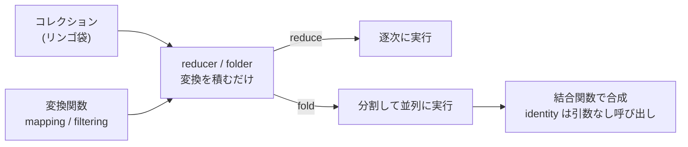
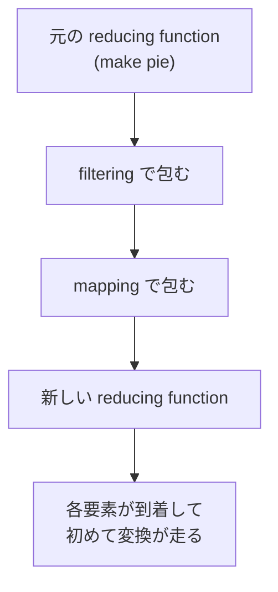

# Rich Hickey『Reducers』(QCon NY 2012) 解説

- **記録日:** 2026-10-08
- **位置づけ:** Clojure の並列コレクション処理ライブラリ「reducers」の設計思想を、初心者向けに日本語で整理した解説ドキュメント。
- **一次資料:** 書き起こし https://github.com/matthiasn/talk-transcripts/blob/master/Hickey_Rich/Reducers.md ／ 動画 http://www.infoq.com/presentations/Clojure-Reducers
- **注意:** 本書は書き起こし(コミュニティ作成・スライド画像は除去済み)を読んだ範囲の解説で、動画は視聴していない。コード片は書き起こしの文章説明から筆者が再構成した説明用の簡易スケッチであり、スライドそのものではない。

## 0. 先に結論(5行)

1. 動機は性能。クロック速度が頭打ちなので、速くするには複数コアで並列に動かす必要がある、と講演者は述べる。
2. 従来の `map`/`filter` は「順序」と「具体的なコレクションを作ること」に縛られており、並列化しにくい。
3. 解決策は、`map`/`filter` を「データを変換する関数」ではなく「**reducing function(畳み込み関数)を別の reducing function に変換するもの**」として定義し直すこと。
4. 変換は「レシピ」として積むだけで実行は後回し。最後に `reduce`(逐次)にも `fold`(並列の可能性あり)にも渡せる。
5. 結果として、コレクションの表現・順序・操作(逐次/並列)が互いに独立になる。講演者は途中の割り当て(allocation)が無いので遅延シーケンスより速いと述べ、デモも行った(数値は書き起こしに出ず)。

## 1. 講演の基本情報

| 項目 | 内容 |
|---|---|
| 題名 | Reducers |
| 登壇者 | Rich Hickey(Clojure の作者) |
| 会議 | QCon NY 2012(書き起こしの表記) |
| 時期 | 2012年6月 |
| 長さ | 不明(書き起こしに記載なし) |
| 性格 | 技術講演。ライブラリの設計思想の解説＋短いデモ。開始時に、別の講演者の代役だったと本人が述べている |

## 2. 背景(なぜこの講演か)

- 講演者は、昔は「18か月待てば新しいコンピュータでプログラムが速くなった」が、もう成り立たないと述べる。コア数は増えるが、逐次(順番に1つずつ進む)プログラムは速くならない。
- 将来も使われたい言語には、この問題への答えが必要だと主張している。
- 目標は、**今のコレクション処理にできるだけ似た書き味**のまま並列化の恩恵を得ること。
- 着想源として2つが挙げられる。(1) Haskell の Iteratee/Enumerator(畳み込み操作を「物」として扱った仕事)、(2) 2009年の並列処理に関する講演(Iterator や fold left/right は本質的に逐次なので脱却すべし、という批判だったと講演者は紹介)。内容は講演者による紹介で、筆者は未確認。
- 対象は Clojure だが、高階関数(関数を引数に取る関数)とコレクションがある言語なら考え方は通用する、と冒頭で述べている。

## 3. 講演の中身(流れ順)

### 3.1 従来モデルの何が問題か

- Lisp 由来の「リスト＋再帰」は先頭から1つずつ処理するので本質的に逐次。命令的にアキュムレータ(累積変数)を書き換えても、関数的に結果を連ねても、逐次であることは変わらないと述べる。
- 古典的な `map` の定義は「先頭要素に関数を適用した結果を、残りを `map` した結果にくっつける」というもの。講演者はこれが**入力側**では `first`/`rest`(順序に敏感な操作)に頼り、**出力側**では連結リスト(cons セル)を実際に作る、と指摘する。Clojure では遅延(lazy、必要になるまで計算しない)でもあり、これも「先頭から」という順序を前提にする。つまり「やりすぎ・約束しすぎ」だという。

### 3.2 reduce と reducing function

- `reduce`(他言語の fold left)は「初期値と最初の要素に関数を適用 → その途中結果と次の要素に適用 …」と進み、**全体で1つの答え**を作る。例: `+` と初期値 0 で合計。
- Clojure の `reduce` は、シーケンスという抽象ではなく**プロトコル**(protocol。後から外付けで機能を足せる多態性の仕組み。型クラスに近い)で定義されている。コレクション自身が「自分をどう reduce するか」を知っているので、コレクションの構造から独立できる。ただし順序依存は残る。
- **reducing function** は2引数の関数で、第1引数が「ここまでの結果」、第2引数が「次の入力」という意味づけがある。`+` は引数の入れ替えが効くが、`reduce` はこの意味づけで使う。講演者は、以降の話全体がこの関数の加工に基づくと強調する。

### 3.3 核心のアイデア: reducing function を変換する

- `map`/`filter` は本来、順序を気にしていない。たまたま順序が入り込んだだけ。そこで `reduce` 上に作り直し、順序の約束は一旦無視する。
- 問題は「何を返すか」。答えは**具体的なコレクションを作らない**こと。
- 講演者は「パイ職人と助手」の例え話を使う。リンゴ袋(コレクション)のシールを剥がす(= map)、傷んだものを除く(= filter)。怠け者の助手は、先に別の袋へ詰め替えず、パイを作る段になって1個ずつシールを剥がして渡す。つまり map/filter は「パイの作り方(reducing function)を変える」ことで実現できる。

コードのイメージ(筆者による説明用の再構成。書き起こしは文章説明のみ):

```clojure
(defn mapping [f]
  (fn [rf]                       ; rf = 元の reducing function(例: パイを作る)
    (fn [result input]           ; 結果と新しい入力を受け取る新しい関数
      (rf result (f input)))))   ; 入力に f を適用してから rf に渡す
```

- 1行目: `mapping` は変換関数 `f`(例: シール剥がし)を受け取る。
- 2行目: 返すのは「reducing function を受け取る関数」。
- 3〜4行目: 新しい reducing function。入力を `f` で変えてから元の関数に渡す。ここに**コレクションは登場しない**、と講演者は強調する。

- **filter** も同様: 述語(predicate)が真なら元の関数を呼び、偽なら「ここまでの結果」をそのまま返す。講演者は、空のコレクションを作って返したりしない点を重視する。
- **mapcat/flatmap**(各要素がコレクションを返し、中身だけ平らに並べる):分割したリンゴ(スライス)を、小袋に包まず1枚ずつ元の関数に渡す。つまり結果に複数回作用する。
- 3種(1対1、減らす、増やす)を一つの考え方で扱える。マクロで定型部分が消えれば、書く必要があるのは「本質の部分」だけ。講演者は、並列ライブラリを選ぶ際にも「自分の操作を書くとき本質部分だけ書けるか」を問えと言う。

### 3.4 「コレクション→コレクション」の形に戻す

- このままでは「map して sum」が `reduce` に変換済み関数を渡す形になり、使いにくい(逆順で書く感じ)。
- そこで「コレクション」の定義を最小にする。**「reduce できるもの」(reduce プロトコルを実装したもの)ならコレクション**とみなす。
- `reify`(その場でプロトコルの実装を作る Clojure の機能。匿名内部クラスに近い)で、「元のコレクション＋変換関数」から「reduce できる論理的なコレクション」を作る `reducer` を**一度だけ**定義する。そのコレクションを reduce されると、元のコレクションに「変換済みの reducing function」で reduce を頼む。
- これを使い、`map`/`filter`/`mapcat` を従来どおり「関数＋コレクション」の呼び出し形で書き直せる(衝突回避に rmap などと呼んだと講演者は述べる)。使う側は `(reduce + 0 (map inc coll))` のように今までと同じ見た目で書ける。

### 3.5 逐次のままでも速い、という主張

- この `reduce` は内部では逐次だが、遅延ではなく、ステップごとの割り当てもない。講演者は、そのため Clojure の遅延シーケンスより速いと述べる。
- 重要なのは、map/filter の側に逐次を前提にした部分が何もないこと。だから別の文脈で再利用できる。

### 3.6 fold: 並列になりうる reduce

- **fold** は「並列に動くかもしれない」reduce の抽象。講演者は、`reduce` は fold left の一種で、fold はより一般的と説明する。
- 並列になりうる以上、関数は**結合的(associative、計算のグループ分けを変えても結果が同じ)**である必要がある。
- 並列化が得でない場合(小さすぎる、単方向連結リストのように分割しにくい)は、並列にならず通常の reduce に戻ってよい。
- 実装は Java の fork/join フレームワーク(仕事を分割し、work stealing で空いたスレッドが他の仕事を奪う仕組み)を使う。
- 動作: (1)コレクションを断片に分ける(実際にコピーはせず、窓のように扱う)、(2)各断片で独立に reduce を並列実行、(3)結果を**結合関数(combining function)**で二つずつ合成。結合関数を省略すると reducing function がそのまま結合関数になる(`+` ならその例)。
- 講演者は、理論上の fork/join は要素1個まで二分するが、実用では途中で止め、底の部分は断片に対する `reduce` で処理する、と述べる。底で `map` を使う設計は、空コレクションや小袋が大量にできて結合側の仕事が増えるので良くない、と主張する。

### 3.7 初期値と identity(モノイド)

- fold には全体の初期値が無く、各断片が自分の初期値を必要とする。それは**結合関数を引数なしで呼んだ戻り値**として得る。
- この値は **identity(単位元)**:足し算なら 0、掛け算なら 1。結合しても相手を変えない「何もしない値」。filter で全部除かれた断片でも、この値が素通しされる。
- 「結合的な二項演算＋単位元」を数学ではモノイド(monoid)と呼ぶが、講演者は「そう呼びたければどうぞ、意味はこれだけ」という立場。
- 単位元を値ではなく**関数呼び出しで得る**ため、可変(mutable)な ArrayList を断片ごとに別々に作れる。内部で可変データを使ってもよいが、断片間で共有してはいけない、と述べる。

### 3.8 reducer と folder、直交性

- 変換が順序に依存しない(map, filter)なら、reducer は fold にも使える。そのための `folder` が reducer と同様に定義され、ライブラリの map/filter はこちらで定義されている。
- 講演者は、(1)コレクション表現、(2)順序、(3)操作(reduce か fold か)、(4)変換 が**互いに独立**になったと主張。「並列 map」も「並列コレクション」も要らず、分解して好きな時に組み直せばよい、とする。
- 変換はコレクションを渡さない形(カリー化)で合成でき、「レシピ」は第一級(値として扱える)。あとで任意のコレクションに適用できる。

### 3.9 map/reduce 方式との比較とデモ

- 並列 filter が各所で空コレクションを返すような方式(「map して reduce」型)と対比し、reducers はそれをしない点が決定的な違いだと講演者は述べる。高度なコンパイラ最適化(stream fusion 等)に頼らなくて済む、とも。
- デモは3段階: (1)通常の遅延シーケンスで filter→map→sum、(2)reducer 版 filter/map＋通常の reduce(割り当て削減で高速)、(3)reduce を fold に替えるだけ。fold が並列化できないときは reduce に戻る。書き起こしには**具体的な時間の数値が出ていない**ので、速度差の大きさは不明。





## 4. 用語集

| 用語 | 意味 |
|---|---|
| reduce (fold left) | 初期値と要素を順に関数へ適用し、1つの答えにまとめる操作 |
| reducing function | 「結果」と「次の入力」を受け取り新しい結果を返す2引数関数 |
| 高階関数 | 関数を引数や戻り値にする関数 |
| 遅延 (lazy) | 必要になるまで計算しない評価方式 |
| プロトコル (protocol) | Clojure の、後付けで型に機能を足せる多態性の仕組み |
| reify | その場で protocol の実装オブジェクトを作る機能 |
| reducer | 「元コレクション＋変換」から作る、reduce できる論理コレクション |
| folder | reducer の拡張で fold にも対応するもの |
| fold | 並列に動く可能性のある reduce |
| combining function | 断片ごとの結果を2つずつ合成する関数 |
| associative (結合的) | 括弧の付け方を変えても結果が同じ性質 |
| identity (単位元) | 合成しても相手を変えない値(足し算の 0 など) |
| monoid (モノイド) | 結合的な二項演算＋単位元の組 |
| fork/join | 仕事を分割して並列実行し合成する Java のフレームワーク。work stealing を持つ |
| mapcat / flatmap | 各要素を複数要素に展開して平らに並べる操作 |

## 5. 実務での使いどころ(筆者の提案)

※本節は書き起こしにない、筆者(本書の作成者)の提案。

- 大きな数値コレクションの「filter→map→集計」を、まず reducer 版に替えて割り当て削減の効果を測る。次に fold に替えて並列の効果を測る。
- fold を使う前に、集計関数が結合的で単位元(引数なし呼び出し)を持つか確認する。足し算・件数カウントは典型例。
- 内部で可変コレクションを使う高速化を狙う場合、断片ごとに新規生成する(共有しない)。
- 小さなデータや連結リストでは並列化の利益が出にくいので、計測してから判断する。
- 他言語でも、「変換を reducing function の加工として表す」発想は応用できる(講演者も言語横断だと述べている)。

## 6. 考察:強みと限界(考察(筆者の見立て))

※以下は事実ではなく筆者の見立て。

**強み**
- 「何を変換するか」と「どう実行するか」を分離する設計は、新しい操作を足す負担を下げそう。
- 呼び出しの見た目が従来と同じなので、導入の心理的ハードルが低い。

**限界・批判的視点**
- 講演者の速度の主張は、書き起こしからは具体的数値・条件が分からず、筆者は未検証。実際の効果はデータ量・マシンで変わるはず。
- reducer は遅延でないため、「先頭だけ必要」「無限列」といった遅延の用途には向かないと考えられる(`take` のように順序に依存する操作は fold に向かない、という講演者の指摘とも整合)。
- 結合律や単位元を満たさない関数を fold に渡すと誤った結果になりうる。利用者側の責任が増える。
- 例え話は直感的だが、実際のコード(スライド)が書き起こしに無いため、細部の理解は動画やライブラリのソースで補う必要がある。
- 「並列 map/並列コレクションは不要」というのは講演者の立場で、他方式(並列コレクション等)との優劣は本書では評価していない。

## 7. 確認範囲と限界

- 確認したのは書き起こし全文(56段落)。動画は未視聴。
- スライド画像が除去されているため、コード部分は文章説明から再構成した。講演者が示した実際のコードとは異なる可能性がある。
- 引用された外部の話(Haskell Iteratee の論文、2009年の講演の内容)は講演者の主張・紹介であり、筆者は**未確認**。
- 性能の優劣は講演者の主張として記載し、数値は確認できていない。
- 講演時点(2012年)の内容。その後のバージョンでの変化は調べていない。

## 8. 参考リンク

- 書き起こし: https://github.com/matthiasn/talk-transcripts/blob/master/Hickey_Rich/Reducers.md
- 動画(InfoQ): http://www.infoq.com/presentations/Clojure-Reducers
- 会議ページ: https://qconnewyork.com/2012/
