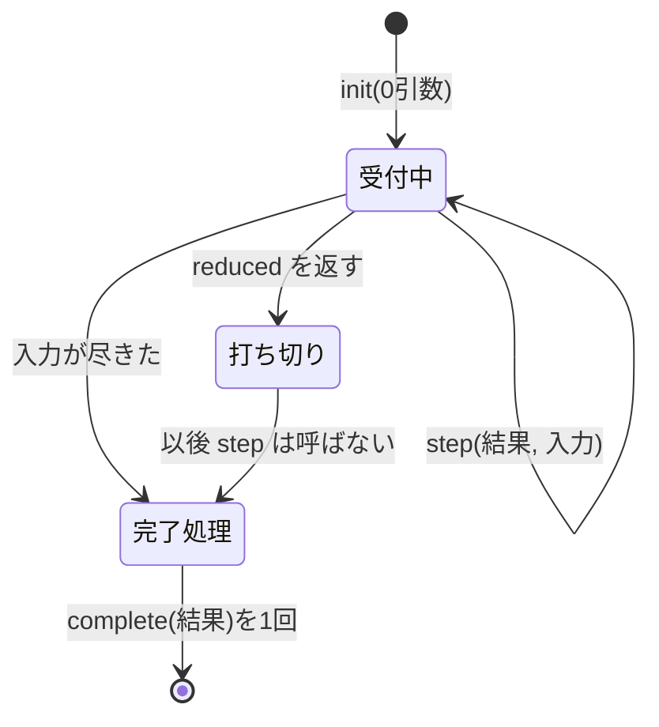

# Rich Hickey『Transducers』(Strange Loop 2014) 解説

- **記録日:** 2026-10-08
- **位置づけ:** 講演の書き起こしを全文読んで作った、初心者向けの日本語解説。講演の主張と筆者の考察は分けて書く。
- **一次資料:** 書き起こし https://github.com/matthiasn/talk-transcripts/blob/master/Hickey_Rich/Transducers.md / 動画 https://www.youtube.com/watch?v=6mTbuzafcII

> 注意: 書き起こしはコミュニティ作成で、スライド画像は除かれている。コードは書き起こしに載っていないので、本稿ではスライドの内容を文章から読み取れる範囲で説明する。**「筆者の補足」と書いた箇所は講演の主張ではない。**

---

## 0. 先に結論(5行)

1. Transducers(トランスデューサ)は、`map` や `filter` の「本質」だけを取り出して、どこでも再利用できるようにする考え方である。
2. 本質とは「入力を1つ受け取るたびに行う小さな処理(ステップ)」。これを「プロセスの変換」として書き直す。
3. 一度作った変換は、コレクション・遅延シーケンス・チャネル(非同期の通り道)など、まったく違う場面にそのまま使える。
4. 中間コレクションを作らず、関数呼び出しの積み重ねだけで動く。途中終了・完了(後片付け)・状態保持にも決まりごとがある。
5. 講演者はこれを「新しい発明ではなく、既存の部品の組み替え」と位置づけている。

## 1. 講演の基本情報

| 項目 | 内容 |
|---|---|
| 題名 | Transducers |
| 登壇者 | Rich Hickey(Clojure の作者) |
| 会議 | Strange Loop 2014 |
| 時期 | 2014年9月 |
| 長さ | 約2700秒(約45分、メタ情報より) |
| 再生回数(目安) | 約115,400回(**取得時点の目安**であり、現在は変動する) |
| 性格 | 技術講演。設計思想と、実装上のルール(契約)の解説 |

## 2. 背景(なぜこの講演か)

- 講演者の問題意識は、`map` や `filter` が「コレクション」「ストリーム」「observable(イベントの流れ)」「チャネル」ごとに何度も作り直されていること。共有も再利用もできていない、という指摘である。
- Clojure でもチャネルに対して `map` や `filter` を書き始めていた、と語られている。それが「立ち止まって考え直す」きっかけになった。
- 書き起こしの範囲では、**Reducers の講演との関係は語られていない**。そのため本稿でも関係には触れない。
- 論文として、R. S. Bird の「Lectures on constructive functional programming」と Graham Hutton の「A tutorial on the universality of fold」が参考として挙げられる(講演者の紹介。内容は筆者は**未確認**)。

## 3. 講演の中身(流れ順)

### 3.1 発想:`map`/`filter` の本質を取り出す

- 「新しさはない」と最初に断っている。冒頭では料理のたとえで、既存の材料の並べ替えだと言う。
- 対象は「ステップの連続としてモデル化できるプロセス」。各ステップは入力を1つ取り込んで進む。
- コレクションを作ることは、その一例にすぎない。一般形は「初期値つきの左 reduce」である。ただし目的は特定のものを作ることではなく、プロセスそのもの。終わらないプロセス(無限に動くもの)も含む。

### 3.2 命名:reduce / ingest / transduce

- reduce は「元へ導き戻す」、transduce は「横切って導く」という語源の説明がある。reduce の最中に、入力を一連の変換に通す、という意味である。

### 3.3 手荷物のたとえ(講演全体の軸)

- 指示は「手荷物を飛行機に載せる。その間に、パレットをばらす→食べ物の匂いがするものは除く→重いものにラベルを貼る」。
- 荷物係は、運搬がトロリーかベルトコンベアかを気にしない。**指示は運び方に依存しない**のが現実の世界だ、と講演者は述べる。
- プログラミングでは、この3工程が mapcat・filter・map に当たる。ここまでは分かりやすい。

### 3.4 従来のやり方の問題

- `map` などは「集まり→集まり」の関数なので、規則がその型に縛られる。チャネルや observable には使えない。
- 途中経過がたくさん生まれる。例えると、各工程のたびに荷物をトロリーから降ろして、次のトロリーに載せ直すようなもの。賢い管理者(コンパイラ)がいつか何とかしてくれる、という期待に頼っている状態。
- 再利用がなく、新しい種類の流れのたびに関数群が増える(rx の例で「100個の関数」と言及)。
- 講演者は「全体の仕事」ではなく「ステップ」に関する指示にすれば、全体の仕事はそこから作れるが、逆はできない、と述べる。

### 3.5 使い方の先出し

- `mapcatting`(パレットをばらす)・`filtering`・`mapping` を `comp`(関数合成)で合成し、`process-bags` という変換を作る。それ自体も transducer である。
- 同じ `process-bags` を、次の複数の場面に使える。
  - `into`: 変換しながらコレクションに流し込む。
  - `sequence`: 変換結果を遅延シーケンスで得る。
  - `transduce`: reduce に似た関数。変換・演算・初期値・入力元を渡す。例では重さを合計する。
  - チャネル: 作成時に transducer を渡すと、流れてくるものすべてに適用される。
- 講演者は、これは「パラメータ化」ではなく、**具体的なものをそのまま再利用**することだと強調する。
- 将来 RxJava の関数の半分は不要になるかもしれない、と構想として述べる(実装はされていない)。
- into・sequence・transduce・chan を「transducible process(transducer を受け入れるプロセス)」と呼ぶ。transducer を作る側と、受け入れる側が、直交した2つの部品になる。

### 3.6 fold との関係

- 講演者によれば、リスト処理は fold(畳み込み)で書き直せ、規則性を持たせて推論しやすくなる。再帰の構造が fold に隠れるから、というのが理由である。
- `map` と `filter` を fold で書くと、枠組み(fold・空リスト・対象コレクション)は同一で、中身の小さな関数だけが違う。
- 右 fold は遅延の道、左 fold(左 reduce)はループの道。対象の用途には後者が速く一般的、遅延は後から得られる、と説明する。

### 3.7 `conj` が漏れている:transducer への書き換え

- 左 reduce で書いた `map`・`filter`・`mapcat` の中には、結果への追加操作 `conj`(コレクションに要素を足す関数)が入り込んでいる。これは「トロリーに載せる」という外側の仕事が、一般的な考えの真ん中に漏れている状態だと講演者は言う。
- 内側の関数はどれも「これまでの結果と新入力を受け取り、次の結果を返す」形(reducing function)。
- そこで `conj` を引数(step)に置き換える。`mapping f` は「step を受け取り、まず入力に f を適用してから step を呼ぶ新しい step を返す関数」になる。
- `filtering` は述語で step を呼ぶかどうかを決める。`cat` は step を入力の各要素に対して複数回呼ぶ。`mapcatting` は map と cat の合成。
- 従来の `map` などは、`mapping` に `conj` を渡す形で作り直せる。これで本質を「アラカルト」で使える。

> **筆者の補足(講演のコードではない・説明用):** 考え方を擬似コードで示すと次のとおり。
> ```clojure
> (defn mapping [f]            ; f を受け取り
>   (fn [step]                 ; step を受け取り
>     (fn [acc x]              ; 新しい step を返す
>       (step acc (f x)))))    ; f を適用してから step を呼ぶ
> ```
> 1行目: 「何を変換するか」を受け取る。2行目: 「結果をどうするか」(conj など)は後で受け取る。3〜4行目: 入力 `x` を加工して step に渡す。

### 3.8 transducer のルール

- transducer は何のプロセスを変えているか知らない。step を「呼ばない・1回呼ぶ・複数回呼ぶ」ことしかできない。入力には触れられる。
- 守るべき決まり: step が返した結果は、必ず次の step 呼び出しの第1引数に渡す。第2引数(入力)は加工してよい。

### 3.9 「逆順」に見える件

- `comp` は通常どおり右から左へ変換を組み立てる。しかし結果として出来る step は、書いた順(左から右)に処理を行う。例ではパレットをばらす→食べ物除外→ラベル貼り、の順である。
- よって `comp` が壊れたのではなく、step を包む構造のせいで逆に見えるだけ、と講演者は説明する。


### 3.10 効率と型の話

- 中間コレクションも遅延もなく、関数呼び出しの積み重ねで済む。インライン化の可能性もある。「何もない」と「1個だけ入ったリスト」は別物で、余計な箱詰めも要らない。
- 型については、Haskell 界隈で型付けが議論された、と講演者は述べる。「うまくいく」から「型が辛い」まで様々な結果を見たという。
- 難所として2つ挙げる。(a) step の結果は「直前の結果」でなければならず、`R→R` だけでは表せない。(b) 入出力の型が同じとは限らない(X→Y→Z→X と返す状態機械も正当な reducing function)。この話は酒場の課題にしよう、と冗談を交えている。

### 3.11 早期終了(early termination)

- 無限に流れるものや、途中でやめたい場合のために、処理を打ち切る仕組みが要る。例は「時を刻む(時限爆弾らしき)荷物が来たら作業終了」の `taking-while`。
- Clojure の `reduce` に既にある `reduced`(「もう入力は要らない。ここまでの結果です」と包む)を使う。`reduced?` で確認、deref で中身を取り出す。
- Maybe や Either のように通常値まで包むことはせず、**打ち切りのときだけ**包む。
- ルール: step が reduced を返したら、transducer や処理側は二度と step を呼んではいけない。処理側も reduced を尊重する。

### 3.12 状態を持つ transducer

- `take`・`partition-all`・`partition-by` などは状態が必要。遅延や再帰の枠を隠した以上、状態は明示的に transducer が自分で作る。
- ルール: step を変換する(適用する)たびに、新しい状態を作る。組み立て時(`comp` 時点)には状態は存在しない。適用後のスタックは状態を持つものとして扱い、別名で共有(エイリアス)しない。
- 実際は、transducible process 側が適用を行うので、利用者が直接適用することは基本ない。ただしこれは**慣習**による、と講演者は認めている。
- 例として `dropping-while`(述語が真の間は捨て、偽になったらフラグを倒す)を挙げる。「きれいではない」と本人も言う。

### 3.13 完了(completion)と初期化(init)

- 有限の入力が終わったときの後片付けが「完了」。`partition 5` が3個余っていたら、最後に吐き出すためである。
- そのため step 関数には、入力なしの1引数版(蓄積値だけを受け取る)が必須。処理は終了時にこれを**ちょうど1回**呼ぶ。transducer も内側の完了を呼ぶ。その前に溜めた分を流す(flush)ことができる。
- ただし reduced を一度でも見ていたら、溜めた分は捨てる(入力を渡してはいけないため)。
- 3つ目の操作が init(引数0個版)。何もない所から初期値を作れる。transducer は中身が見えないので、内側の init に素通しで渡すだけ。Lisp の `+` が引数なしで 0、`*` が 1 を返す例を挙げる。
- Clojure では「引数の個数(arity)の違い」で3操作を1関数に持たせる。`map` にコレクションを渡さずに呼ぶと transducer が返る。これは「`mapping`」のような別名を避けるための選択である。
- `filter` の transducer 版では init と complete は素通し、1つの入力を扱う版だけが仕事をする。コレクション版は、この transducer を `sequence` に渡して作れる。つまり **transducer の方が基本的な部品**だと講演者は言う。



### 3.14 締めくくり

- 一度変換を定義すれば、新しい文脈(チャネル、次は observable)は transducer を受け入れるだけで、既存の変換をすべて無料で利用できる。逆に、他人が作った変換の組み合わせも、すぐ使える。
- Perlis の格言「1つのデータ構造に100個の関数」を引いて、「データ構造すら要らない100個の関数」を狙う、という言い方をする。
- まとめ: 文脈に依存せず、具体的に再利用でき、早期終了と完了に対応し、合成でき、効率が良い。

## 4. 用語集

| 用語 | 意味 |
|---|---|
| transducer(トランスデューサ) | step 関数を受け取って、加工した新しい step 関数を返す関数 |
| reducing function / step | 「これまでの結果」と「新しい入力」から次の結果を返す関数 |
| reduce / fold | 要素を順に畳み込んで1つの結果にする処理(左・右がある) |
| mapcat | 各入力から複数の要素を作り、並べてつなぐ処理 |
| conj | コレクションに要素を足す Clojure の関数(conjoin) |
| comp | 関数合成 |
| transducible process | transducer を受け入れて、内部の step を変換する処理(into, sequence, transduce, chan) |
| reduced | 「打ち切り」を示す包み(wrapper) |
| completion / init | 終了時の後片付け(1引数版) / 初期値の生成(0引数版) |
| arity | 関数の引数の個数 |
| チャネル(chan) | 非同期にデータを流す通り道 |
| observable | イベントなどの流れを扱う抽象(Rx 系) |

## 5. 実務での使いどころ(筆者の提案)

- 複数の入れ物(配列・ストリーム・キュー)に同じ前処理(正規化→除外→変換)を使うなら、変換の部分だけを切り出すと見通しが良くなる。他言語でも「step を受け取って step を返す」形は真似できる。
- 大量データで中間コレクションを作りたくない場面で検討できる。
- 状態を持つ変換を自作する場合は、適用のたびに状態を作る原則を守る。使い回すと不具合になりやすい。
- 型付き言語に写すときは、3.10 の難所(結果の受け渡し順、入出力型の変化)を先に確認する。

## 6. 考察:強みと限界(筆者の見立て)

*以下は書き起こしの事実ではなく、筆者の見立て。*

- **強み:** 「全体の仕事」と「ステップ」を分ける発想は明快。手荷物のたとえで、概念が非常に分かりやすい。
- **限界・批判的視点:**
  - 「中間物がなく効率的」は講演者の主張で、具体的な性能数値は示されていない。実測は**未確認**。
  - ルール(結果の受け渡し、reduced 後に呼ばない、状態を共有しない)の多くは**慣習**で、言語が強制してくれない。誤用に気づきにくい。
  - 逆順に見える合成や、arity で3操作を表現する作りは、初学者には取っつきにくい。
  - 型付けは講演者自身が難しいと認めている。型の恩恵を重視する言語では導入コストが高い可能性がある。
  - RxJava との統合は構想の段階として述べられたもの。実現性は**未確認**。
  - 1ステップで済むような単純な変換なら、通常の `map` で十分な場合も多いと考えられる。

## 7. 確認範囲と限界

- 書き起こしの全57行を最後まで読んだ。ただしスライドのコードと図は含まれないので、図の内容は話された文章から推測できる範囲に限る。
- 引用された論文・格言・外部事情(Haskell 界隈の反応、RxJava など)は講演者の言及であり、**未確認**。
- 再生回数は取得時点の目安。
- コミュニティ作成の書き起こしのため、聞き取り違いの可能性がある。厳密な確認には動画を参照してほしい。
- 「筆者の補足」の擬似コードは説明用で、講演のスライドそのものではない。

## 8. 参考リンク

- 書き起こし: https://github.com/matthiasn/talk-transcripts/blob/master/Hickey_Rich/Transducers.md
- 動画: https://www.youtube.com/watch?v=6mTbuzafcII
- R. S. Bird, Lectures on constructive functional programming: http://www.cs.ox.ac.uk/files/3390/PRG69.pdf
- Graham Hutton, A tutorial on the universality of fold: http://www.cs.nott.ac.uk/~gmh/fold.pdf
- Alan Perlis の格言集: http://www.cs.yale.edu/homes/perlis-alan/quotes.html
