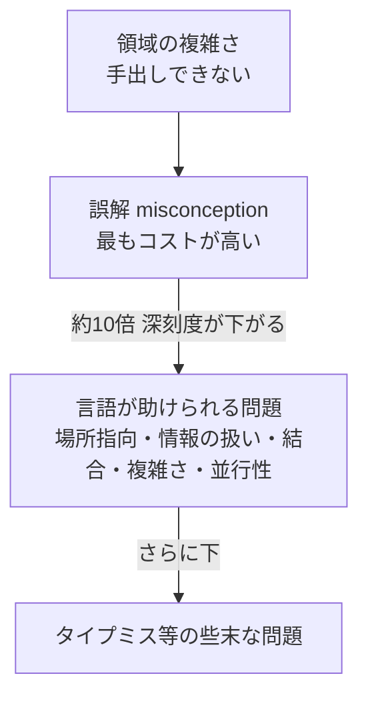
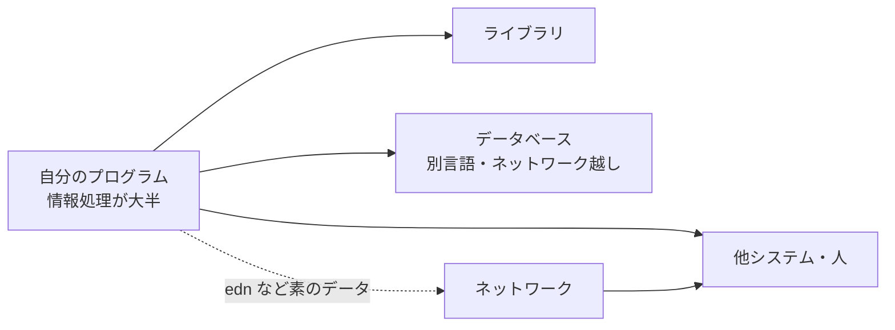

# Effective Programs ― 10 Years of Clojure（Rich Hickey, Clojure/Conj 2017）解説

- **記録日:** 2026-10-08
- **位置づけ:** Clojure（クロージャ。Lisp系のプログラミング言語）の公開10周年にあたる講演を、初心者向けに日本語で整理した解説ノート。Rich Hickey 本人の主張と、筆者（本ノート作成者）の考察を分けて書く。
- **一次資料:** 書き起こし https://github.com/matthiasn/talk-transcripts/blob/master/Hickey_Rich/EffectivePrograms.md ／ 動画 https://www.youtube.com/watch?v=2V1FtfBDsLU

> 注意: 書き起こしはコミュニティ作成で、一部に聞き取り不能の箇所（`?` 付き）や音声の欠落があります。本ノートは書き起こしのみを根拠にし、動画本体やスライドは確認していません。

---

## 0. 先に結論（5行）

1. Hickey は「プログラミングとは、コンピュータを現実世界で *effective*（意図した結果を出せる）にすること」と定義し、「正しさ（correctness）」が型検査を通ることの意味に偏る風潮に反対している。
2. Clojure の対象は、データベースや他システムと長期間つながって動く「状況に埋め込まれた（situated）プログラム」であり、コンパイラや定理証明器とは性格が違う、と述べる。
3. 設計の核は「不変（immutable）データを既定にする」「情報は汎用のマップ等で表す」「名前（キーワード）を第一級にする」「データをそのままネットワークに流す」の4点。
4. 静的型は保守性の面で利点より害（結合の増大・情報の硬直化）が大きい、というのが彼の経験則に基づく主張。検証は「à la carte（必要なものを必要なだけ選ぶ）」であるべきとする。
5. 今後は機械学習など「情報で動く部分」が増えるため、プログラムそのものが他のプログラムから扱える（programmable）言語が重要になる、と締めくくる。

---

## 1. 講演の基本情報

| 項目 | 内容 |
|---|---|
| 題名 | Effective Programs - 10 Years of Clojure |
| 登壇者 | Rich Hickey（Clojure の作者） |
| 場 | Clojure/Conj 2017（2017年10月開催の Clojure 年次カンファレンス） |
| 動画の長さ | 4491 秒（約74分51秒） |
| 再生数 | 175,856 回（取得時点の目安。増減する） |
| 動画の公開日（メタ情報） | 2017-10-12 |
| 書き起こしの分量 | 約6.9万文字（英語、メタ情報より） |

---

## 2. 背景（なぜこの講演か）

- Clojure の公開から10年。講演冒頭で Hickey は、公開当初は「100人が使えば途方もないこと」と思っていたと振り返る。
- そのため本講演は新技術の発表ではなく、**「Clojure は何の問題を解こうとし、何を意図的に入れなかったか」の振り返り**になっている。
- 彼は「言語の動機を最初から全部語れる人はいない。時間が経たないと何が起きたか分からない」とも述べ、後付けの整理であることを認めている。
- 経歴（本人の語り）: 2005年時点で18年の経験。放送局向けスケジューリング、イールドマネジメント（空席のように時間で価値が消える在庫の収益最大化）などを C++ 中心で作った。Common Lisp 版が本番で採用されず C++ で書き直した際、「4倍の時間、5倍のコード量、速くもならない」経験をしたという。
- 2年間の自主休暇で Clojure と音声認識研究に取り組み、完成の見通しが立つ Clojure を選んだ。のちに Datomic（データベース）も Clojure で作った。

---

## 3. 講演の中身（流れ順）

### 3.1 「opinionated（意見が強い）」という評判
- Hickey はこれを「強く支える書き方が少数あり、支援が厚い」と言い換える。設計は選択であり、**何を入れないかが大きな選択**で、講演はその話を含むと予告する。

### 3.2 「状況に埋め込まれたプログラム（situated programs）」
- 彼が書いてきたプログラムの共通点として挙げた特徴:
  - 長時間（多くは24時間365日）動き続ける。
  - 情報を消費し、記録して、時間とともに蓄積する記憶を持つ（データベースが固定入力ではなく、動くたびに増える）。
  - 現実世界の不規則さを扱う。例: 「同じ曲を続けて流さない」が目的のスケジューラに、ある曜日だけ同じアーティストの曲を2曲流す企画（"two for Tuesday"）が来る。
  - 他システム・人間と対話する。長く使われ、世界のルールも変わる。ライブラリ生態系の中にも位置づけられる。
- 対比として、**コンパイラや定理証明器はこの種ではない**と言う。入力を自分で決められ、不規則な例外を禁止でき、通常データベースも使わないからだ。

### 3.3 「effective」の定義と、プログラミングは何についてか
- effective ＝ 「意図した結果を出すこと」。「correct」が型検査に通ることと同義になりがちなことへの不満を述べる。ただし「動けば何でもよい」という意味ではないとも断る。
- 彼の定義: プログラミングは「コンピュータを現実世界で effective にすること」。人が effective なのは**経験から予測力を作る**からで、経験＝情報＝実際に起きた事実だと主張する。
- したがって、**効果は計算より「情報から予測力を生むこと」に由来する**。プログラミングは型の整合性を証明すること自体のためではない、と明言する（数学者の言葉を引いて、数学は数学自身についてであるべきだとも述べる）。
- ロジックも好きだが、実際のプログラムでは**情報処理が大半**を占め、言語がそれを不得意にするせいで必要以上に肥大している、という見方。

### 3.4 プログラムは「一つの言語の中」に収まらない
- 図の流れ: 自分のロジック → ライブラリ → データベース（別言語・ネットワーク越し）→ 他システム（さらに多くの通信規約）。
- DB との境界ではつい「相手を直したくなる」。これを**parochialism（偏狭さ：自分の言語・流儀の見方を世界に押しつけること）**と呼ぶ。
- 結論: 本当に解くべき問題はこの全体であり、しかもすべてが時間とともに変化する。**「時間をかけてこれをうまくやる」のが effective なプログラミング**。

### 3.5 プログラミングの問題を深刻度で並べる
- 彼の整理（自分の経験に基づく順位）:
  1. 領域そのものの複雑さ（手出しできない）。
  2. 誤解（misconception：世界の捉え違い）。ここを外すと以降すべて失敗し、コストが最も高い。
  3. 以降は約10倍深刻度が下がる階層で、言語が助けられる問題（後述）。
  4. さらに下に、タイプミスや型の取り違えといった些末な問題。
- Clojure が取り組んだのは中間層の一部。**資源利用（Java と同じ実行モデル）やライブラリ生態系は新しい解を出していない**と述べる。
- 根本の問いは「もっと単純な部品でプログラムを作れないか」。加えて、受け入れられる条件として JVM（Java 仮想マシン）上で「ただの Java ライブラリ」として使えることを重視した。
- 彼が**問題ではないと考えたもの**: 括弧（後で核心的価値だと述べる）と動的型付け。「コンパイルが通れば動く」は大きな問題の役には立たなかった、と語る。

### 3.6 問題1: 場所指向プログラミング（place-oriented programming）と並行性
- 「場所指向」＝ 変数やオブジェクトという"場所"に値を上書きしていく流儀。彼は**自分で招いた第一の問題**と呼び、特にマルチスレッドで正しく書くのは C++ で極めて難しかったと言う。
- 対策は、関数型プログラミングと不変データを既定にすること。課題は「速さ」で、目標は読み取り2倍以内・書き込み4倍以内。調べたのが永続データ構造（persistent data structure：更新しても旧版が残る構造）で、Bagwell の構造を永続化できると気づいて目標を満たした、と述べる（書籍・論文の内容は**未確認**）。
- 関数型コミュニティの多くが「関数型＝静的型付き関数型」と見ていたことには同意せず、価値の大半は型の側ではなく不変性側にあり「99対1」くらいだと主張する。
- 並行性の残りは、状態遷移を扱う言語機構（彼が別講演で述べた「epochal time model」）で扱う、としている。

### 3.7 問題2: 情報の扱い ― 静的型付き言語は情報に向かない（と彼は主張）
- 情報の性質（彼の整理）: **疎**（世界は全項目を埋めてくれない）、**開放的**（何を知りうるかに上限がない）、**蓄積する**（時間とともに増える）、**名前で扱う**（"47"だけでは伝わらない）。
- 問題点: クラスや型で包むと、**入れ物（aggregate）が意味を決めてしまう**。フォームに書いた内容の意味は、そのフォームの種類で決まるわけではないはずだ、というたとえを使う。
- 位置で意味が決まる積型や、コンパイル後に消える名前では情報を合成できず、小さな情報ごとに型が増えて組み合わせられない、と述べる。
- 用語の主張: リレーショナル代数・Datalog・RDF は**データ抽象**だが、Person クラスなどは単なる**concretion（具体化物）**だと位置づける。
- Clojure の答えは「とにかくマップを使う」。マップ同士を merge で合成でき、`select-keys` で部分集合を取れ、キーワードは関数としてマップを引ける（名前が第一級）、と述べる。
- 意味は入れ物ではなく**属性（namespace 付きキー）に結びつける**のがよいとし、spec（Clojure のデータ仕様記述ライブラリ）もその発想に沿うとする。

### 3.8 問題3: 脆さと結合（coupling）、位置による意味付けの限界
- 静的型は経験上、結合を強めると言う。構造のパターンマッチが100か所に散らばること自体が結合だ、という論旨。
- **位置（positional）による意味付けは規模に耐えない**: 引数17個の関数、積型、型パラメータが7個もあるジェネリクスなど。病院の問診票の「42行目に書け」方式のたとえを使い、ラベルを隣に置くのが人間のやり方だと言う。
- 結論として「型はプログラムの保守・拡張に対するアンチパターン」とまで言い切る（強い表現であり、**彼の経験に基づく意見**である点に注意）。
- Clojure の対応: 動的型付け、マルチメソッドやプロトコルによる実行時多態性、開いたマップ。**知らない情報は単に入れない**（"Maybe" で包まない）。余分なキーは素通しで構わない。

### 3.9 言語規模・実行モデル
- Clojure は小さい言語（「関数があり、値があり、適用する」。継承やパラメータ化はない）。実行モデルは JVM を採用し、性能と既存の Java ツールを活かせる点を利点に挙げる。

### 3.10 parochialism（偏狭さ）と RDF、名前空間
- どの言語も「こう考えるべき」という見方（代数的データ型、継承…）を持ち、それが他の言語・DB・ネットワークと噛み合わなくなる。
- 例（本人の語る一般論）: 会社合併後、同じ人が別DBの別テーブルに入り同じ郵便が2通届く。同じ情報だと誰も知らないのが原因で、RDF（主語・述語・目的語の三つ組で事実を表す規格）DBを仲介に置く企業もある、と述べる（統計は示されていない）。
- 型が精緻なほど偏狭になり、汎用の操作やネットワーク伝送に向かなくなる、と主張。対策が**namespace 付きキー**（逆ドメイン名形式を使えば Java の名前とも衝突しない）で、RDF が URI を名前に使う発想と近い。
- キーワードは関数で、Clojure を知らない利用者でもテキストに書いて使える、と述べる。

### 3.11 分散とデータ
- 「リモートオブジェクト技術は失敗した。インターネットは素のデータを線で送るもの」と述べる。内部をすべて**データ構造の受け渡し**で書いておけば、後で「半分をネットワーク越しに」という要求が来ても edn（extensible data notation：Clojure のデータ記法）を送れば済む、という論旨。

### 3.12 Lisp から受け継いだもの・直したもの
- 受け継いだ点: 動的、小さい、第一級の名前、実行時に中身を見られる、コードがデータ。Smalltalk や Common Lisp は「アプリを作る人が作った言語」と評価し、JVM も動的志向だと述べる。
- REPL（Read-Eval-Print Loop：対話実行環境）は「試せる」だけでなく、**read/print が豊かなデータ構造と組み合わさって「無料の通信プロトコル」になる**点が重要だと言う。
- 直した点: 具体的データ構造が先で抽象が後付け、不変性が芯にない、リストが基本構造として貧弱。ゆえに Common Lisp 上のライブラリでなく新言語にした。
- 「edn データモデルは Clojure の心臓」で、他言語にもある map・vector 等の共通語（lingua franca）になりうると述べる。leverage（再利用力）の話は時間切れで割愛した。

### 3.13 型の利点への反論
- 静的型の著名な論者が挙げた「型の利点」の整理（誤りの不在の保証、部分的な機械検証済み仕様、設計言語、IntelliSense 等の対話支援、保守性）を引き、最大の利点とされる**保守性に反対**する。
- 論拠: 最大の誤りは型では拾えずテストが要る。`list a → list a` の型は `reverse` という名前が無ければ何も教えない。500か所のパターンマッチ修正は型が作った問題、とする。
- IntelliSense と性能最適化への寄与は認める。
- 検証は**à la carte（必要に応じて選択）**であるべきで、言語に組み込むべきでない。言語内の話にとどまらず、システム全体（例: 通信プロトコルを spec で記述）に向けるほうが費用対効果が高い。
- 型システムは若いころパズルとして楽しいが、「パズルではなく問題を解け」という趣旨。

### 3.14 情報 vs ロジック ― 今後
- 車の運転や囲碁は人間も手順を説明できず、機械学習のように**情報で学習させる**方向に進んでいる。これは前述の「誤解」の層を狙う技術だと位置づける。
- ただしモデル自身はデータ収集も行動の実行もできない。その周辺を担うため、**他のプログラムから操作できる（programmable）言語**が重要になると主張する。現実世界の安全は「証明」でなく「経験」から来る、とも述べる。
- 結び: 「Clojure が違うことを受け入れよ」「ロジックは道具であって主人ではない」「言語だけでなくシステムレベルで設計せよ」「puzzles ではなく problems を解け」。

---

## 4. 用語集

| 用語 | 意味 |
|---|---|
| situated program | 現実世界・DB・他システムに結びついて長期間動くプログラム（講演での用語） |
| effective | 意図した結果を出すこと。講演では correct の代わりに重視 |
| place-oriented programming | 変数などの「場所」に値を上書きしていく方式 |
| parochialism | 自分の言語・流儀の見方に閉じてしまい、他と組み合わせにくくなること |
| concretion | 講演での造語的用法。抽象ではなく具体的な入れ物（クラス等） |
| namespace-qualified key | 名前空間付きのキー。意味が文脈に依存しない |
| edn | Clojure のデータ記法。JSON に近いが型が豊富 |
| RDF | 主語・述語・目的語の三つ組で事実を表すデータ形式 |

---

## 5. 実務での使いどころ（筆者の提案）

以下は講演の主張を踏まえた**筆者の提案**であり、講演者が述べた内容ではない。

- **連携設計**: 内部でも名前付き属性のデータを基本にし、キーは名前空間付きにする。
- **検証の段階導入**: 全体に型を求めず、API やメッセージの境界にスキーマ検証を置く。
- **前提**: 自チームの失敗要因（型の取り違えか仕様の誤解か）を先に測って手段を選ぶ。

---

## 6. 考察：強みと限界（考察（筆者の見立て））

以下は**事実と分けた筆者の見立て**。

**強み**
- 「正しさ」を型検査に狭めず有効性から問い直す視点は、誤解が最も高コストという整理と整合的。
- 情報を属性に結びつける考えは、データ統合やイベント設計で役立つ。

**限界・批判的な見方**
- 主張の多くは本人の経験談で、**定量的な根拠は講演内で示されていない**（書き起こしの範囲）。静的型の保守性に関する評価は、他の研究者・実務者と意見が分かれるはずだ。
- 型の議論は言い切りが強く、リファクタリングの安全網など型の価値への配慮は薄い。柔軟さとのトレードオフと見るのが妥当。
- マップ中心の設計は、キーの綴り誤りや必須項目の欠落を実行時まで見逃しやすい。その補完として spec があるが、導入の手間はかかる。
- 機械学習への言及は2017年時点の展望であり、その後の状況との照合は別途必要（本ノートでは未確認）。

---

## 7. 確認範囲と限界

- 確認したもの: 書き起こし全文。長い行は表示が切れたため、末尾を別途取得して確認した。
- 未確認: 動画本体、スライド、書き起こしの聞き取り誤りの有無。講演者が言及した外部の書籍・論文・他言語の事例・歴史的経緯（Bagwell の構造、型の利点の整理（引用元の講演）、RDF の企業統合事例、JVM の設計経緯、リモートオブジェクト技術の評価など）は**講演者の主張／引用であり、本ノートでは検証していない**。
- 再生数は取得時点の目安。
- 講演者の発言は要約であり、逐語ではない。ニュアンスは原典で確認してほしい。

---

## 8. 参考リンク

- 書き起こし: https://github.com/matthiasn/talk-transcripts/blob/master/Hickey_Rich/EffectivePrograms.md
- 動画: https://www.youtube.com/watch?v=2V1FtfBDsLU
- Clojure/Conj 2017: http://2017.clojure-conj.org
- Clojure 公式: https://clojure.org
- edn 仕様: https://github.com/edn-format/edn
