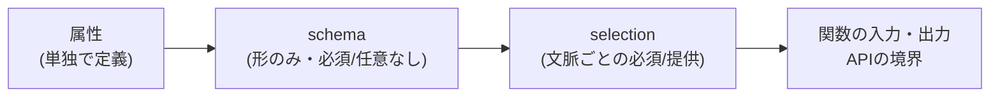
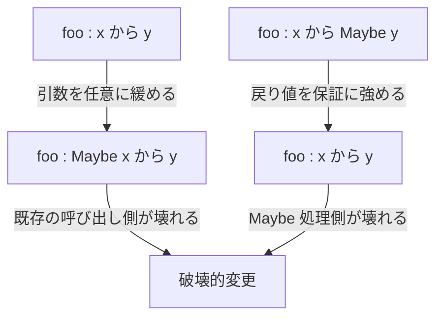

# Rich Hickey『Maybe Not』解説（Clojure/conj 2018）

- **記録日:** 2026-10-08
- **位置づけ:** 講演の書き起こしを精読して作った、初心者向けの日本語解説（要約であり全訳ではない）
- **一次資料:** 書き起こしURL https://github.com/matthiasn/talk-transcripts/blob/master/Hickey_Rich/MaybeNot.md ／ 動画URL https://www.youtube.com/watch?v=YR5WdGrpoug

## 0. 先に結論（5行）

1. 「あるかもしれないし、ないかもしれない」（任意・オプショナル）を型で表す Maybe 型は、引数や戻り値を後から変えると既存の呼び出し側を壊す、と講演者は指摘する。
2. Maybe / Either は型システムの本物の「または（union=和集合型）」ではなく、union 型が無いことの代用品だ、というのが講演者の主張。
3. 集合体（aggregate=一緒に運ばれる情報のまとまり）の定義に「任意」を埋め込むのは誤り。任意かどうかは使う場面（文脈）で決まるから。講演者は自分が作った spec の `:opt` も同じ誤りだと認めた。
4. 解決案は「形（schema）」と「その場で何が必須か（selection）」を分離すること。selection は木構造の深い所まで指定できる。
5. これは講演時点の構想で、構文は未定（"syntax TBD"）。

## 1. 講演の基本情報

| 項目 | 内容 |
|---|---|
| 題名 | Maybe Not |
| 登壇者 | Rich Hickey（Clojure 言語の作者） |
| イベント | Clojure/conj 2018（2018年11月） |
| 長さ | 約3808秒（約63分。メタ情報より） |
| 再生数 | 180,627回（取得時点の目安） |
| 主題 | 任意性（optionality）の表現と、Clojure spec の次の設計 |

## 2. 背景（なぜこの講演か）

- 講演者は冒頭で、言語設計者は他人の土台を作る仕事で、間違いを避けたいがそれでも起きる、と述べる。
- 出発点は Tony Hoare の有名な発言「null 参照の発明は10億ドルの失敗」。null（値が無いことを表す特別な値）は多くの言語で今も残る。
- 講演者の論点は、null の有無ではなく「情報が要らない／無い」という考え自体が今も必要で、それをどう表すかにある。
- spec（Clojure の仕様=spec を書く標準ライブラリ。データの形を宣言し、検証やテスト生成に使う）の次期設計を、ここで予告する場でもあった。

## 3. 講演の中身（流れ順）

### 3.1 任意性が現れる3つの場面
講演者は次の3つに分ける。
- **引数**（任意の入力）。Clojure は可変長引数やキーワード引数があるので、あまり困らない。
- **戻り値**（見つからなければ nil を返す等）。Clojure では nil を使うのが普通。
- **集合体の部分情報**。これが講演の中心。Clojure ではマップのキーを省き、nil を値に入れることはしない、と述べる。

### 3.2 Maybe 型は互換性を壊す
Maybe 型（Haskell では `Just a | Nothing`。値があるか無いかを包む型）は「チェックを強制できる」と宣伝される、と講演者は言う。しかしコストが語られない、と批判する。例は2つ。
- 引数を緩める変更（`x -> y` を `Maybe x -> y` へ）。要求を減らすだけなのに、既存の呼び出し側が壊れる。
- 戻り値を強める変更（`x -> Maybe y` を `x -> y` へ）。約束を強めるだけなのに、Maybe を処理していた呼び出し側が壊れる。

講演者の考えでは、要求の緩和と約束の強化は本来、互換な変更であるべきだ。

### 3.3 Maybe / Either は「または」ではない
- 講演者の主張では、Maybe と Either は union 型（A または B という和集合の型）の代用品で、利用者側で補っているだけ。補いきれない。
- Either は名前に反して、結合律・交換律・対称性を持たない（"left right thingy" と皮肉っている）。
- **反例として他の型システムを紹介:** Kotlin は `String`（null 不可）と `String?`（null 可）を区別する。Dotty（Scala の次世代）は `A | B` の union 型を計画しており、`A | B` と `B | A` は同じ型。講演者は型システム全般ではなく、Maybe と Either を批判していると明言する。
- Clojure では `spec/nilable` と `spec/or` が対応する。述語で定める集合の和集合なので、本物の「または」だという。

### 3.4 集合体：群れ（herd）の比喩
- aggregate の語源（ラテン語で「群れ」）から、「一緒に運ばれる情報」と捉える。
- **集合（set）対 枠（slot）:** Clojure のマップは「キーの集合」。レコードや積型（product type=フィールドを順に並べた型）は「場所」の並び。
- マップは宣言的に書ける数学的な関数で、`keys` や `vals` で中身を問い合わせられる、と講演者は評価する。
- レコード系は場所指向プログラミング（PLOP）で、名前付きでも名前自体が関数として使えない。場所には必ず何かを入れねばならず、null か「Maybe の羊」を入れる羽目になる。
- 一方、マップは「ない」ものはキーごと無い。マップは自分の知っていることだけを知っている。
- 反論として、レコードは可能なものを列挙するがマップは無制限、という指摘も紹介。答えが spec/keys。

### 3.5 属性は文脈を持たない
- spec では属性を単独で定義できる（例：`::make` は文字列）。講演者は RDF（意味を記述するデータモデル）流の考え方と述べる。
- そこから、「何かが本質的に Maybe 文字列である」ことはない、と主張する。名前は常に文字列で、「名前を知っているか」は別の概念。両者を型で一体にするのは誤り、という。
- 「Maybe の羊を6頭トラックに積んでいる」とは言わない、という比喩を使う。

### 3.6 集合体への任意の埋め込みは誤り
- Haskell の `model :: Maybe String` も、spec の `:opt [::model ::year]` も、「いつ」任意なのかを示さない。
- 引数や戻り値は「その関数を呼ぶ時」という文脈があるが、集合体の定義には無い。
- 講演者は spec でも同じ誤りを犯したと認め、「spec の完成は、これを解決した時」と語る。

### 3.7 欲しいもの
- スキーマ（schema=データの形の設計図）の再利用を最大化し、文脈ごとに似た定義が増える状況を避ける。
- 要求と応答が対称な API（一部記入した書式を渡し、より埋まったものが返る）。
- 情報を段階的に足すパイプライン（Ring のハンドラ連鎖など）。段ごとに別 spec を作ると爆発する。
- スキーマは入れ子で木になる。ルートにだけ任意の注釈を付けても、深い所は指定できない。

### 3.8 解決案：schema と selection の分離
- **schema:** 形だけを定める（必須かどうかは言わない）。
- **selection:** ある文脈で、何を必須とするか／提供するかを選ぶ。
- 構想中の例（疑似コード。構文は未定）:

```clojure
(s/select ::user [::id ::addr {::addr [::zip]}])
```
意味：「user から id と addr が必須。addr の中では zip が必須」。映画の上映時間を引く関数は id と郵便番号だけ、注文関数は氏名と住所全体、のように使い分ける。
- 「その属性が必須」と「その属性の中身の要件」は別の話で、分けて書く。コレクションの各要素にも要件を指定できる予定。
- 要件なしの `(s/select ::user)` も許される。意図の伝達とテスト生成に役立つ。
- spec は開いたシステムで、これは最小要件。余分なデータが流れても構わない（「ヘリコプターが来ても、次に渡せばいい」という比喩）。
- selection は利用の境界（エッジ）で使うもので、入れ子の selection は禁止する方向、と語る。

### 3.9 今後の予定
- schema/select が `keys` を置き換える見込み。移行期は名前が併存し得る。
- spec をプログラムで操作しやすくする仕組み（alpha2 のマクロ定義の仕組み）。
- 関数 spec の見直し。`reverse` の「A のリストを受けて A のリストを返す」という型表現は情報が乏しい。戻り値は引数に依存して述べるべきで、そうすれば型パラメータ（総称型）は不要になる、という見方。
- 全部を spec で書き切る必要はなく、部分的でも型システムが言えること以上を言える。
- 外部状態を追加の入力として扱う案も考えている。
- 既存の spec を壊さない移行を重視する。





## 4. 用語集

| 用語 | 意味 |
|---|---|
| null / nil | 「値が無い」を表す特別な値（Clojure では nil） |
| Maybe型 / Option | 値が「ある／ない」を包む型（Haskell: Maybe、Scala: Option） |
| Either | 2つの型のどちらかを持つ型。左右の区別があり、対称ではない |
| 型 | 値の種類を分類する仕組み。講演では「集合」として捉える |
| union型 | A または B のどちらの値も入る型（和集合） |
| spec | Clojure の仕様記述ライブラリ。検証やテスト生成に使う |
| スキーマ（schema） | データの形（どの属性が含まれうるか）の設計図 |
| selection | ある文脈で必須／提供する属性を選ぶ指定（構想中） |
| aggregate | 一緒に運ばれる情報のまとまり。講演では「群れ」 |
| 積型（product type） | 複数のフィールドを順に並べた型。場所指向 |
| RDF | 属性を独立して定義するデータモデル。講演者は発想の参考にしている |
| 述語（predicate） | 値が条件を満たすかを返す関数 |

## 5. 実務での使いどころ（筆者の提案）

講演の主張を踏まえた提案で、講演の内容ではない。
- Clojure では、値が無いなら nil を入れずキーごと省く習慣を持つ。
- API のデータ形式（JSON スキーマ等）で、型定義に「任意」を焼き込まず、エンドポイントごとの必須項目表を別に持つと、スキーマの重複を減らせる。
- 現行の spec では、`:opt` を既に使っている部分を、使う側（関数ごと）で必要な項目を `:req` で絞る設計に変える余地がある。講演の selection はまだ構想段階なので、導入できるかは公式の提供状況を確認すること。
- 公開APIの引数・戻り値を変えるときは、互換性（緩和／強化が破壊的にならないか）を先に点検する。

## 6. 考察：強みと限界（考察（筆者の見立て））

ここは筆者の見立てで、講演者の主張とは分けて読んでほしい。

**強み**
- 「任意かどうかは文脈で決まる」という整理は、API 設計全般に使える視点。
- 形と要件の分離は、重複する型定義を減らす方向として説得力がある。

**限界・注意**
- 発表時点では構想で、構文も未定。実際の仕様は変わりうる。
- 動的型付けでは検証が実行時やテスト時になる。コンパイル時に全部拾いたい人には物足りないかもしれない。

**反対側（静的型付け派）の見方**
- Maybe 型の強みは、「値が無い場合の処理漏れ」をコンパイル時に必ず検出できること。講演者はこれを軽く扱うが、大規模な改修で価値を感じる人は多い。
- 互換性の問題は、Kotlin 型や union 型を持つ言語で緩和できる。講演者自身もそう述べており、批判の対象は Maybe/Either にほぼ限られる。
- レコードの型で必須／任意を固定すると、全体像が読み取りやすい、という利点もある。
- Haskell 界隈の側でも、record の扱いや、型を分ける設計手法などの工夫がある（筆者の一般知識。講演では触れられず、未確認）。

## 7. 確認範囲と限界

- 書き起こし全文（約1080行）を最後まで読んだ。動画は未視聴で、スライドの図の細部（最後の図の文字など）は確認していない。
- 講演内で触れられた他言語（Kotlin、Dotty、Haskell、Scala）の仕様や、Tony Hoare の発言、RDF、Datomic pull の挙動は、講演者の説明を要約したもので、筆者は独自に検証していない（未確認）。
- 講演の「構想」部分は2018年時点のもので、現在の spec（spec-alpha / spec2 など）の状態は未確認。
- 再生数は取得時点の目安。

## 8. 参考リンク

- 書き起こし: https://github.com/matthiasn/talk-transcripts/blob/master/Hickey_Rich/MaybeNot.md
- 動画: https://www.youtube.com/watch?v=YR5WdGrpoug
- Clojure/conj 2018: http://2018.clojure-conj.org
- Tony Hoare の講演（講演中に引用）: https://www.infoq.com/presentations/Null-References-The-Billion-Dollar-Mistake-Tony-Hoare
- Ring（講演中に言及）: https://github.com/ring-clojure/ring
