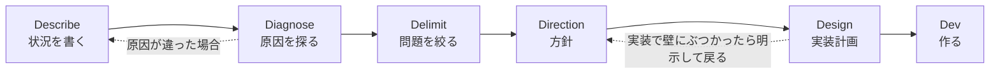
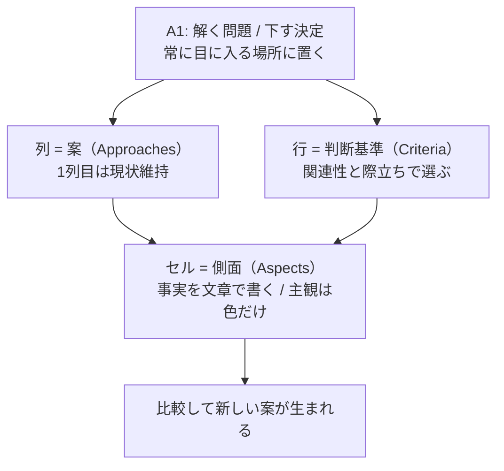

# Rich Hickey『Design in Practice』解説 ― 「設計」を具体的な作業に分解する

- **記録日:** 2026-10-08
- **位置づけ:** Clojure の作者 Rich Hickey による講演の日本語解説（要約＋筆者の考察）。講演者の主張と筆者の見立てを分けて書く。
- **一次資料:**
  - 書き起こし: https://github.com/matthiasn/talk-transcripts/blob/master/Hickey_Rich/DesignInPractice.md
  - 動画: https://www.youtube.com/watch?v=c5QF2HjHLSE
  - スライドPDF（書き起こし冒頭に記載あり）: https://download.clojure.org/presentations/DesignInPractice.pdf

---

## 0. 先に結論（5行）

1. 設計は「ハンモックで考える」だけの神秘的な行為ではなく、**書く・問う・表にする**といった具体的作業の積み重ねだ、というのが講演の主張。
2. 設計の進捗は「コードが増えること」ではなく**理解が増えること**で測る。「いま何を知っているか／次に何を知る必要があるか」を毎日問う。
3. 流れは Describe（状況を書く）→ Diagnose（原因を探る）→ Delimit（問題を絞る）→ Direction（方針）→ Design（実装計画）→ Dev（作る）。順序どおりに進むとは限らず、戻るときは「戻る」と明言する。
4. 中心技法は**決定マトリクス（Decision Matrix, DM）**。共有スプレッドシートに「案×判断基準」を並べ、主観は**セルの色だけ**に閉じ込める。
5. 「機能が無い」は問題文にならない。機能要望を「ユーザーの意図と、それを妨げているもの」に翻訳してから解く。

---

## 1. 講演の基本情報

| 項目 | 内容 |
|---|---|
| 題名 | Design In Practice |
| 登壇者 | Rich Hickey |
| 会議（書き起こし見出しの表記） | Clojure Conj 2023 - April 2023 |
| 動画公開日（YouTubeメタ） | 2023-05-12 |
| 長さ | 3645秒（約60分45秒） |
| 再生数 | 64,049回（メタ取得時点の目安。増減する） |
| YouTubeタイトル | "Design in Practice" by Rich Hickey |
| 書き起こし | コミュニティ作成。スライド内の画像は除去済み（例: 実例のスプレッドシート画像は本文に無い） |

---

## 2. 背景（なぜこの講演か）

講演者自身が冒頭で述べる動機は次のとおり。

- 過去の講演は設計の「考え方」を多く扱ったが、**具体的な実践は説明不足**で、設計が魔法のように見える原因になった。それを解きたい。
- 現場では「設計の時間を取りたいが、"2週間考えさせて"では正当化できない」という悩みが多い。**作業（アクティビティ）として具体化**すれば、プロジェクト管理ツールのストーリー（作業票）にでき、成果物も残る。
- 設計に「前に進んでいるか、空回りか」の感覚を持ちたい。
- 紹介される技法は、Clojure と Datomic（データベース）のチームが**実際にやっている軽量な手法**で、正式な方法論ではない、と明言している。

**ハンモック駆動開発との関係:** 書き起こしの中で講演者は、決定マトリクスの列に「他者のやり方」を入れる点を「Hammock-driven Development（2010年10月の講演）にある内容」と述べ、冒頭スライドにも「not (just) going to the hammock」とある。したがって**過去の講演の考え方を、実践手順として補う位置づけ**であることは書き起こしから確認できる。「正式な続編」と呼べるかどうかは書き起こしにないので、ここでは断定しない。

---

## 3. 講演の中身（流れ順）

### 3.1 設計とは何か（0:00〜0:07頃）

- 「設計＝コードを書かせてもらえない期間」という冗談を紹介した上で、**設計の最中にもコードは書く**と主張する（実験や途中の疑問への答えのため）。このため、プロジェクトを立ち上げなくてもすぐ試せる言語環境（探索的プログラミングができる言語）が重要だという。
- 本講演での設計の意味は「計画を描き出すこと」。「何かが起きるべきだ」という感覚から、計画を描き、その後の開発に至るまで全体を含める。
- **書くことは思考の一部**。記録のためではなく、書いた文章が自分への入力になる。再開・参加・検証・最終的な文書化にも役立つ。

### 3.2 言葉の技法（用語集・辞書）

- **言葉を精密に選ぶ**。名前付けの議論（バイクシェッド＝些細な議論）や宣伝のためではなく、共通理解のため。
- **あだ名やヒーロー名は避ける**。意味を持たないため曖昧さを覆い隠し、考えが変わっても名前が変わらず追従しない。箱にあだ名だけ入れ、矢印にラベルが無い図を、困った例として挙げている。
- **succinct（簡潔）**は「必要なものをすべて集めて短くする」こと。単に短い（concise）ではなく、重要な詳細を削らない。
- **辞書で語源まで引く**。語は接頭辞などの組み合わせでできており、そこから抽象的な意味が見える。良い言葉が後で「しっくり来なくなる」のは、考えが変わった合図かもしれない。
- **技法①用語集（Glossary）**: 用語を1か所で定義し、一貫して使い、壊れたら直すか捨てる。実例として Datomic の locality（データの局所性）・affinity（関連データを同じ区画に置く方針）・partition（区画）などの用語集を、8か月ほどのプロジェクトで維持したと紹介。

### 3.3 問いの技法

- **質問は強力な思考道具**。質問にすると「何を求めているか」が明確になる。論理は主に「これは成り立たない」と排除するのに使う。
- **技法②ソクラテス式問答**: 皆で冷静に（dispassionate）考えを検証する。自分と自分の案を同一視しない。「真実は決めるものではなく発見するもの」。参考書として *The Socratic Method: A Practitioner's Handbook* を挙げている（講演者の推薦。筆者は未読）。
- **4つの問い**（高校時代のイエズス会の担任がいつも発していたと紹介）: 「いまどこにいるか／どこへ行くか／何を知っているか／何を知る必要があるか」。開発者は前の2つ（進捗報告）が得意だが、後の2つ（なぜ）が抜けがちだという。
- **技法③Reflective Inquiry（内省的な問い）**: 上の4つを表に整理する。

| | 理解（Understanding） | 活動（Activity） |
|---|---|---|
| 現状（Status） | 何を知っているか | どこにいるか |
| 予定（Agenda） | 何を知る必要があるか | どこへ行くか |

  設計は「理解を積み上げる（accrete）」作業であり、次の活動は「次に知りたいこと」から決める。自分の思考について考えることで、頭の背景処理にも課題を与えられる、と述べる。

### 3.4 トップストーリー（PM上のチケット）

- 先に細かいチケットを切ろうとしても、何を作るか未理解で無理がある。そこで、理解が進んだ段階で**全体の方針を書く「トップストーリー」**を1枚持つ（最初でも最後でもない、初期のチケット）。設計活動そのものも、そこへ貢献する早期のストーリーとして扱う。
- どのストーリーも4節を持つ: **Title / Description / Problem / Approach**。例として「Java Streams を Clojure の seq 関数で扱えるようにする」ストーリーが示される（状況→課題→方針の形）。

### 3.5 設計の進み方（フェーズ）

- 進捗は「チェックリストの消化」ではなく、**理解の増加と、決定とその理由**で測る。紹介する活動は必須ではなく、理解を進めるのに必要なものを選べばよい。
- ウォーターフォールを一括否定した結果、「iterative（反復）」という考えが広まったが、講演者はこの語を「やり直し」の意味だとして疑問視し、**incremental（積み増し）**の方が良いとする。
- 進み方は山登りのように、常に上りとは限らない（単調でない）。**戻る場合は明示する**。この時期は変更が最も安い。

**6つの D のフェーズ**（バンド King Crimson の曲の歌詞に掛けた言い回し）:

加えて、どの時点でも **Decide（やる／やらないの判断＝スコープ決め）** が起こりうる。例: 「どの案でも問題の8割までしか解けない」「予算が出ない」など。

### 3.6 Describe（状況の記述）

- 聞こえてくる不満・バグ報告・ログ・要望を**ただ書き留める**。成果物はトップストーリーの題名の初期案と、**1段落の Description**。
- してはいけないこと: 問題が何かを断定する。「誰かが『これが原因だ』と言った」場合も事実扱いせず「Xさんは Y と言っている」と書く。例え: 「患者は頭痛を訴えている」であって「脳腫瘍だ」ではない。

### 3.7 Diagnose（診断）

- diagnosis は「横断して知る」の意味。2種類ある。
  1. **バグ**: 修正にも設計が要る（でないとモグラ叩きになる）。症状→考えられる複数の原因→真の原因へ。
  2. **機能要望**: 機能から問題へさかのぼる。
- バグ診断の要点: 仮説は**必ず複数**出す（1つしか思いつかなければ2つ目を考える）。調べるのは**1つずつ**。論理で除外し、最有力のもの、あるいは**問題空間を最も小さくするもの**から。本番の巨大システムではなく、小さなコードで再現させる、という助言。
- **科学的手法**（深掘りは対象外。同僚の別講演を参照と述べる）: 仮説を立て、実験を設計する。コツは、**コードを書く前に結果を埋める表の雛形を作り**、「この表が埋まれば結論が出る」と確認してから、その表を埋めるプログラムを書くこと。
- 機能要望の診断: 「機能Xが無い」は**決して有効な問題文ではない**。例として、自動車のタッチパネル（走行中に指を滑らせて送風を調整したい人はいないが、「若者は買わない」という理由で導入された、という皮肉）を挙げる。やることは、機能要望を「その機能が答えの1つになるような問題」に変換すること。そのために「ユーザーの意図は何か（手段ではなく）」「何が妨げているか」を問う。これで答えが閉じた1つから**開いた集合**になる。

### 3.8 Delimit（問題の限定）と問題記述

- 診断で見えた問題を、**短く正確に述べ、範囲を決める**。
- **技法④Problem Statement**: 「満たされていないユーザーの目的と原因」の簡潔な記述。症状・逸話・要望でも、解決策・機能でもない。トップストーリーの題名を「症状」から「問題」に直し、Description の後ろに Problem を足す。陳腐化させず更新する。
- 講演者は「これが最も重要な成果物」と強調する。題名の例: 「トースターを作る」→「ユーザーは焦げ目のついたパンを好む」。ストーリー一覧が「機能の羅列」から「問題の解決の羅列」になる点が気持ち良い、とも述べる。

### 3.9 Direction（方針・戦略）

- 戦略レベルの話。例として「自動化するか／ユーザーが自分でできる道具を提供するか」「ライブラリかアプリか」「買うか作るか」など。
- 成果物は、**ユースケース一覧**、**戦略用の決定マトリクス**（基準・案・トレードオフ）、スコープの決定、トップストーリーの Approach 節。
- **技法⑤ユースケース（使い方の表）**: まず「何をしたいか」だけを書く。「オレンジの丸ボタンを押すと音楽が流れる」のような手段は最初は書かない。
  - 表の A1 に対象の問題、A列に意図（例: 「ラジオの音を上げたい」「通話が来たとき消したい」）、B列「How」は**空欄にしておく**。方針が決まってから埋める（そのとき「ボリュームのつまみを付けよう」となる）。
  - 実例: Morse（REBL の後継ツール）の用途を40分ほどの議論で埋めたシート（画像なし）。

### 3.10 決定マトリクス（DM）― 講演の核心

講演者は「この講演の核心」と位置づける。以前は Org mode（Emacs）で1人で行っていたが、今は**複数人が同時編集できるスプレッドシート**（Google Sheets）が最良と述べる。文章（ドキュメント）は直線的で、案同士の対比が難しいからである。

- **A1**: 取り組む問題（または具体的な決定）。空欄なら、まず A1 から始めると述べる。
- **列＝案**: 現状維持を最初の案にする。他者のやり方、自分の最初の案も入れる。名前は短い題＋必要なら2行目に1文の説明。見出し行は固定表示。**買い物ではない**。比較を通じて**新しい列（案）を生み出す**場だ、というのが重要点。
- **行＝判断基準（criteria）**: 特性の網羅ではなく、「判断の手段」。その問題で**際立つ（salient）か、関係する（relevant）もの**だけ入れ、重要順に並べる。典型例: 問題の解決度、各種「〜性（-ilities）」、コスト・リスク、互換性・複雑さ。例え話として、生きたウサギとウサギの着ぐるみの戦車を比べるなら「毛の色」ではなく「レタスを食べるか／トラックを潰せるか」を行にする。
- **セル＝側面（aspects）**: 「その基準から案を見ると何が見えるか」。Yes/No や数値でなく**どう実現するかを文章で**書く（バックアップが「ある」でも、フロッピーかレプリケーションかで違う）。
- **主観は色だけ**: 無色＝普通、黄＝課題あり、赤＝致命的・問題を解けない、緑＝特に良い（彩度は低めに）。この方式なら、他の人は色を消して複製すれば主観のない表を得られる。
- 「利点・欠点」行だけだと、低遅延の案と高スループットの案を、お互いの弱点で比べられない。**基準ごとに行を分ける**ことで、対比（エッジ）が生まれ、思考が動く、という説明。
- 実例（画像は書き起こしに無く、講演者の口頭説明のみ）: Java の関数型インターフェースを Clojure からどう扱うか（現状は adapter や reify が必要で冗長）。実装段階の例として、Java の Math 関数（cosine など）を初心者が見つけにくい問題に対し、「何もしない」「静的 import」「Java から自動生成」「手書き」を比べ、最終的に自動生成を採ったと紹介（出荷済み）。

**DMのコツ（講演者の助言）:**

- 全部緑の列は、**自己正当化のサイン**。
- 差のない列が並ぶなら、区別する基準（行）が足りない。
- 基準を事前の固定テンプレートで網羅しない。差を生む行を上へ動かし続ける。
- リンクだけをセルの中身にしない（要点を文で書く。リンクは補足）。
- コメント機能（ホバーで見える）は使わず、隣のセルやノート欄に直接書く。
- 基準を疑問文にしない。疑問は「?」で検索できるよう、案・基準・セルのどこにでも **? を付けて書き残す**。

**DMの成果物と効用:** 問題と案の簡潔な記述、何が大事かの明示、対比できる詳細、一目で分かる主観評価、後続の疑問一覧、利点と代償。効用は、再開・途中参加のしやすさ、Zoom で口頭＋各自メモよりも**全員が同じ画面に書きながら話す**ことで曖昧さや矛盾が見つかる（ソクラテス式の検証になる）こと、そして抽象化が生まれる場所になること。日中にやっておくとハンモックや睡眠中に新しい発想が出る、とも述べる。

### 3.11 Design（実装計画）

- 従来の意味の「設計」はここ。**最初からここに飛ぶと上流の価値ある工程を飛ばす**。
- Approach が決まった後の、API の形や署名などの実装レベルの決定を扱う。同じように複数案を出して、同じ技法（基準・DM）で選ぶ。DM は**15分程度の軽いもの**でもよく、すべての決定で苦しむ話ではない。
- 成果物: 実装用の DM、図、実装上の決定、トップストーリー Approach への詳細追記、ユースケース表の「How」列の記入。実装の難しさが判明したら**スコープ調整や後戻り**もありうる。
- **図（Diagrams）**: 詳細は対象外。表や文章が不十分な構成・流れ・関係・UI で使う。助言は「**解決策だけでなく問題も図にする**」（「ここの情報が別の所に必要だが経路が未定」を ? つきで描く）。

### 3.12 Dev（作る）

- この時点で、なぜ作るか、どう作るか、動くという確信があり、支える資料も揃う。チームの追加や引き継ぎも楽になる。
- 講演者の確信として、**このように設計すると成果物は小さく、汎用的になる**（Clojure の特徴もこの積み重ねから来る、と述べる）。
- 助言: **思いついた日に作り始めない**。一晩寝かせると翌朝「それは違う」となることがある、とのこと。
- 結びで、同僚たちに謝意を述べ、難しいが学べると励ます。

---

## 4. 用語集

| 用語 | 意味（本稿での説明） |
|---|---|
| Design | 計画を「描き出す」こと。講演では状況認識から開発まで全体を指す（フェーズ名としては実装計画の意味） |
| succinct | 必要事項を漏らさず簡潔にまとめること。単なる短縮（concise）とは区別される |
| Glossary | 用語の定義を1か所にまとめた一覧。一貫して使い、壊れたら直す |
| Socratic method | 問いと答えを重ねて共同で真実に近づく対話法 |
| Reflective Inquiry | 「何を知る／知る必要」×「どこにいる／行く」の4問で自分の思考を振り返る枠組み（講演者の命名） |
| Description | 状況・症状・要望を1段落で書く節（原因は書かない） |
| Problem statement | 満たされていないユーザーの目的と原因の簡潔な記述。解決策は含めない |
| Use cases（講演の用法） | 手段ではなく、ユーザーの意図だけを並べた表。How 列は後で埋める |
| Decision Matrix (DM) | 案を列、基準を行、側面をセルに置く共有スプレッドシート |
| Criteria | 判断の基準。特性の羅列ではなく、その問題で際立ち・関係するもの |
| Aspects | ある基準から見たときの、案の具体的な姿 |

---

## 5. 実務での使いどころ（筆者の提案）

以下は講演内容を踏まえた**筆者の提案**で、講演者の主張ではない。

- **チケット雛形を4節（Title / Description / Problem / Approach）にする**。Description と Problem を分けるだけで、要望がそのまま実装依頼になる事故が減りそう。
- **「機能Xが無い」の問題文をレビューで見つけたら、「ユーザーは何をしたい？ 何が邪魔？」に書き換える**ルールを置く。
- **技術選定にDMを使う**: 現状維持を1列目に入れ、基準を行に分ける、色は主観のみ、全部緑なら疑う。ADR（設計判断記録）の前段として、会議中に共同編集で埋めると議事録兼用になる。
- **15分の軽量DMを日常化**し、大きな決定だけ重くする。

---

## 6. 考察：強みと限界（筆者の見立て）

以下は**考察（筆者の見立て）**であり、講演で述べられた事実とは区別する。

**強み**
- 抽象的になりがちな「設計」を、成果物（用語集・問題記述・ユースケース表・DM）単位に分け、チケット化できる形にした点は実用的。
- 「進捗＝理解の増加」という定義は、設計の停滞を自覚するのに役立つ。
- 主観を色に分離する、リンクだけのセルを禁じる、疑問に ? を付けるなど、小さなルールが具体的で試しやすい。

**限界・批判的視点**
- 「成果物が小さく汎用的になる」は講演者の確信であり、書き起こしの範囲では比較データや事例による裏付けは示されていない。他の方法との優劣は不明。
- 実例は Clojure／Datomic の言語・データベース開発（利用者が開発者で、要求が比較的安定した領域）に偏る。業務アプリや、利害関係者が多く要件が不確実な現場に同じ重さで当てはまるかは、講演からは分からない。
- 色付けや基準（行）の取捨は個人差が出うる。
- iterative を語源（do-over）で退ける主張は、現代の実務での使われ方とずれて見える。語源の議論と実践上の是非は別。

---

## 7. 確認範囲と限界

- 確認したのは**コミュニティ作成の書き起こし全体（1,565行）を通読した範囲**。映像は見ていないため、スライド画像・実例のスプレッドシートの中身・話者の口調は未確認。
- 画像除去のため、実例のDMやMorseのユースケース表の詳細は、講演者の口頭説明の範囲でしか書けない。
- 講演者が触れた外部のもの（ソクラテス式問答の書籍、同僚の「科学的手法によるデバッグ」講演、King Crimson の歌詞、語源の説明、自動車のタッチパネルの逸話、Hammock-driven Development）は、**講演者の主張／引用であり、筆者は独自に検証していない（未確認）**。語源は講演者の説明に従った。
- 再生数・長さは取得時点のメタ情報（目安）。

---

## 8. 参考リンク

- 書き起こし: https://github.com/matthiasn/talk-transcripts/blob/master/Hickey_Rich/DesignInPractice.md
- 動画: https://www.youtube.com/watch?v=c5QF2HjHLSE
- スライドPDF: https://download.clojure.org/presentations/DesignInPractice.pdf
- Clojure Conj 2023 イベントページ（書き起こし冒頭のリンク）: https://clojure.org/events/2023/clojure-conj-2023--1880831835
- 関連（講演内で言及）: Hammock-driven Development の書き起こし https://github.com/matthiasn/talk-transcripts/blob/master/Hickey_Rich/HammockDrivenDev-mostly-text.md
