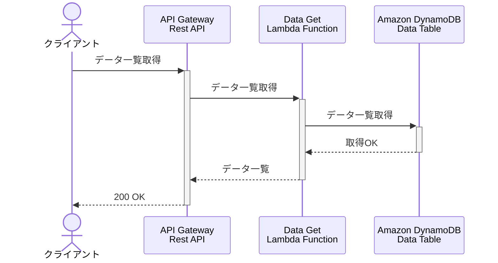
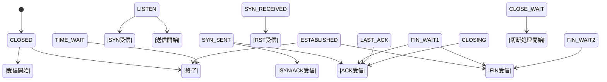
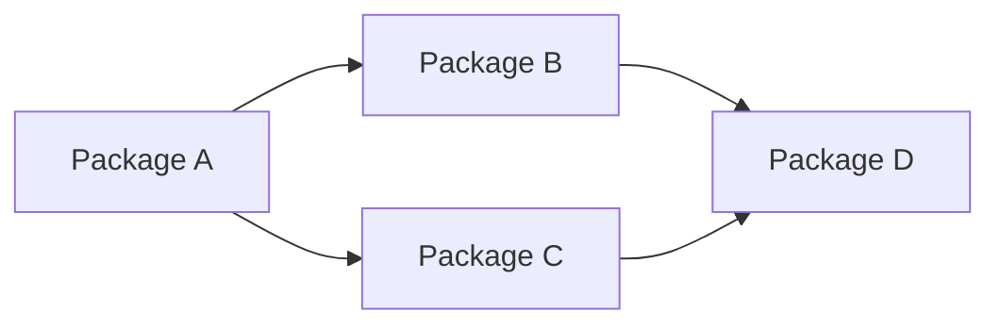

# PlantUML/Mermaidによる図表作成 入門・参考リンク集

> ステータス: INFO / カテゴリ: DEV / 作成日 2026-08-15
> ⚠️ マスキング規約準拠。秘密（トークン/鍵）は一切記載しない。ホスト名/ユーザー名/IP 等は placeholder。
> 出典: 自己リポジトリ `public`(uml/) を再構成し、最新情報を検証のうえまとめ直したもの。

## 1. これは何か

設計ドキュメントやアーキテクチャ図を「コードとして」管理できる図表作成ツール、PlantUML と Mermaid の入門情報・サンプルコード・参考リンク集です。両ツールとも、テキスト（DSL）で図を記述し、Git でバージョン管理・差分レビューできるのが最大の利点です。

## 2. PlantUML

### 2.1 概要

PlantUML はテキストベースで UML図（クラス図・シーケンス図など）やアーキテクチャ図を記述・生成するオープンソースツールです。Graphviz（グラフ描画エンジン）を利用して図を生成するため、フル機能で使う場合は別途インストールが必要です。

### 2.2 サンプル: シーケンス図（AWS構成の例）

```plantuml
@startuml Sequence Diagram - Spots and stereotypes

!define AWSPuml https://raw.githubusercontent.com/awslabs/aws-icons-for-plantuml/master/dist
!includeurl AWSPuml/AWSCommon.puml
!includeurl AWSPuml/Compute/all.puml
!includeurl AWSPuml/Mobile/APIGateway.puml
!includeurl AWSPuml/General/InternetGateway.puml
!includeurl AWSPuml/Database/DynamoDB.puml

actor User as user
APIGatewayParticipant(api, Credit Card System, All methods are POST)
LambdaParticipant(lambda, AuthorizeCard,)
DynamoDBParticipant(db, PaymentTransactions, sortkey=transaction_id+token)
InternetGatewayParticipant(processor, Authorizer, Returns status and token)

user -> api: Process transaction\nPOST /prod/process
api -> lambda: Invokes lambda with cardholder details
lambda -> processor: Submit via API token\ncard number, expiry, CID
processor -> processor: Validate and create token
processor -> lambda: Returns status code and token
lambda -> db: PUT transaction id, token
lambda -> api: Returns\nstatus code, transaction id
api -> user: Returns status code
@enduml
```

### 2.3 サンプル: シンプルなアクター図

```plantuml
@startuml Hello World

!define AWSPuml https://raw.githubusercontent.com/awslabs/aws-icons-for-plantuml/master/dist
!includeurl AWSPuml/AWSCommon.puml
!includeurl AWSPuml/EndUserComputing/all.puml
!includeurl AWSPuml/Storage/SimpleStorageServiceS3.puml

actor "Person" as personAlias
WorkDocs(desktopAlias, "Label", "Technology", "Optional Description")
SimpleStorageServiceS3(storageAlias, "Label", "Technology", "Optional Description")

personAlias --> desktopAlias
desktopAlias --> storageAlias

@enduml
```

> 補足（最新情報の確認）: `!define AWSPuml .../master/dist` のように `master` ブランチを直接参照する記法は、上流リポジトリ（[awslabs/aws-icons-for-plantuml](https://github.com/awslabs/aws-icons-for-plantuml)）でバージョンタグ（例: `v14.0`）を指定する記法が推奨されるようになっています。`master` を直接参照すると、上流の更新によって意図せず描画が変わるリスクがあるため、本番のドキュメントでは `!include AWSPuml/AWSCommon.puml`（バージョン固定のURL）形式を使うほうが安全です。

### 2.4 インストール参考リンク

- [PlantUMLインストール手順（Qiita）](https://qiita.com/incho9/items/d70e53c8d405098d0ae6)
- [Eclipse Temurin（Java、PlantUML実行に必要）](https://adoptium.net/download/)
- [Graphviz（図の描画エンジン）](https://graphviz.org/download/)
- [PlantUML公式（日本語）](https://plantuml.com/ja/)
- [AWS Icons for PlantUML 公式リポジトリ](https://github.com/awslabs/aws-icons-for-plantuml)

## 3. Mermaid

### 3.1 概要

Mermaid は Markdown に近い記法で図を記述できる JavaScript ベースのツールで、GitHub・GitLab・多くのドキュメントツール（Notion, Zenn, Qiita等）で標準的にレンダリングされるようになっているのが大きな特徴です（PlantUMLのように専用のレンダリングサーバーを都度用意する必要がない）。

### 3.2 サンプル: シーケンス図



### 3.3 サンプル: 状態遷移図（TCPのステートマシン）



### 3.4 サンプル: パッケージ依存関係図



### 3.5 参考リンク

- [Mermaid公式ドキュメント（Sequence diagram構文）](https://mermaid.js.org/syntax/sequenceDiagram.html)
- [Mermaid GitHubリポジトリ](https://github.com/mermaid-js/mermaid)
- [Mermaid記法まとめ（Qiita）](https://qiita.com/ryamate/items/3779418172c4f5a83212)

> 補足（最新情報の確認）: Mermaid は現在も活発に開発が続くOSSで、GitHub の Markdown コードブロック内で```mermaid``` と明示するだけでネイティブレンダリングされる点は変わらず有効です（本記事作成時点で確認）。複雑な大規模図はPlantUML（AWSアイコン等の専用パーツが充実）、README内の簡易フロー図やシーケンス図はMermaid、といった使い分けが実務では一般的です。

## 4. PlantUML と Mermaid の使い分けの目安

| 観点 | PlantUML | Mermaid |
|---|---|---|
| GitHub上でのネイティブ表示 | 不可（別途レンダリングサーバー/拡張機能が必要） | 可能（コードブロックが自動描画される） |
| AWS構成図等の専用アイコン | 豊富（aws-icons-for-plantuml） | 標準では無し（アイコンは別途工夫が必要） |
| 学習コストの低さ | やや高め | 低め（Markdownに近い記法） |
| 対応図の種類の多さ | 非常に多い（UML全般をカバー） | 主要な図に絞られるが継続的に拡充中 |

## 5. その他の学習リンク

- [UMLクラス図とは（Lucidchart）](https://www.lucidchart.com/pages/ja/what-is-uml-class-diagram)
- [UML（統一モデリング言語）とは（Lucidchart）](https://www.lucidchart.com/pages/ja/what-is-UML-unified-modeling-language)

## Author and Ownership / 著作権と所属について

This project was created as a personal initiative and is not connected to any organization or group.
It is published as an individual creative work.

本プロジェクトは個人の活動として作成したものであり、特定の組織や団体の業務とは関係ありません。
個人の創作物として公開しています。
