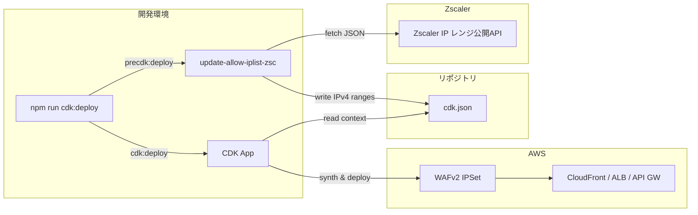

# TypeScript: Result / Logger パターンと Zscaler IP自動更新 → CDK連携スクリプト

> ステータス: INFO / カテゴリ: DEV / 作成日 2026-08-15
> ⚠️ マスキング規約準拠。秘密（トークン/鍵）は一切記載しない。ホスト名/ユーザー名/IP 等は placeholder。
> 出典: 自己リポジトリ `public`(typescript/) を再構成し、最新情報を検証のうえまとめ直したもの。

## 1. これは何か

TypeScript 版の `Result` / `Logger` パターン(Python 版は別記事参照)と、それを実務で使った具体例として「Zscaler が公開する最新 IP レンジを自動取得し、AWS CDK の設定ファイルへ反映するスクリプト」を紹介します。

## 2. Result パターン(TypeScript版)

### 2.1 型定義

```typescript
export interface Failure {
  code: string;
  message: string;
}

export type Result<T, E extends Failure> = SuccessResult<T> | FailureResult<E>;

export class SuccessResult<T> {
  constructor(private readonly value: T) {}
  isSuccess(): this is SuccessResult<T> { return true; }
  isFailure(): this is FailureResult<Failure> { return false; }
  getValue(): T { return this.value; }
}

export class FailureResult<E extends Failure> {
  constructor(private readonly failure: E) {}
  isSuccess(): this is SuccessResult<unknown> { return false; }
  isFailure(): this is FailureResult<E> { return true; }
  getFailure(): E { return this.failure; }
}
```

Python版の `dataclass` による単一クラス実装とは異なり、TypeScript 版は「成功クラス」と「失敗クラス」を分けたユニオン型で表現しています。TypeScript の型ガード(`is`)機能により、`isSuccess()` / `isFailure()` の呼び出し後、コンパイラが自動的に型を絞り込んでくれるのが利点です。

### 2.2 ResultPipeline(Promiseベース)

```typescript
import { Result, Failure } from "./result";

export class ResultPipeline<T, E extends Failure> {
  constructor(private readonly promise: Promise<Result<T, E>>) {}

  static from<T, E extends Failure>(promise: Promise<Result<T, E>>) {
    return new ResultPipeline<T, E>(promise);
  }

  run(): Promise<Result<T, E>> {
    return this.promise;
  }
}
```

Python版が「同期/非同期それぞれ専用の `pipe`/`pipe_async` メソッドでチェーンする」設計なのに対し、TypeScript版は最初から `Promise<Result<T,E>>` をラップする設計で、JS/TS の非同期処理(Promise)と自然に融合しています。

### 2.3 Logger(シングルトン + traceId/requestId対応)

```typescript
export enum LogLevel {
  Error = "error", Warn = "warn", Info = "info",
  Debug = "debug", Request = "request", Response = "response",
}

export class Logger {
  private static instance: Logger;
  private context: LogContext = {};

  private constructor(private readonly level: LogLevel) {}

  static getInstance(level: LogLevel = LogLevel.Info): Logger {
    if (!Logger.instance) {
      Logger.instance = new Logger(level);
    }
    return Logger.instance;
  }

  setContext(context?: Partial<LogContext>): void {
    this.context = {
      traceId: context?.traceId ?? crypto.randomUUID(),
      requestId: context?.requestId ?? crypto.randomUUID(),
    };
  }
  // ... info/warn/error/debug/request/response メソッド
}
```

Python版よりも一段実務寄りで、`traceId`/`requestId` をコンテキストとして保持し、分散トレーシング的なログ相関に対応しています。`crypto.randomUUID()` は Node.js 14.17+ / ブラウザで標準サポートされている組み込みAPIです(2026年時点で広くサポートされ、追加ライブラリ不要)。

## 3. 実践例: Zscaler IP自動取得 → CDK設定更新

### 3.1 背景・目的

Zscaler（クラウド型セキュアWebゲートウェイ/SASEサービス）は、利用者の環境からアクセスされる送信元 IP アドレスのレンジを定期的に更新・公開しています。社内システムで「Zscaler 経由のアクセスのみ許可する」ファイアウォール/WAF ルールを設定している場合、この IP レンジ変更に追従して許可リストを更新し続ける必要があります。

このスクリプトは、AWS CDK でのデプロイ前フック(`precdk:deploy`)として実行し、Zscaler の公開 JSON API から最新 IPv4 レンジを取得して `cdk.json` の `allowedIpV4AddressRanges` を自動更新する仕組みです。

> 補足(最新情報の確認): Zscaler の IP レンジ公開エンドポイントは `config.zscaler.com`(および `.net`/`.us` などクラウド別ドメイン)配下で現在も提供されています。ただし正式なエンドポイント名・パス形式はクラウド環境(zscloud.net等)やテナントの契約クラウドによって異なる場合があるため、実際に使う際は [Zscaler Config の公式ページ](https://config.zscaler.com/) で自社テナントの正しいエンドポイントを確認することを推奨します。IP レンジは "Service Continuity Policy" に基づいて予告なく変更されうるため、定期的な自動更新の仕組み自体は今も有効なプラクティスです。

### 3.2 アーキテクチャ



### 3.3 IP取得部分(fetch-ips-json.ts)

```typescript
import https, { IncomingMessage } from "https";
import { Result, SuccessResult, FailureResult, Failure } from "../result/result";
import { ResultPipeline } from "../result/result-pipeline";
import { Logger, LogLevel } from "../logger/logger";

const logger = Logger.getInstance(LogLevel.Info);

export interface IpEntry {
  ipv4Ranges?: string[];
  ipv6Ranges?: string[];
}
export interface IpsResponse {
  ips: IpEntry[];
}

export function fetchIpsJson(url: string): ResultPipeline<IpsResponse, Failure> {
  logger.request({ functionName: "fetchIpsJson", message: { url } });

  const promise = new Promise<Result<IpsResponse, Failure>>((resolve) => {
    https.get(url, (res: IncomingMessage) => {
      let raw = "";
      res.on("data", (chunk) => { raw += chunk; });
      res.on("end", () => {
        try {
          resolve(new SuccessResult(JSON.parse(raw) as IpsResponse));
        } catch (err) {
          resolve(new FailureResult({ code: "JSON_PARSE_ERROR", message: (err as Error).message }));
        }
      });
    }).on("error", (err) => {
      resolve(new FailureResult({ code: "FETCH_JSON_ERROR", message: err.message }));
    });
  });

  return ResultPipeline.from(promise);
}
```

### 3.4 cdk.json 更新部分(update-cdk-json.ts)

```typescript
import fs from "fs";

export function updateCdkJson(filePath: string, ipv4Ranges: string[]) {
  // filePath の cdk.json を読み込み、allowedIpV4AddressRanges を
  // 最新の ipv4Ranges で上書きして書き戻す
  const json = JSON.parse(fs.readFileSync(filePath, "utf8"));
  json.allowedIpV4AddressRanges = ipv4Ranges;
  fs.writeFileSync(filePath, JSON.stringify(json, null, 2));
}
```

### 3.5 エントリーポイント(index.ts 相当)

```typescript
const ZSCALER_URL = "https://config.zscaler.com/api/zscaler.net/future/json"; // ※要: 自社テナントのエンドポイントに置き換え
const CDK_JSON_PATH = path.resolve(__dirname, "../cdk.json");

async function main() {
  const result = await fetchIpsJson(ZSCALER_URL).run();
  if (result.isFailure()) {
    logger.error({ functionName: "main", message: result.getFailure() });
    process.exit(1);
  }
  const ipv4Ranges = result.getValue().ips
    .filter((item) => Array.isArray(item.ipv4Ranges))
    .flatMap((item) => item.ipv4Ranges ?? []);

  await updateCdkJson(CDK_JSON_PATH, ipv4Ranges).run();
}
```

`package.json` 側では以下のように `cdk deploy` の前段フックとして仕込みます。

```json
{
  "scripts": {
    "precdk:deploy": "ts-node ../../typescript/update-allow-iplist-zsc/index.ts",
    "cdk:deploy": "cdk deploy"
  }
}
```

### 3.6 注意点

- Zscaler API の仕様・エンドポイントは変更されうるため、契約中のテナント設定を都度確認する
- IPv6 は本実装の対象外(必要であれば `ipv6Ranges` フィールドを使って拡張可能)
- `cdk.json` はスクリプトによって自動上書きされる前提のため、手動編集は非推奨
- `Result` 型による安全なエラー処理により、Zscaler 側の障害・仕様変更時もクラッシュせず明示的にハンドリングされる

## 4. 関連記事

- Python版の Result/ResultPipeline/Logger 実装は別記事「Python: Result / ResultPipeline / Logger パターン」を参照。

## Author and Ownership / 著作権と所属について

This project was created as a personal initiative and is not connected to any organization or group.
It is published as an individual creative work.

本プロジェクトは個人の活動として作成したものであり、特定の組織や団体の業務とは関係ありません。
個人の創作物として公開しています。
