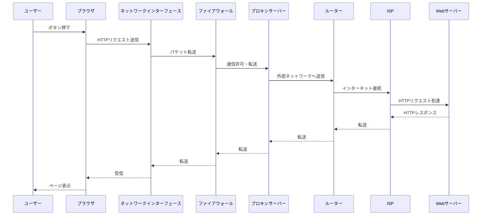

# Linux ネットワーク管理コマンド完全ガイド（ip コマンド中心）

> **対象**: Linuxサーバーのネットワーク設定・確認を行う開発者・インフラ担当者向け。
> **作成日**: 2026-08-15（JST） / **ステータス**: INFO（情報提供・コマンドリファレンス）
> **一次情報**: [iproute2（Linux Foundation管理）](https://wiki.linuxfoundation.org/networking/iproute2)、各ディストリビューションのmanページ
> **元記事**: public2リポジトリ `network/network.md` `network/connection_test.md` を再構成（内容はweb_searchで裏取りし加筆修正）

---

## 用語ミニ解説（初心者向け）

- **net-tools**: `ifconfig` `route` `netstat` `arp` 等を含む、Linuxの古典的なネットワーク管理ツール群。**2001年頃から開発が停滞しており、多くのディストリビューションで非推奨（deprecated）扱い**。
- **iproute2**: net-toolsの後継として現在標準的に使われているツール群。`ip` コマンドに機能が統合されている。
- **ICMP**: Ping等で使われる、ネットワークの疎通確認用プロトコル（OSI参照モデルの第3層＝ネットワーク層）。

---

## 1. net-tools は非推奨、iproute2 が標準

多くのLinuxディストリビューションにおいて、`net-tools`（`ifconfig` 系コマンド群）は長期間メンテナンスされておらず、事実上非推奨の状態にあります。現在は `iproute2` パッケージの `ip` コマンドが標準です。

| 旧コマンド（net-tools・非推奨） | 新コマンド（iproute2・推奨） | 用途 |
|---|---|---|
| `ifconfig` | `ip addr show`（`ip a`） | インターフェースのIPアドレス確認 |
| `route` | `ip route show` | ルーティングテーブル確認 |
| `netstat` | `ss -tuln` | ネットワーク接続状況確認 |
| `arp` | `ip neigh show` | ARPテーブル（IP-MAC対応）確認 |

> ⚠️ 一部のディストリビューション・クラウドイメージには依然として `net-tools` がプリインストールされていますが、新規のスクリプト・手順書では `iproute2` 系コマンドを使うのが現在の標準的な作法です。

---

## 2. `ip` コマンド実践

### `ip a`（`ip addr show`）: IPアドレス確認

```bash
ip a                          # 全インターフェースのIPアドレスを表示
ip a show dev eth0            # 特定インターフェースのみ表示
ip addr add 192.168.1.100/24 dev eth0   # IPアドレス追加
ip addr del 192.168.1.100/24 dev eth0   # IPアドレス削除
```

出力例:
```
2: eth0: <BROADCAST,MULTICAST,UP,LOWER_UP> mtu 1500 qdisc fq_codel state UP
    link/ether <mac-address> brd ff:ff:ff:ff:ff:ff
    inet <server-ip>/24 brd <broadcast-ip> scope global dynamic eth0
    valid_lft 3600sec preferred_lft 3600sec
```

### `ip route show`: ルーティングテーブル確認

```bash
ip route show
```

出力例と意味:

| 出力例 | 意味 |
|---|---|
| `default via <gateway-ip> dev eth0 proto static` | デフォルトゲートウェイ。外部への通信は全てこの経路 |
| `<network>/24 dev eth0 proto kernel scope link src <server-ip>` | ローカルネットワークの直接接続経路 |

ルート追加・削除:

```bash
sudo ip route add 10.0.0.0/24 via <gateway-ip> dev eth0
sudo ip route del 10.0.0.0/24
```

### `ss -tulnp`: ネットワーク接続状況確認（netstatの後継）

```bash
ss -tulnp
```

| オプション | 意味 |
|---|---|
| `-t` | TCP接続のみ表示 |
| `-u` | UDP接続のみ表示 |
| `-l` | LISTEN状態のポートのみ表示 |
| `-n` | ホスト名解決をせずIPアドレスで表示 |
| `-p` | プロセス情報を表示 |

---

## 3. 疎通確認（Connection Test）コマンド集

| 目的 | Linux（bash） | Windows（PowerShell） |
|---|---|---|
| Ping疎通確認 | `ping -c 5 example.com` | `Test-Connection example.com -Count 5` |
| 経路確認（traceroute） | `traceroute example.com` | `tracert example.com` |
| TCPポート開放確認 | `nc -zv example.com 443` | `Test-NetConnection example.com -Port 443` |
| DNS詳細確認 | `dig example.com` | `Resolve-DnsName example.com` |
| HTTPレスポンス確認 | `curl -I https://example.com` | `Invoke-WebRequest https://example.com` |
| HTTPステータスコードのみ取得 | `curl -o /dev/null -s -w "%{http_code}\n" https://example.com` | `(Invoke-WebRequest https://example.com).StatusCode` |

### IP直打ちでのDNS切り分け

DNS名前解決の問題を切り分けたい場合、IPアドレスを直接指定して疎通確認する。

```bash
ping <server-ip>
curl http://<server-ip>
```

### プロトコル階層と疎通確認の対応関係

| プロトコル | OSI層 | 確認目的 |
|---|---|---|
| ICMP | 第3層（ネットワーク層） | 基本的な生存確認 |
| TCP | 第4層（トランスポート層） | ポート開放・リスナーの存在確認 |
| HTTP/HTTPS | 第7層（アプリケーション層） | 実サービスの稼働確認 |

> AWSのセキュリティグループ等で疎通確認を行う場合、ICMP許可・特定ポートのTCP許可・HTTP/HTTPS許可はそれぞれ別々に設定が必要な点に注意。

---

## 4. 回線品質評価（RTT・パケットロス率）

| 指標 | 定義 | 測定コマンド |
|---|---|---|
| RTT（Round Trip Time） | パケット往復時間（ms） | `ping`, `iperf3` |
| パケットロス率 | 応答が返らなかった割合（%） | `ping -c 100`, `iperf3 -u`, `mtr` |

| ツール | OS | 用途 |
|---|---|---|
| `mtr` | Linux | traceroute + ping の統合版（経路ごとのロス率） |
| `pathping` | Windows | mtr相当 |
| `iperf3` | 両方 | 帯域・RTT・ロス率の詳細測定（TCP/UDP対応） |
| `tcpdump` / `Wireshark` | 両方 | パケットキャプチャによる詳細解析 |

---

## 5. ブラウザ操作からインターネット到達までの流れ

一般的な企業ネットワーク環境（プロキシ・ファイアウォール経由）での通信経路イメージ:



各層（ファイアウォール・プロキシ）でトラブルが起きた場合、上記の経路のどこで止まっているかを疎通確認コマンドで切り分けるのが定石。

---

## まとめ

- `net-tools`（ifconfig/route/netstat/arp）は非推奨。`iproute2`（ip/ss コマンド）へ移行するのが現在の標準。
- 疎通確認はICMP（生存確認）→TCP（ポート確認）→HTTP/HTTPS（実サービス確認）の順に階層的に切り分ける。
- 回線品質はRTTとパケットロス率で評価し、`mtr`/`iperf3`で詳細分析する。

## Author and Ownership / 著作権と所属について

This project was created as a personal initiative and is not connected to any organization or group.
It is published as an individual creative work.

本プロジェクトは個人の活動として作成したものであり、特定の組織や団体の業務とは関係ありません。
個人の創作物として公開しています。
