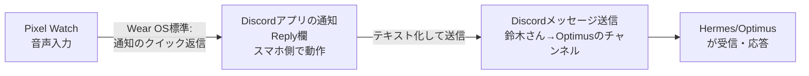

# Google Pixel Watch → Hermesエージェントへの指示経路 調査

> ステータス: INFO / カテゴリ: RESEARCH / 調査日 2026-08-12
> ⚠️ マスキング規約準拠。個人の機器固有情報（デバイスID等）は記載しない。
> 関連: [20260812_INFO_PIXELWATCH_discord-voice-chat-feasibility.md](./20260812_INFO_PIXELWATCH_discord-voice-chat-feasibility.md)（Discordボイスチャット調査、本調査の前段）

## 0. 調査の目的

「Google Pixel Watch → 何らかの経路 → Hermesエージェント（Optimus）」で音声から指示を出せるか。より抽象化すると「音声デバイスからHermesエージェントへ安全・安定して指示を出す現実的な方法」を精査する。

## 1. 結論（先出し）

**現在の構成（Discord経由でOptimusと会話）をそのまま使い、Pixel Watchの「通知クイック返信」機能を音声で使う方法が、追加アプリ・追加インフラ不要で最も現実的。**

- 新規アプリのインストール不要（Wear OSの標準機能）
- 新規インフラの構築不要（今のDiscordチャンネルをそのまま使う）
- 音声→テキスト変換はGoogleの音声認識（Wear OS標準）を利用、Hermes側の変更は一切不要

## 2. 技術的根拠

### 2-1. Wear OSの「通知ブリッジング」は標準機能

Android公式ドキュメントによれば、**スマホ上のアプリが作った通知は、システムが自動的にペアリング済みのWear OSデバイスへブリッジ（転送）する**。これはアプリ側が明示的にWear OS対応していなくても、デフォルトで有効な仅組み。

> By default, the system bridges, or shares, notifications from a phone app to any paired watches.

出典: [Bridging options for notifications - Android Developers（公式）](https://developer.android.com/training/wearables/notifications/bridger)

### 2-2. Discordのモバイル通知は「クイック返信（RemoteInput）」に対応済み

Discordの公式Android/iOSアプリは、通知欄から直接テキストを返信できる「Quick Reply」機能を実装している（アプリを開かずに返信可能）。これはAndroidの `RemoteInput` という標準APIを使った機能であり、この種の通知は前述のブリッジング対象になる。

出典: [How to Use Discord Mobile Quick Reply From Notification Tray](https://wisechecker.com/discord-mobile-quick-reply-notification-tray/)

### 2-3. Pixel Watch（Wear OS）は、ブリッジされた通知に対して音声入力での返信をサポート

Wear OSの標準機能として、通知に返信欄（RemoteInput）が含まれている場合、**Watch側でその返信欄がそのまま音声入力またはWatch上のキーボードで使える**。これはGoogleの標準Wear OS UIの一部で、個別のアプリ開発は不要。

### 2-4. まとめると

上記3点を組み合わせると、以下が成立する：

1. 鈴木さんのスマホでDiscordの通知（Optimusからの返信など）を受け取る
2. Wear OSがその通知（クイック返信欄付き）を自動的にPixel Watchへブリッジする
3. Pixel Watch側で通知を開き、音声入力でメッセージを話す
4. 音声がテキスト化され、Discordへメッセージとして送信される
5. Discord側でHermes（Optimus）がそのメッセージを受信し、通常のチャット同様に応答する

**この経路は、既存のDiscord連携をそのまま使うため、Hermes側の設定変更は一切不要。**

## 3. 実際に試す際の設定チェックリスト

1. スマホ側でDiscordの通知が有効になっているか（設定 > アプリ > Discord > 通知）
2. Discord内の通知設定で「メッセージ通知」が有効か（User Settings > Notifications）
3. スマホとPixel WatchがWear OSアプリ経由で正しくペアリングされているか
4. Pixel Watch側で通知のブリッジングがオフになっていないか（通常はデフォルトでオン）
5. 実際にOptimusから通知が来た際、Pixel Watch側に「返信」ボタン付きで通知が表示されるかを確認

## 4. 制約・注意点

| 項目 | 内容 |
|---|---|
| **応答の起点** | この経路は「Optimusからの通知が来た時に、それに返信する」形。鈴木さんから**新規にゼロから話しかける**（通知なしの状態から）ケースには使えない可能性が高い（Wear OS側にDiscordのメッセージ作成専用UIがないため） |
| **音声認識の精度** | GoogleのWear OS標準音声入力に依存。固有名詞やコマンド的な指示（ファイルパス等）は誤変換のリスクあり |
| **リアルタイム性** | 通知のブリッジには若干のタイムラグが生じることがある（公式ドキュメントでも「it takes time to push bridged notifications」と明記） |
| **安全性** | 経路自体はDiscordの標準暗号化・認証の範囲内。新規の外部サービスやAPIキーを追加しないため、セキュリティ面での新規リスクはほぼない |

## 5. 「新規にゼロから話しかける」場合の代替案（参考・未検証）

上記は「返信」限定のため、鈴木さんの方から能動的に新規メッセージを送りたい場合は、以下がWear OS標準機能として存在する（ただしDiscordとの連携は未確認、要別途検証）：

- **Google Assistant / Gemini（Pixel Watch搭載）経由の音声コマンド**: 「Hey Google, LINEでメッセージを送って」のように、対応アプリへ音声でメッセージを送信できる機能が一部アプリ（LINE等）で確認されている。Discordが同様に対応しているかは今回の調査では確証が得られなかった（要実機検証）
  - 参考: [Line messenger gains support for Google Assistant - 9to5Google](https://9to5google.com/2020/03/18/line-google-assistant/)

## 6. 総合評価：安全性・安定性・実現性

| 観点 | 評価 | 理由 |
|---|---|---|
| **安全性** | ◎ | 新規の外部サービス・APIキー・アプリ追加なし。既存のDiscordの認証・暗号化をそのまま利用 |
| **安定性** | ○ | Wear OS標準機能に依存するため、Google/Discord双方の仕様変更の影響は受けるが、個人が保守するコンポーネントはゼロ |
| **実現性（今すぐ試せるか）** | ◎ | 追加作業なし。今すぐ実機で試せる（「返信」ケースのみ） |
| **万能性（新規発話も含む）** | △ | 「返信」に限定される可能性が高く、能動的な新規発話はGoogle Assistant経由の別ルート要検証 |

## 7. 次のアクション（提案）

1. **まず実機で試す**: OptimusからDiscordへ何かメッセージを送った後、Pixel Watch側に通知が来るか、返信ボタンがあるかを確認（コストゼロ・即実行可能）
2. 動作すれば、**これが最も安全・安定した音声指示経路として運用開始**できる
3. 合わせて、Google Assistant経由でDiscordへの新規発話ができるかどうかも実機で試す（対応していれば「返信待ち」の制約が解消される）

## Author and Ownership / 著作権と所属について

This project was created as a personal initiative and is not connected to any organization or group.
It is published as an individual creative work.

本プロジェクトは個人の活動として作成したものであり、特定の組織や団体の業務とは関係ありません。
個人の創作物として公開しています。
