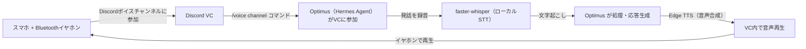

# Discord VCモードによるスマホ音声対話の実現（2026-08-28）

## 概要

スマートフォン（Pixel 10）と Bluetooth イヤホンを使い、Discord のボイスチャンネル（VC）経由で Optimus（Hermes Agent）とリアルタイムに音声で対話できるようにした構築記録です。

「スマホ＋イヤホンで自然に話しかけて、音声で返事をもらう」という目的を、**新しいアプリや外部サービスを一切追加せず、Hermes Agent 標準機能だけで実現**しました。

---

## 背景・目的

- これまでは Discord のテキストチャットのみで Optimus とやり取りしていた。
- 「スマホ＋Bluetoothイヤホンで話しかけるだけで指示ができ、結果も声で確認できるようにしたい」という要望が発端。
- 過去に検討していた Pixel Watch 経由の音声入力（LINE連携によるクイック返信方式）は、実現しても「返信専用・単発」の弱い機能にとどまる見込みだったため、より汎用的な本アプローチが完成した時点で不要と判断し、対応をクローズした。

---

## 全体設計

### 採用した技術要素（すべて無料・追加インフラなし）

| 要素 | 採用技術 | 理由 |
|---|---|---|
| 音声認識（STT） | **faster-whisper**（ローカル実行） | 完全無料・APIキー不要。精度も実用十分 |
| 音声合成（TTS） | **Edge TTS**（Microsoft、無料） | APIキー不要、日本語音声も高品質 |
| 音声伝送経路 | **Discord ボイスチャンネル** | 既存のDiscord連携をそのまま利用でき、新規アプリ導入が不要 |

---

## 開始手順（重要）

1. **スマートフォンの Discord アプリで、対象サーバーのボイスチャンネル（VC）に参加する**
   - サーバー内のチャンネル一覧から、スピーカーアイコン🔊のついたチャンネルをタップするだけ（通話に入る操作と同じ）
2. **VC に参加した状態で、テキストチャンネルまたはDMから `/voice channel` と入力して送信する**
3. 数秒待つと、Optimus が自動的にそのボイスチャンネルへ参加し、「I'll speak my replies and listen to you. Use /voice leave to disconnect.」という案内が表示される
4. この状態になれば、あとは**Bluetoothイヤホンに向かって普通に話しかけるだけ**で、発話が認識され、音声で返信が返ってくる

---

## 終了手順（重要）

Optimus 自身がボイスチャンネルから**自発的に退出することはできない**（安全上、外部からの強制切断のような操作を避ける設計になっているため）。以下のいずれかの方法で終了する。

| 方法 | 手順 |
|---|---|
| **① テキストコマンドで退出させる（推奨）** | テキストチャンネルまたはDMから `/voice leave` と送信する |
| **② 自分がVCから退出する** | Discordの通話画面の「切断」ボタンを押して、自分がボイスチャンネルから退出する（Optimus側も接続が切れる） |

---

## 実機テスト結果（2026-08-28）

3往復の音声対話をテストし、すべて正常に動作した。

| 発話内容 | 認識結果 | 応答 |
|---|---|---|
| 「はいはい、もし聞こえてますか」 | 正確に文字起こし | 音声で応答 |
| 「あ、すげぇ！ちゃんと聞こえてるんですね〜」 | 正確に文字起こし | 音声で応答 |
| 「終わり方、終了のさせ方を教えて」 | 正確に文字起こし | 音声で応答（終了方法を案内） |

初回セットアップ時のみ、faster-whisper のモデル（約150MB）が自動ダウンロードされるため、初回だけ反応が少し遅くなる点に注意。

---

## 所感・今後の課題

**開始・終了の手順がやや煩雑**という所感が得られた。具体的には:

- 「VCに参加する」→「`/voice channel` を打つ」という**2段階の操作**が必要で、直感的にワンアクションで始められない
- 終了時も「`/voice leave` を打つ」か「通話画面で切断する」のどちらかを意識的に選ぶ必要があり、スマホ操作に慣れていない場面（歩きながら、作業をしながら等）ではやや面倒

この課題を解決する方向性として、**「話しかけるだけで起動する（ウェイクワード方式）」**の実現可能性を別途調査済み。Discordの仕組みだけでは実現できず、Home Assistant Companion アプリ等の追加コンポーネントが必要になることが判明しており、別タスクとして今後検討する。

---

## 関連ファイル

- `~/.hermes/config.yaml` の `stt` / `tts` セクション（音声プロバイダ設定）
- `~/.hermes/hermes-agent/tools/tts_tool.py`（Edge TTS の音量パラメータを追加する最小パッチを実施）
- `~/.hermes/hermes-agent/scripts/discord-voice-doctor.py`（Discord音声機能の診断スクリプト、Hermes Agent標準同梱）

---

## Author and Ownership / 著作権と所属について

This project was created as a personal initiative and is not connected to any organization or group.
It is published as an individual creative work.

本プロジェクトは個人の活動として作成したものであり、特定の組織や団体の業務とは関係ありません。
個人の創作物として公開しています。
