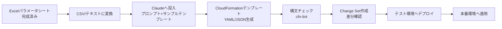

# Excelパラメータシート→CloudFormationリソース自動生成:Claude Chatを使った実践ガイド

作成日: 2026-09-08 / STATUS: INFO / TOPIC: AWS

> 完成済みのExcelパラメータシートをもとに、Claude(チャット版)を使ってAWS CloudFormationテンプレートを自動生成するための、具体的な手順・注意点をまとめた実践ガイド。

---

## 1. 全体の流れ(サマリー)

大きく5段階です。

1. **Excelの情報を、Claudeが読みやすい形式に整える**
2. **Claudeに生成させる(プロンプト設計が肝)**
3. **生成物を機械的に検証する(構文・整合性チェック)**
4. **Change Set(変更セット)で差分を事前確認**
5. **テスト環境 → 本番環境の順に適用**

---

## 2. 具体的な手順

### Step 1: Excelのデータを「Claudeが誤読しない形式」に変換する

Claude(チャット版)はExcelファイルを直接アップロードして読み取ることも可能ですが、**表の構造が複雑(結合セル、複数シート、注釈列混在等)だと誤読のリスクが上がります**。可能であれば、以下のいずれかに整形してから渡すことを推奨します。

- **CSV形式**にエクスポートする(最もシンプルで誤読が少ない)
- パラメータシートが「リソース種別・論理名・プロパティ名・値」のような列構成になっている場合は、**そのままの列構成を維持**し、余計な結合セル・装飾セルは削除する
- 1シートに複数のリソース種別(EC2、S3、RDS等)が混在している場合、**リソース種別ごとに範囲を明示**しておくと、Claudeが誤って別リソースのプロパティを混同するリスクを減らせる

### Step 2: プロンプトを設計する(ここが最重要)

Claudeに丸投げで「このExcelからCloudFormation作って」と頼むと、**存在しないプロパティ名を作り出す(ハルシネーション)、必須プロパティの漏れ、非推奨の書き方の混入**といった問題が起きやすいです。以下の要素を明示的にプロンプトへ含めることを強く推奨します。

- **出力形式の指定**: 「YAML形式で」「JSON形式で」を明示
- **対象リソースタイプの明示**: 「AWS::EC2::Instance」「AWS::S3::Bucket」等、CloudFormationの正式なリソースタイプ名を伝える(Claude側の推測に任せない)
- **命名規則の指定**: 論理ID(Logical ID)の命名ルールがあれば明示(例:「PascalCaseで、末尾にリソース種別の略称を付ける」等)
- **パラメータ化の方針**: どの値を`Parameters`セクションで外出しするか、どの値をハードコードして良いかを指示する
- **既存テンプレートをサンプルとして渡す**: 社内・過去案件で使っている既存のCloudFormationテンプレートがあれば、1つサンプルとして貼り付け、「このテンプレートのスタイル・命名規則に合わせて」と指示すると、生成物の一貫性が大きく向上する
- **タグ付けルールの指定**: AWSベストプラクティスとして「包括的なタグ戦略の実装」が推奨されているため、Environment、Owner、Project等の共通タグ付与ルールも指示に含める

### Step 3: 生成されたテンプレートを機械的に検証する

**Claudeの出力をそのまま信用してデプロイしない**のが鉄則です。以下のツールで必ず検証してください。

| ツール | 役割 |
|---|---|
| **cfn-lint** | CloudFormation公式の構文チェッカー。プロパティ名の誤り、必須項目の欠落、型の不一致等を検出 |
| **AWS CloudFormation Guard** | ポリシーをコード化してチェックする仕組み(例:「全てのS3バケットは暗号化必須」等のルールを強制) |
| **`aws cloudformation validate-template`** | AWS CLIでの構文検証コマンド(デプロイ前の最終チェック) |

これらはローカル環境やCI/CDパイプラインに組み込んでおくと、**「早期に、かつ何度でも」低コストで検証できる**ようになります(AWS公式ベストプラクティスでも「フィードバックループを短縮する」ことが明確に推奨されています)。

### Step 4: Change Set(変更セット)で影響範囲を事前確認する

生成したテンプレートを直接`update-stack`で適用せず、**必ずChange Setを作成してから適用**してください。

- Change Setは「このテンプレートを適用すると、実際に何が変更・削除・新規作成されるか」を**事前にプレビュー**できる機能です
- AIが生成したテンプレートは、既存リソースの意図しない削除・置換(Replacement)を引き起こす記述ミスが混入するリスクがあるため、**特に既存スタックの更新時はChange Setの確認が必須**です

### Step 5: テスト環境 → 本番環境の順で段階的に適用する

- 同じテンプレートを複数環境(dev/stg/prod)で使い回す前提であれば、**パラメータファイルを環境ごとに分離**しておく
- 本番適用前に、必ず**開発・検証環境で一度デプロイして動作確認**する

---

## 3. 注意すべき点(落とし穴)

### 3-1. AIによるIaC生成は、まだ発展途上の技術

2026年に発表された学術研究(Multi-IaC-Eval)では、**LLM(大規模言語モデル)によるIaC(Infrastructure as Code)生成を、CloudFormation・Terraform・CDKの複数形式で横断的にベンチマーク評価する取り組み**が行われています。裏を返せば、**「AIが生成したIaCが常に正確とは限らない」ことが、業界的にも明確な課題として認識されている**ということです。生成物を無条件に信頼せず、検証工程を必ず挟む前提で運用してください。

### 3-2. 機密情報・認証情報をテンプレートに埋め込まない

AWS公式ベストプラクティスでも明確に「**テンプレートに認証情報を埋め込まない**」ことが推奨されています。Excelパラメータシートにパスワードやアクセスキー等の機微な値が含まれている場合、それらをそのままClaudeへの入力に含めないよう注意してください。機密パラメータは`NoEcho`属性を使う、またはAWS Secrets Manager/Systems Manager Parameter Storeで別管理する設計が推奨されます。

### 3-3. AWS固有のパラメータ型・制約を活用する

CloudFormationには`AWS::EC2::KeyPair::KeyName`のような**AWS固有のパラメータ型**や、パラメータの許容値を制限する**制約(AllowedValues、AllowedPattern等)**があります。Excelシートの列(例:「許容される値の一覧」「入力パターン」)にこうした情報が含まれている場合、それをプロンプトに反映させることで、より安全なテンプレートを生成できます。

### 3-4. モジュール化・再利用を意識する

一度にすべてのリソースを1つの巨大なテンプレートに詰め込むのではなく、**ライフサイクル・所有者(オーナー)単位でスタックを分割**し、クロススタック参照(Cross-Stack References)で値を共有する設計が、AWS公式でも推奨されています。Excelシートが複数のリソース種別・複数システムにまたがる場合は、生成段階から「どう分割するか」を意識してClaudeに指示すると良いです。

### 3-5. ドリフト検出を運用に組み込む

CloudFormationで管理しているはずのリソースが、コンソール等から手動で変更されてしまう「ドリフト(乖離)」が発生することがあります。AI生成のテンプレートに限った話ではありませんが、**定期的なドリフト検出**を運用フローに組み込んでおくことで、実際の環境とテンプレートの整合性を保てます。

### 3-6. Claude Chatの限界:大規模・長大なテンプレートでは分割が必要になることがある

パラメータシートの行数が非常に多い場合、1回のやり取りで全リソースを一括生成しようとすると、出力が長くなりすぎて途中で省略・簡略化されることがあります。**リソース種別ごと、またはシステム単位で分割して生成し、後から結合する**運用が現実的です。

---

## 4. まとめ:実務でのチェックリスト

- [ ] Excelを誤読されにくい形式(CSV等)に整形したか
- [ ] プロンプトに出力形式・リソースタイプ・命名規則・タグ付けルールを明示したか
- [ ] 既存テンプレートをサンプルとして提示し、スタイルを揃えたか
- [ ] 機密情報をプロンプトに含めていないか
- [ ] cfn-lint / CloudFormation Guard / validate-templateで機械的に検証したか
- [ ] Change Setで変更内容を事前確認したか
- [ ] テスト環境で先に動作確認してから本番に適用したか
- [ ] 定期的なドリフト検出を運用に組み込んだか

---

## 5. 参考(公式ドキュメント)

- AWS CloudFormation ベストプラクティス: https://docs.aws.amazon.com/AWSCloudFormation/latest/UserGuide/best-practices.html
- CloudFormationパラメータの構文: https://docs.aws.amazon.com/AWSCloudFormation/latest/UserGuide/parameters-section-structure.html

---

## Author and Ownership / 著作権と所属について

This project was created as a personal initiative and is not connected to any organization or group.
It is published as an individual creative work.

本プロジェクトは個人の活動として作成したものであり、特定の組織や団体の業務とは関係ありません。
個人の創作物として公開しています。
