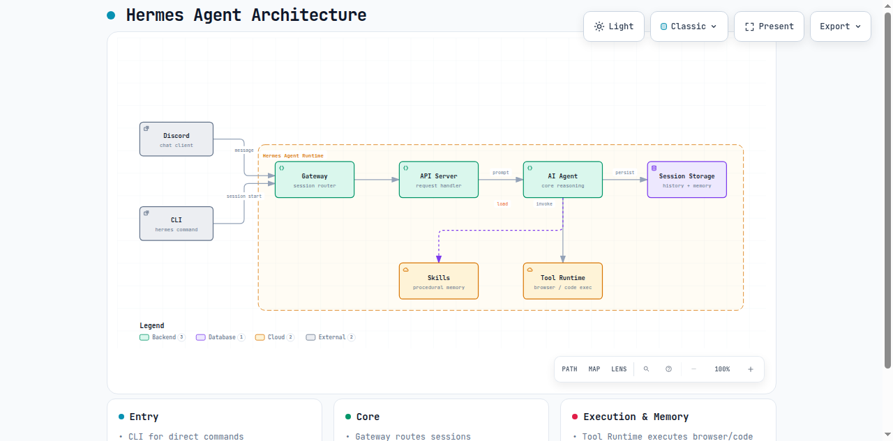
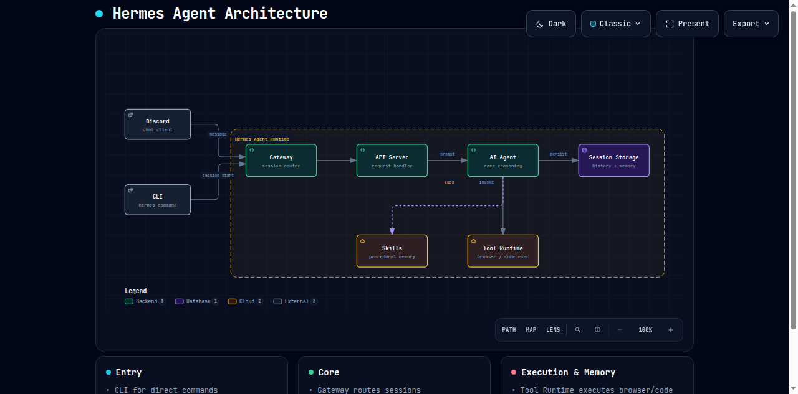

# AI作図スキル「archify」の信頼性チェックと実機検証 — diagram-designとの比較

- **記録日:** 2026-09-14
- **位置づけ:** GitHub週間トレンドで急伸していた`tt-a1i/archify`について、過去に導入・評価済みの`cathrynlavery/diagram-design`と同じ手順(信頼性チェック→実機での比較検証)で調査した記録。作図スキル選定の第2弾。

## きっかけ

GitHub週間トレンドで、`tt-a1i/archify`(スター数58,286、直近の伸び幅+10,718)というAIエージェント向け作図スキルが紹介された。以前`diagram-design`(スター数38,350)を評価・導入した際と同じ観点で調査してほしいという依頼を受け、同一の手順で信頼性チェックと実機検証を行った。

## 1. 外部スキル導入前の信頼性チェック

過去記事(「AI作図スキル・ツールの導入検討と比較」)で定めたチェック項目に沿って確認した。

| チェック項目 | 確認結果 |
|---|---|
| Star数・Fork数 | Star **60,674**、Fork **3,980**(GitHub API実測値、調査時点) |
| 作者情報 | GitHubアカウント`tt-a1i`。2019年作成、フォロワー1,478人、公開リポジトリ64件。実名・企業情報の公開はないが、活動履歴は十分にある個人アカウント |
| メンテナンス状況 | `archived: false`。直近のpushは調査当日、継続的にメンテナンスされている |
| ライセンス | MIT License(明記あり) |
| コード内容 | `scripts/`配下はビルド・テスト・パッケージング用のスクリプトのみで、目視で不審な外部通信・難読化コードは確認されなかった。`SECURITY.md`(脆弱性報告の受付方針)も整備済み |
| 第三者スキャン | スキル配布ツール`npx skills add`のインストール時に表示された自動スキャン結果:**Socket = 0 alerts、Snyk = Low Risk、Gen = Safe** |

以上より、**diagram-design同様に信頼できると判断**し、実機での比較検証に進んだ。

## 2. archifyの概要

- 正式名称は「Archify」。Node.js製の**レンダリング・検証システム**で、Cursor / Claude Code / Codex CLI / OpenCodeなど複数のAIエージェントに対応
- AIエージェントが「型付きのJSON中間表現(IR)」を生成し、Archifyがそれを**決定論的に**HTML/SVGへコンパイルする、という2段階構成
- 対応する図の種類は5つ:`architecture`(構成図)、`workflow`(業務フロー)、`sequence`(シーケンス図)、`dataflow`(データフロー)、`lifecycle`(状態遷移図)
- Mermaidの`flowchart`/`sequenceDiagram`/`stateDiagram`記法を読み込んで、Archify形式に変換することも可能
- 出力は**1ファイル完結のHTML**で、ダーク/ライトテーマ切り替え、PNG/SVG/WebM等へのエクスポート機能を内蔵

## 3. 実機での比較検証

前回のdiagram-design評価時と同じ題材(Hermes Agentのアーキテクチャ:入口→中核処理→保存先・実行基盤)で、archifyを実際にインストールし作図した。

### インストールと生成の流れ

```bash
npx skills add tt-a1i/archify -g
```

でスキルを導入後、以下の3ステップで図を生成する。

1. JSON形式で構成要素(コンポーネント・境界・接続関係)を記述
2. `node bin/archify.mjs validate architecture <ファイル> --quality showcase --json` で**検証**
3. 検証を通過したら `node bin/archify.mjs deliver architecture <ファイル> <出力先.html> --quality showcase --json` で**HTML出力**

### 検証機能の厳格さが際立つ

実際に検証を回したところ、**ラベルがコンポーネントに重なる**、**2本の矢印のラベル同士が0pxしか離れていない**といった、見た目の乱れに繋がる問題を検証コマンドが機械的に検出し、具体的な修正座標(`labelAt`の値)まで提示してきた。

```
Label "invoke" overlaps component "agent"
Suggested fix: labelAt [757, 298] or labelDy +24 (below); or labelAt [757, 216] or labelDy -58 (above)
```

提示された座標をそのまま反映すると、検証は9項目すべて合格(`checksPassed: 9, checkCount: 9, errors: 0, warnings: 0`)となった。**「とりあえず動く図」ではなく「レイアウト崩れがないことを機械的に保証された図」**を作る設計思想が明確に表れている。

### 生成結果

**ライトテーマ**



**ダークテーマ**(画面右上のトグルで即座に切り替え可能)



**参考:diagram-designでの同一題材の出力**(前回記事より再掲)


## 4. diagram-designとの比較

| 観点 | archify | diagram-design |
|---|---|---|
| 対応する図の種類 | 5種類(architecture / workflow / sequence / dataflow / lifecycle) | 39種類(より幅広いテンプレート) |
| 入力形式 | 型付きJSON(スキーマ厳格) | HTML+SVGを直接記述 |
| レイアウト検証 | **機械的な検証コマンドを内蔵**(ラベル重なり・矢印の直交性等を自動チェックし、具体的な修正案を提示) | 目視・ルールベースでの品質担保(検証コマンドは持たない) |
| テーマ切り替え | 生成物内にライト/ダーク切り替えボタンを標準搭載 | 生成時に指定 |
| Mermaid入力の取り込み | 対応(flowchart/sequenceDiagram/stateDiagramを解釈して再構成) | 対応(draw.io形式等の取り込み実績あり) |
| 差分比較機能 | Before/After比較(アーキテクチャ変更のレビュー用)を標準搭載 | 標準搭載なし |
| 学習コスト | JSONスキーマの理解が必要だが、検証コマンドがエラーを具体的に指摘してくれるため、AIエージェント経由での自動修正がしやすい | HTML+SVGの直接記述、詳細なルールに従うことで一貫した品質を出す設計 |
| 見た目の傾向 | ダッシュボード風、境界ボックス・凡例・下部カードでの要約が標準装備 | タイポグラフィ・凡例・余白へのこだわりが強く、より洗練された印象 |

### 使い分けの所感

- **AIエージェントに自動生成〜自動修正まで任せたい場合はarchify優位**。検証コマンドが機械的にレイアウト崩れを検出し、修正すべき座標まで提示してくれるため、エージェントが人間の目視チェックなしでも品質を担保しやすい設計になっている。
- **図の種類の幅広さ・見た目の作り込みではdiagram-design優位**(39種類のテンプレート、ブランドカラー自動反映等)。
- **アーキテクチャ変更のレビュー**(Before/After比較)が主目的なら、その機能を標準搭載しているarchifyが有利。

## 5. 結論・使い分けの方針(更新版)

前回記事の結論に、archifyを踏まえた使い分けを追加する。

- **GitHubのREADME等、公開ドキュメントに直接埋め込みたい場合 → Mermaid**(変わらず)
- **構成図の変更点をBefore/Afterで機械的にレビューしたい場合、またはAIエージェントに検証・自動修正まで任せたい場合 → archify**
- **社内資料や、見た目重視の1枚絵・多様なテンプレートが必要な場合 → diagram-design**
- **CLIでサッと図を試したい場合 → D2**
- **UML記法に慣れている、または既存のPlantUML資産がある場合 → PlantUML**

いずれも無料・OSSであり、用途によって使い分けるという結論は変わらないが、**「検証の厳格さ」という新しい評価軸が今回加わった**点が大きな学びだった。

## 6. AIエージェント運用における学び

1. **新しいツールの評価は、毎回同じ手順(信頼性チェック→同一題材での実機比較)で行うことで、過去の評価結果と横並びで比較できる**ようになる。今回もHermes Agentの構成という共通題材を使ったことで、diagram-designとの違いが定量的・視覚的に把握しやすかった。
2. **「検証コマンドを内蔵しているか」は、AIエージェントに作図を任せる上で重要な評価軸**であると分かった。人間の目視チェックに頼らず、ツール自体が機械的に品質を保証してくれる設計は、AIエージェント運用と相性が良い。

## Author and Ownership / 著作権と所属について

This project was created as a personal initiative and is not connected to any organization or group.
It is published as an individual creative work.

本プロジェクトは個人の活動として作成したものであり、特定の組織や団体の業務とは関係ありません。
個人の創作物として公開しています。
