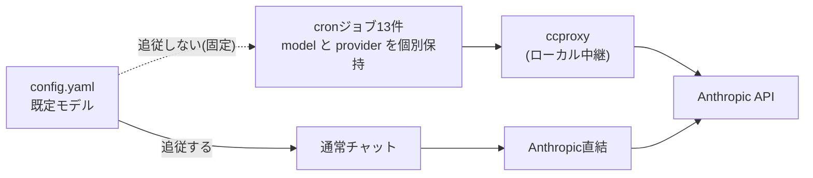

作成日: 2026-10-06 / STATUS: INFO / TOPIC: HERMES

# Hermes運用記録:モデル表記の罠・cronのモデル固定・TTS音量パッチ・更新の影響

- **記録日:** 2026-10-06
- **位置づけ:** Prime(Hermes Agent上のアシスタント)の環境で、2026-10-05〜06に実施した「モデルを最新に追従させる作業」の構築手順と、途中で見つかった落とし穴の記録。Hermes本体の更新(v0.21.3→v0.21.5)の影響確認、音声読み上げ(TTS)の音量設定も含む。
- **公式ドキュメント:** https://hermes-agent.nousresearch.com/docs
- **マスキング:** ホスト名・IP・ユーザ名・各種IDは`<...>`または`~/`に置換。機密値は記載しない。

## 0. 先に結論(3行)

1. **モデル名は「ドット」ではなく「ハイフン」で書く。** `claude-sonnet-5.5`ではなく`claude-sonnet-5-5`。ccproxy経由ではドット表記が404になる。
2. **cronのモデルは各ジョブに固定されている。** 設定ファイルの既定を変えても追従しない。今回は「固定のまま名前だけ更新」(案B)を選んだ。
3. **Hermes本体への手当て(TTS音量パッチ)は、本体の更新で消える。** 更新のたびに確認が必要。

## 1. 全体像



- **ccproxy:** Claude Code(CLI)のサブスクリプション認証を使い、Anthropic APIへ中継するローカルサービス。cronはここを経由している。
- **通常チャット(このDiscord会話)** は、設定の`provider: anthropic`(直結)で動く。

## 2. 罠① モデル表記:ドットとハイフン

### 実測した事実

| 送ったモデル名 | 宛先 | 結果 |
|---|---|---|
| `claude-sonnet-5.5`(ドット) | ccproxy | **404**(「`claude-sonnet-5-5`ですか?」と返る) |
| `claude-sonnet-5-5`(ハイフン) | ccproxy | **200成功**(同名のモデルで応答) |

### なぜ起きるか

Hermes本体の`normalize_model_for_provider`関数は、`provider=anthropic`のときだけドット→ハイフンに自動変換する。`provider=anthropic-ccproxy`では**変換しない**(本体の関数を直接呼んで確認)。

| モデル名(入力) | provider=anthropic | provider=anthropic-ccproxy |
|---|---|---|
| `claude-sonnet-5.5` | `claude-sonnet-5-5` | `claude-sonnet-5.5`(そのまま) |

→ 設定に**ドット表記を書くと、ccproxy経由のcronだけが失敗する**。通常チャットは変換されるので気づきにくい。

### 対処

`~/.hermes/config.yaml`のモデル名を、ハイフン表記に統一した(11か所)。

```bash
# バックアップしてから置換
cp ~/.hermes/config.yaml ~/backups/config.yaml.manual-$(date +%Y%m%d-%H%M)
sed -i -e 's/claude-sonnet-5\.5/claude-sonnet-5-5/g' \
       -e 's/claude-opus-5\.5/claude-opus-5-5/g' \
       -e 's/claude-fable-5\.1/claude-fable-5-1/g' ~/.hermes/config.yaml
```

検証:ドット表記が0件、ハイフン表記が11件、YAML構文OK、他の設定に差分なし。

## 3. 罠② ccproxy経由でOpus 5.5・Fable 5.1が通らない(解決済み)

ccproxy経由でOpus・Fableを呼ぶと、400エラーになっていた。

> Claude Code 2.1.226 does not support this model; version 2.1.280 (Opus) / 2.1.251 (Fable) or newer is required.

### 原因

ccproxyは**起動時に`claude` CLIのバージョンを検出し、そのバージョンを名乗るヘッダー情報を作って保持する**。Claude Code本体を2.1.289に更新しても、ccproxyは約5日間再起動していなかったため、古いバージョン情報のまま動いていた(コードの読み取りと、キャッシュファイル`claude_headers_<版>.json`の時刻から特定)。

### 対処:ccproxyの再起動

```bash
# 事前:キャッシュのバックアップ
cp -a ~/.cache/ccproxy ~/backups/<日付>-ccproxy-restart/cache
# 再起動(sudo不要)
systemctl --user restart optimus-ccproxy.service
# 起動完了(ポート8990の待受)を待つ。約4〜5分かかった
ss -ltn | grep :8990
```

| モデル | 再起動前 | 再起動後 |
|---|---|---|
| `claude-sonnet-5-5` | 200 | 200 |
| `claude-haiku-4-5` | 200 | 200 |
| `claude-opus-5-5` | 400 | **200** |
| `claude-fable-5-1` | 400 | **200** |

新しいキャッシュ`claude_headers_2.1.289.json`が作られたことも確認した。

### 運用ルール(重要)

- **Claude Code(CLI)を更新したら、ccproxyを再起動する。** 再起動しないと、新モデルが400になる。
- **再起動中は約4〜5分、ポート8990が閉じる**(起動時に未使用のCodex CLIの検出を試みて待つため)。その間、ccproxy経由のリクエストは接続拒否になる。cronが走らない時間帯に行う。
- 起動ログのCodex関連エラー(`Failed to capture Codex CLI request`)は、Claudeの経路とは無関係で、起動のたびに出る。
- 応答モデルの確認:応答本文はBrotli圧縮されているため、`curl`では文字化けして見える。Hermesのvenv(`brotli`入り)のPythonで展開すると、`claude-opus-5-5`・`claude-fable-5-1`が、それぞれ同名のモデルとして応答していた。

## 4. cronのモデル固定の仕様

### 何が起きていたか

エージェント系cron(LLMを使うジョブ)は、作成時や過去の操作(`resnap`)で`model`と`provider`が**ジョブごとに保存**されていた。設定ファイルの既定を最新にしても、各ジョブは古い値のまま動く。

### 固定を外す方法と、その副作用

更新ツールの`pinned=false`で固定を外せるが、**`model`と`provider`が両方外れる**。provider(ccproxy)だけを残す指定はない。

- 外すと、cronは通常チャットと同じ`provider: anthropic`(直結)で動く。
- 直結にすると、ccproxyを使う目的(課金経路の回避)がcronでは効かなくなる恐れがある。**課金経路は未確認**。

### 選択した方式:案B(固定のまま、名前だけ更新)

| 案 | 内容 | メリット | デメリット |
|---|---|---|---|
| A | 固定を全件解除 | 常に最新に追従 | cronの経路が変わる(課金経路が未確認) |
| **B(採用)** | モデル名だけ書き換え | ccproxy経由を維持 | 次の更新時に再度一括変更が必要 |

### `hermes cron edit`の使い方

```bash
# ジョブIDを指定して、モデルとプロバイダを同時に設定
hermes cron edit <job-id> --model claude-sonnet-5-5 --provider anthropic-ccproxy

# 固定の解除は --unpin、固定は --pin
```

- `hermes cron edit --help`に`--model`・`--provider`・`--pin/--unpin`がある。
- 設定ファイル`~/.hermes/cron/jobs.json`は手で編集せず、このコマンドか管理ツールを使う。
- 有効/無効・スケジュールは、この操作で変わらない(差分検証済み)。

### 今回の作業手順と検証

1. **事前:** `jobs.json`を3時点でバックアップ。ccproxyで新モデルが通ることを実測。
2. **試験:** 停止中のジョブ1件で更新し、保存された項目を確認。
3. **一括:** 固定されていた全ジョブ(稼働11件+停止中2件)に適用。失敗0件。
4. **事後:** バックアップとの差分比較。件数17→17、ID一致、変更キーは`model`のみ(1件は誤って`provider`も外れたため、元に戻した)。想定外の変更なし。
5. **動作:** 定常ジョブ`taskboard-poller`を1回手動実行。`claude-sonnet-5-5`で41秒・正常終了。他のジョブは次回の自然な実行で確認する。

### 落とし穴

- 次に新モデル(例:5.6)が出たら、手順を繰り返す必要がある(案Bのため)。
- Googleの再認証エラー(`invalid_grant`)のあるジョブがある。モデルとは無関係。

## 5. TTS(音声読み上げ)の音量パッチ

### 経緯

- 2026-08-28に、音声の音量を+250%(`volume: 3.5`)にする設定を行った。
- Hermes本体のコードに4行を追加する形だったため、9月の更新で退避(autostash)されたまま戻らなかった。
- 2026-10-06の更新でコードが整理され、関数が別のファイルへ移動した。元のパッチは`git apply --check`で失敗した。

### 現状(2026-10-06)

- **移動先:** `~/.hermes/hermes-agent/tools/tts_tool_providers.py`の`_generate_edge_tts`。
- **公式対応:** edge-ttsの音量は公式未対応(Piperのみ対応)。
- **当て直し(+3行):**

```python
    volume = float(edge_config.get("volume", tts_config.get("volume", 1.0)))
    ...
    if volume != 1.0:
        kwargs["volume"] = f"{round((volume - 1.0) * 100):+d}%"
```

- **設定(`~/.hermes/config.yaml`の`tts:`):**

```yaml
tts:
  use_gateway: false
  provider: edge
  edge:
    voice: ja-JP-NanamiNeural
    volume: 3.5
```

- **検証:** 構文チェックOK、差分は1ファイル+3行のみ。実音声を生成して「ちょうどよい」と確認。
- **発見:** 設定ファイルの`tts:`に、`voice`と`volume`が元々なかった(8月のバックアップ時点から)。保存先は未特定。

### 落とし穴

- **本体の更新で消える可能性がある。** 更新後に音量が小さくなったら、このパッチを当て直す。
- バックアップ:`~/backups/20261006-tts-volume/`(パッチ前のファイル)。

## 6. Hermes本体更新の影響(v0.21.3→v0.21.5)

### 実行したコマンドと結果

```bash
sudo apt update && sudo apt full-upgrade   # 44件、成功
hermes update                              # v0.21.3 → v0.21.5、ゲートウェイ自動再起動
claude update                              # 2.1.285 → 2.1.289
```

### 更新で自動的に変わったもの

| 項目 | 変更前 | 変更後 |
|---|---|---|
| 設定形式(`_config_version`) | 34 | 49 |
| `display.background_process_notifications` | `all` | `concise` |
| `delegation.max_iterations` | 50 | 250 |
| ツールセット | `bfl`あり | `bfl`廃止、`connections`追加 |

### 副作用・注意点

- **Python環境が入れ替わった。** `execute_code`内で`brotli`が使えなくなった。YAMLの読み込みなどは、`~/.hermes/hermes-agent/venv/bin/python`を使う。
- **`hermes restart`というコマンドはない。** 正しくは`hermes gateway restart`。再起動するとDiscord接続と作業セッションが一度切れる。
- **`gh`コマンドは未導入。** GitHub操作はgitとMCPで足りているため、導入しない判断。
- **Claude Codeの「2か所インストール」警告:** 調べると、実体はnpm版1つ(`~/.local/bin/claude`がシンボリックリンク)。ccproxyも同じパスを指す。対処不要と判断。

## 7. 設定ファイルの保護とバージョン管理

### エージェントは`config.yaml`を直接書き換えられない

`patch`や`write_file`で`config.yaml`を書くと、「セキュリティ関連設定は変更できない」と拒否される。回避せず、**ユーザーが直接編集する**運用にした。

### バージョン記録(`versioned_edit.sh`)のずれ

- 記録(v11)と実ファイルが一致しない「DRIFT」状態になっていた。原因は、Hermesの自動更新や承認の記録(`command_allowlist`)の追加。
- ユーザー自身がターミナルで新しい基準(v12)として記録し直した:

```bash
mkdir -p ~/.hermes/sysfile-versions/config
cp -p ~/.hermes/config.yaml ~/.hermes/sysfile-versions/config/v12
sha=$(sha256sum ~/.hermes/config.yaml | awk '{print $1}')
printf '{"version": 12, "path": "/home/<your-user>/.hermes/config.yaml", "hash": "%s"}\n' "$sha" \
  > ~/.hermes/sysfile-versions/config/meta.json
~/.hermes/scripts/versioned_edit.sh status | grep config   # → OK を確認
```

- **未対応:** `memory`・`user`も記録(v1)とずれている。メモリ機能で日常的に更新されるためと推測(未検証)。

## 8. 未解決・今後の課題

| 項目 | 状態 |
|---|---|
| ccproxy経由のOpus 5.5・Fable 5.1 | **解決済み**(ccproxy再起動で200。Claude Code更新後は再起動が必要) |
| Claude Code更新後のccproxy再起動の自動化 | 未対応。再起動に4〜5分かかるため、設計が必要 |
| 「常に最新」への追従 | 案Bのため手動更新。固定解除は課金経路の確認後に再検討 |
| TTSパッチの恒久化 | 本体更新で消える。更新後の再確認が必要 |
| 古いautostash(9/10付け) | 役目を終えたため破棄可能(`git stash drop`) |
| `memory`・`user`の記録ずれ | 運用上、対象から外すかを判断する |

## 9. 失敗したこと・反省

- **設定の更新で、モデルIDの表記確認が不足していた。** 先に`5.5`と書き込み、実測するまでドット表記の罠に気づかなかった。以降は、**変更前にccproxyで実測する**。
- **承認待ちコマンドで止まった。** `sed`置換を含むコマンドがユーザー承認待ちで5分応答がなく、実行されなかった。迂回せず中断し、ユーザーの手動実行に切り替えた(結果として保護機能を尊重する運用になった)。

## Author and Ownership / 著作権と所属について

This project was created as a personal initiative and is not connected to any organization or group.
It is published as an individual creative work.

本プロジェクトは個人の活動として作成したものであり、特定の組織や団体の業務とは関係ありません。
個人の創作物として公開しています。
