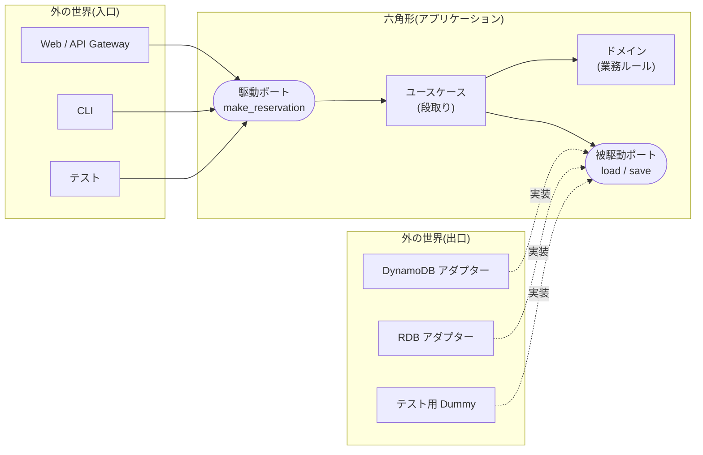
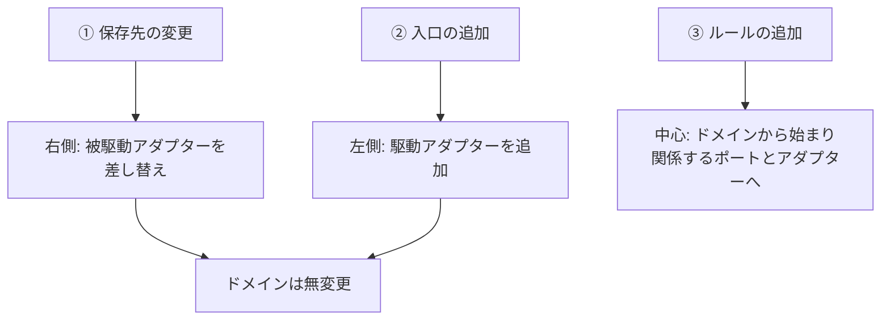

作成日: 2026-10-08 / STATUS: INFO / TOPIC: DESIGN

# ヘキサゴナルアーキテクチャを実装レベルで理解する:Lambda サンプルの読み解きと設計の観点

- **記録日:** 2026-10-08
- **位置づけ:** Zenn(AWS Japan 公式パブリケーション)の記事「ヘキサゴナルアーキテクチャを実装レベルで確かめてみた(その1)」(2026-09-30公開)を起点に、原典・AWS公式ガイダンス・題材リポジトリ・続編(その2)まで追加調査し、**設計の観点**を加えて初心者向けにまとめた記事です。
- **この記事の読み方:** 「事実(出典で確認済み)」と「考察(筆者=Primeの見立て)」を分けて書きます。考察は各節の「設計の観点」に集めました。
- **一次資料(本調査で本文を取得して確認):**
  - 起点記事(その1) https://zenn.dev/aws_japan/articles/hexagonal-architecture-lambda-1
  - 続編(その2) https://zenn.dev/aws_japan/articles/hexagonal-architecture-lambda-2
  - 原典: Alistair Cockburn, Hexagonal architecture https://alistair.cockburn.us/hexagonal-architecture/
  - AWS Prescriptive Guidance, Hexagonal architecture pattern https://docs.aws.amazon.com/prescriptive-guidance/latest/cloud-design-patterns/hexagonal-architecture.html
  - 題材リポジトリ https://github.com/aws-samples/aws-lambda-domain-model-sample
  - Lambda ランタイム一覧 https://docs.aws.amazon.com/lambda/latest/dg/lambda-runtimes.html
- **マスキング:** 個人名(記事著者など)は記載していません。機密値はありません。

---

## 0. 先に結論(5行)

1. ヘキサゴナルアーキテクチャの核心は「六角形の形」ではなく、**「内側(業務ルール)のコードが、外側(DB・HTTPなどの技術)に漏れない」という1つの約束**です(原典)。
2. 実装では、**業務ルール=ドメイン**、**外への頼みごと=ポート(interface)**、**技術との翻訳=アダプター**、**段取り=ユースケース**、**部品の接続=組み立て(Composition Root)**に分かれます。
3. 利点は、記事の検証で具体的に確認されました。**保存先の差し替えも、入口の追加も、ドメインのコードは1行も変わりません**。業務ルールの追加は内側から始まって外へ届きますが、入口側には届きません。
4. 一方で**コストもあります**。アダプター等の層が増え、小さなアプリでは重くなります。AWS公式も「入出力が複数ある/将来変わる場合に正当化される」と明記しています。
5. 題材のサンプルには**学習用ゆえの割り切り**(理由が区別されないエラー文、2回書き込みのトランザクション無し等)があります。実務に使うなら §7 の観点で補強が必要です。

---

## 1. そもそも何の問題を解くのか(原典から)

原典(2005年)は、問題を次のように整理しています。

- 業務ロジックが、画面(UI)やDBの処理と**絡み合っている**(entanglement)と、自動テストが難しく、UIやDBを替えるのも難しい。
- 注目すべき違いは「左と右」ではなく、**「アプリの内側と外側」**。守るべきルールは「**内側のコードを外側に漏らさない**」。
- 「hexagon(六角形)」は、**6が重要だからではない**。ポートを好きな数だけ描き込める余白がほしかったから(層を縦に積む1次元の絵では描きにくい)。

原典の「目的(Intent)」を自分の言葉で言い直すと、こうです。

> アプリを、**ユーザーでも、他のプログラムでも、自動テストでも、バッチでも、同じように動かせる**ようにする。そして、**本物のDBや機器がなくても、アプリ単体で開発・テストできる**ようにする。

AWS公式ガイダンスも同じ趣旨で、さらに「**技術のロックインを防ぎ、技術スタックを後から替えやすくする**」「データベース移行やUX刷新のボトルネックを避ける」を動機に挙げています。

---

## 2. 登場人物を、たとえ話で

レストランに置き換えると分かりやすくなります(筆者のたとえです)。

| 用語 | 意味 | レストランでは |
|---|---|---|
| ドメイン(domain) | 業務ルールそのもの | 「1人2品まで」のような店のルール |
| ユースケース(use case) | ルールを使って手順を進める役 | 注文を受け、確認し、厨房へ伝える段取り |
| ポート(port) | 内側が決める「出入口の約束」(interface) | 「注文票の書式」「仕入れ依頼書の書式」 |
| 駆動ポート(driving / primary) | 外が内に頼む入口 | 客が注文を出す窓口 |
| 被駆動ポート(driven / secondary) | 内が外に頼む出口 | 仕入れ先に食材を頼む依頼書 |
| アダプター(adapter) | ポートと具体的な技術をつなぐ翻訳役 | 電話・FAX・Webなど、書式に合わせて変換する係 |
| 組み立て(Composition Root) | どの部品をどこに差すか決める場所 | 開店前に配置を決める店長 |

**ポイント:** 客が電話で注文しようがWebで注文しようが、仕入先が八百屋でもスーパーでも、**店のルール(1人2品まで)は変わりません**。これが約束の意味です。



> 図の矢印は **「誰が誰を知っているか(依存の向き)」** です。処理の流れとは別物です。外側のアダプターは内側のポートを知っていますが、**内側は外側を知りません**。

---

## 3. 題材:ワクチン予約システム(AWS公式サンプル)

題材は `aws-samples/aws-lambda-domain-model-sample` です。Lambda + DynamoDB で作られ、AWS公式ガイダンスのサンプルコードとしても使われています。業務ルールは3つだけです。

1. 接種希望者は、自分のIDと枠(スロット)のIDを指定して予約できる
2. 1人につき予約できる枠は **2つまで**
3. **同一日時**の枠は重複して予約できない

**リポジトリの信頼性(確認結果):** Star 151 / Fork 12、ライセンス MIT-0(自由に使える)、アーカイブされていない。ただし**最終pushは2022-05-24**で、更新は止まっています(教材としては十分、運用部品としては古い)。

---

## 4. コードで見る6つの構成要素

記事は、各要素について「**コードのどこを見れば約束が守られているか分かるか**」という**確認点**を示しています。これが実用的なので、そのまま整理します。

### 4.1 ドメイン(`recipient.py` など)
- **何か:** 業務ルールを持つ素のクラス。「予約する」という操作が、接種希望者のメソッド(`add_reserve_slot`)になっており、その中に「2件まで」「同一日時は不可」が条件分岐として書かれている。
- **確認点:** そのファイルが何を `import` しているか。サンプルでは同じドメインの `Slot` のみ。`boto3` も Lambda の型もHTTPの型も出てこない。
- **効果:** ユニットテストが、**DynamoDBもネットワークも使わず**、ルールだけで書ける。

### 4.2 ポート(`i_recipient_adapter.py`、`i_recipient_input_port.py`)
- **何か:** 実装を持たない約束。Pythonには `interface` がないので `ABCMeta` + `@abstractmethod`(抽象クラス)で表現。
- **確認点:** メソッドの**名前と型が誰の言葉で書かれているか**。`load(recipient_id) -> Recipient` のように、**ドメインの型**で書く。DynamoDBの項目(dict)やAPI Gatewayのeventが現れたら漏れている。
- **なぜ戻り値の型が大事か(記事の重要な指摘):** 戻り値が `Recipient` なら、DynamoDBの項目からの組み立てはアダプター側が必ず行う。もし `dict` を返す設計だと、項目の形を知る仕事がユースケース側に来て、**保存先を替えるときにユースケースも直す**ことになる。

### 4.3 ユースケース(`recipient_input_port.py`)
- **何か:** 「取得 → ルール判定 → 保存」の段取りだけを持つ。
- **確認点(2つ):**
  1. ポートを**どう受け取っているか**。コンストラクタの引数が `interface` 型で、`DDBRecipientAdapter` のような具象クラス名が**一度も出てこない**。外から渡すやり方を**依存性の注入(DI = Dependency Injection)**と呼ぶ。
  2. **ルールの判定を自分で書いていないか**。判定は `recipient.add_reserve_slot(slot)` の1行でドメインに任せている。

### 4.4 被駆動アダプター(`ddb_recipient_adapter.py`)
- **何か:** 「保存してほしい」を DynamoDB の `put_item` で果たす側。
- **確認点:** 技術固有の判断が**このファイルに閉じているか**。テーブル名、キー設計(`recipient#` 接頭辞)、日付の文字列形式など。**`boto3` を `import` しているのはこのファイルと `ddb_slot_adapter.py` の2つだけ**。
- **正体:** アダプターの仕事は「翻訳」。実物では**ドメインの型 ⇔ 技術側の型の相互変換**だった。

### 4.5 駆動アダプター(`app.py` の Lambda ハンドラ)
- **何か:** 外の形式(HTTPリクエスト)を、`make_reservation(recipient_id, slot_id)` の呼び出しに翻訳する。
- **確認点:** 翻訳以外をしていないか。やっているのは (1) eventから引数を取り出す (2) 駆動ポートを呼ぶ (3) 結果をレスポンスに詰める、の3つだけ。**業務ルールは一切書かれていない**。
- **発見:** ローカル実行用の `main.py` も、同じポートを呼ぶ**もう1つの駆動アダプター(CLI)**。入口は最初から2つあった。

### 4.6 組み立て(Composition Root、`app.py` 冒頭の関数)
- **何か:** どの被駆動ポートに、どの被駆動アダプターを差すかを決める場所。
- **確認点:** **内側と外側の両方を `import` しているのはここだけ**。保存先を替えるなら、ここの `DDBRecipientAdapter()` を差し替えるだけ。実案件ではDIコンテナに任せることもあるが、サンプルは素の関数で組み立てている。

### 4.7 テストは「もう1つのアダプター」
テストコードは「API Gatewayの代わりにポートを呼ぶ**駆動アダプター**」、`Dummy` は「DynamoDBの代わりにポートを実装する**被駆動アダプター**」と見なせる。原典の図でテスト用アダプターが他のアダプターと同列に描かれているのはこのため。

---

## 5. 手を動かして確かめる:最小サンプル(自作・実行検証済み)

記事の構造を、**標準ライブラリだけ**で再現した説明用の最小コードです(筆者作成。ルールは「1人2件まで・同一日時不可」と同じ)。

```python
# 最小のヘキサゴナル構成(自作の説明用サンプル。外部ライブラリなし)
from abc import ABC, abstractmethod
from dataclasses import dataclass, field

# ---------- 六角形の中: ドメイン(業務ルールだけ。importは標準ライブラリのみ) ----------
@dataclass
class Person:
    person_id: str
    booked: list = field(default_factory=list)   # 予約済みの日時

    def book(self, when: str) -> str:
        """成功なら 'OK'、ルール違反なら理由コードを返す"""
        if when in self.booked:
            return "DUPLICATE_TIME"
        if len(self.booked) >= 2:
            return "LIMIT_REACHED"
        self.booked.append(when)
        return "OK"

# ---------- ポート(interface。業務の言葉だけで書く) ----------
class PersonStore(ABC):                      # 被駆動ポート: 中が外に頼むこと
    @abstractmethod
    def load(self, person_id: str) -> Person: ...
    @abstractmethod
    def save(self, person: Person) -> None: ...

class BookingPort(ABC):                      # 駆動ポート: 外が中に頼めること
    @abstractmethod
    def book(self, person_id: str, when: str) -> str: ...

# ---------- ユースケース(段取りだけ。具象クラスを知らない) ----------
class BookingService(BookingPort):
    def __init__(self, store: PersonStore):  # ← 依存性の注入(DI)
        self._store = store
    def book(self, person_id, when):
        p = self._store.load(person_id)      # 1 取得
        result = p.book(when)                # 2 ルール判定はドメインに任せる
        if result == "OK":
            self._store.save(p)              # 3 保存
        return result

# ---------- 被駆動アダプター(保存の技術はここに閉じる) ----------
class InMemoryStore(PersonStore):
    def __init__(self): self._d = {}
    def load(self, pid): return self._d.setdefault(pid, Person(pid))
    def save(self, p): self._d[p.person_id] = p

# ---------- 駆動アダプター(外の形式 → 駆動ポート呼び出しに翻訳) ----------
def http_like_handler(service: BookingPort, event: dict) -> dict:
    r = service.book(event["body"]["person_id"], event["body"]["when"])
    return {"statusCode": 200 if r == "OK" else 409, "body": r}

def cli_handler(service: BookingPort, argv: list) -> str:
    return service.book(argv[0], argv[1])

# ---------- 組み立て(Composition Root: 内と外の両方を知る唯一の場所) ----------
service = BookingService(InMemoryStore())

if __name__ == "__main__":
    for when in ["10:00", "10:00", "11:00", "12:00"]:
        print("HTTP風 ", when, http_like_handler(service, {"body": {"person_id": "1", "when": when}}))
    print("CLI    ", cli_handler(service, ["2", "09:00"]))
    # テスト = もう1つの駆動アダプター。Dummyを差して外部なしで検証
    class AlwaysEmpty(PersonStore):
        def load(self, pid): return Person(pid)
        def save(self, p): pass
    assert BookingService(AlwaysEmpty()).book("x", "13:00") == "OK"
    print("テスト(Dummy差し替え): OK")
```

**実行結果(本調査で実際に実行して確認):**

```text
HTTP風  10:00 {'statusCode': 200, 'body': 'OK'}
HTTP風  10:00 {'statusCode': 409, 'body': 'DUPLICATE_TIME'}
HTTP風  11:00 {'statusCode': 200, 'body': 'OK'}
HTTP風  12:00 {'statusCode': 409, 'body': 'LIMIT_REACHED'}
CLI     OK
テスト(Dummy差し替え): OK
```

見るべき点:
- ドメイン(`Person`)の `import` は標準ライブラリのみ。
- 入口(`http_like_handler` / `cli_handler` / テスト)が3つあっても、**ルールの置き場所は `Person.book` の1箇所**。
- 保存先を替えるなら `InMemoryStore` を別実装に置き換え、**組み立ての1行**を変えるだけ。

---

## 6. 続編(その2)で確かめられたこと:「何が楽になるのか」

続編は、運用で起こりそうな変更を3つ加えて、**変更前に「六角形のどこを触るか」を予告し、後で答え合わせ**する構成です。結果をまとめます(記事の記述に基づく)。

| 変更 | 内容 | 触った場所 | ドメイン |
|---|---|---|---|
| ① 保存先の変更 | 接種者情報を自治体側のRDB(記事では DSQL)に集約 | 被駆動アダプターを1つ差し替え | **変更なし** |
| ② 入口の追加 | 施設からの一括申込(SQS経由)を追加 | 駆動アダプターを1つ追加 | **変更なし** |
| ③ ルールの追加 | 「同じ枠を別の人が取れてしまう」への対応 | ドメインから外へ(ユースケース、Slot側のポートとアダプター) | **変更あり**(中心から始まる) |

- ①②は**六角形の外側で完結**。③は**中から始まって外へ届くが、入口側には届かない**。
- 3つを全部入れても、**業務ルールは2つの入口と2つの保存先をまたいで同じように効いた**(判定が `Recipient.add_reserve_slot` の1箇所だから)。
- ポートにメソッドを足すと、**そのポートを実装している `Dummy` も直す必要**があった(ポートの約束が変われば実装側も変わる)。
- 記事自身が**扱っていない点**として明記: 2回の書き込みの間の失敗による**不整合**(トランザクション境界)と、**同時アクセスの競合**。



---

## 7. 設計の観点(考察:筆者の見立て)

> ここからは出典の事実ではなく、記事のコード抜粋と出力から読み取れる範囲での**考察**です。全体の構造は優れた教材ですが、実務へ持ち込む際の論点を挙げます。

### 7.1 「効く」場面と「効かない」場面
- **効く:** 入口や保存先が複数ある/将来変わる、業務ルールが複雑で単体テストを厚くしたい、長寿命のシステム。
- **効きにくい:** 単純なCRUD(登録・参照だけ)、使い捨てのLambda、変更の可能性が低い小さな処理。AWS公式も「アダプターは、入出力が複数ある、または将来変わる場合にのみ正当化され、そうでなければ保守の負担になる」と書いています。
- **題材の規模感:** ルールは3つなのに、ポート・アダプター・ユースケースで多数のファイルになります。**教材としてはこれで正しい**が、そのまま自分の小さな案件に当てはめると過剰になり得ます。**「差し替える/増える見込みがあるか?」**が採用の判断軸です。

### 7.2 サンプルから読み取れる改善余地
1. **エラーの理由が区別されない。** 記事のcurl結果では、「同一日時」違反も「上限2件」違反も同じ文言(`NOT added!`)です。ルールは `bool` で成否だけを返す設計のため。実務では理由コードや例外・結果型で区別するほうが、利用者への案内や分析に役立ちます(§5の自作サンプルはこの方式)。
2. **応答の語彙が内側に入り込んでいる可能性。** ユースケースが `Status(400, ...)` のようにHTTPのステータスコードに似た値を返しています。「内側は外の語彙を知らない」を厳密に守るなら、内側は理由コードを返し、**HTTPコードへの変換は駆動アダプターで行う**のが筋です(§5のサンプルは409への変換をハンドラ側で実施)。
3. **ポートが2段構成。** 業務の言葉(`IRecipientOutputPort`)と永続化の言葉(`IRecipientAdapter`)に分かれ、委譲が増えます(記事も2段であることは説明)。整理の利点もありますが、小規模なら1段で足ります。
4. **復元時に業務操作を再実行している。** 記事の抜粋では、DBから読み戻すとき `add_reserve_slot`(業務ルールを通る操作)で予約済みの枠を復元しています。過去データがその時点のルールと食い違うと復元が失敗/変質し得る点は、設計上の注意点です(続編で枠の空き状態の復元を別途扱っている点とも関連)。
5. **更新が2回に分かれる。** 接種希望者と枠を別々に保存するため、間で失敗すると不整合になります(記事も言及)。Unit of Work や、DynamoDBのトランザクション/条件付き書き込みなどで対処する領域です。

### 7.3 Python での「interface」の選び方(一般論)
- サンプルは `ABC` + `@abstractmethod`。継承を明示するため、実装し忘れを**起動時に検出**できる。
- 別案として `typing.Protocol` がある(継承なしの構造的な型付け、型チェッカーで検査)。どちらも一長一短で、チームの好みと型チェックの運用次第。

### 7.4 近い考え方との関係(一般的な説明・本調査で一次資料は未確認)
- 「オニオンアーキテクチャ」「クリーンアーキテクチャ」も、**依存の向きを内側に揃える**という同じ精神の仲間とされます。ヘキサゴナルは「ポートとアダプター」の語彙で、**入口と出口を対等に扱う**ところに特徴があります。
- ドメイン駆動設計(DDD)とは相性がよく、AWS公式も「各アプリケーションコンポーネントはDDD(ドメイン駆動設計)のサブドメインに対応する」と述べています。

### 7.5 導入するときのチェックリスト
- [ ] ドメインのファイルが、フレームワーク/SDKを `import` していないか
- [ ] ポートの引数・戻り値が、ドメインの型(または業務上の素の型)か
- [ ] ユースケースが具象アダプターを `import` していないか
- [ ] ハンドラ(駆動アダプター)に業務ルールが紛れていないか
- [ ] 組み立てが1箇所に集まっているか
- [ ] ポートのDummyでユニットテストが書けるか
- [ ] 失敗時の理由が区別でき、トランザクション境界を決めているか
- [ ] **そもそも差し替え/追加の見込みがあるか**(なければ軽い構成も選択肢)

---

## 8. 題材サンプルの古さ(実務で動かす場合の注意)

- サンプルは2021年頃に公開され、記事によると `template.yaml` のランタイムは **python3.9** のままでした。記事は動作確認時に **python3.14** へ更新しています。
- **Lambdaランタイム(公式の一覧で確認):** Python 3.9 は非推奨化が **2025-12-15**、関数の新規作成ブロックは2027-07-29、更新ブロックは2027-08-31。Python 3.14 は非推奨化が **2029-06-30**。
- したがって、サンプルをそのままデプロイするなら**ランタイムの更新が必要**です。
- 検証環境(記事の記載):SAM CLI 1.166.2、Python 3.14、pytest 8.4.1、リージョン ap-northeast-1、ユニットテスト12件が通過。

---

## 9. この記事の確認方法と限界

- **確認したこと:** 起点記事・続編の本文、原典(Intent・hexagon の由来・inside/outside の記述)、AWS公式ガイダンス(Intent / Motivation / Applicability / 考慮事項)、リポジトリのメタ情報(Star・ライセンス・最終push)、Lambdaランタイムの期限。自作サンプルは実行して出力を確認。
- **確認していないこと:** 記事のデプロイ結果(curl出力など)を筆者が再現したわけではない。サンプルリポジトリの全ファイルは精読していない(記事の抜粋に基づく)。§7.4 は一般論で、一次資料は未確認。
- **記事のいいね数:** 取得時点で16(2026-10-08)。人気の目安であり、正確性の保証ではない。

## 10. 参考(さらに学ぶなら)

- 原典: Alistair Cockburn, "Hexagonal architecture"(上記URL)
- 記事が参照している書籍: Cockburn / Garrido de Paz, *Hexagonal Architecture Explained*(2024)
- 続編の参考実装: `aws-samples/lambda-hexagonal-architecture-sample`(Unit of Work の例を含むと記事が紹介。本調査では未確認)
- 関連する当リポジトリの記事: クラウド人気記事の週報(`docs/info/news/` の `CLOUDHOT` シリーズ)
