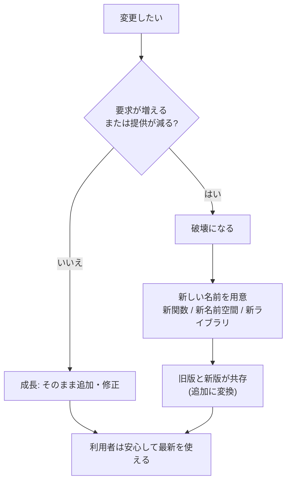
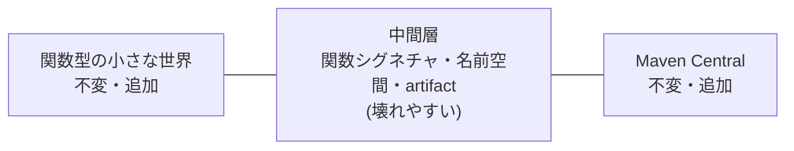

作成日: 2026-10-09 / STATUS: INFO / TOPIC: DESIGN

# Rich Hickey『Spec-ulation』解説 ― 「変更(change)」ではなく「交換(exchange)」で考える

- **記録日:** 2026-10-08
- **位置づけ:** Clojure/Conj 2016 基調講演の解説ノート。ライブラリの「バージョン管理」と「互換性」の考え方を、初心者向けに整理した読み物。
- **一次資料:** 書き起こし https://github.com/matthiasn/talk-transcripts/blob/master/Hickey_Rich/Spec_ulation.md ／ 動画 https://www.youtube.com/watch?v=oyLBGkS5ICk
- 注意: 書き起こしはコミュニティ作成で、画像・ライブコーディング部分は含まれない。本文は筆者による要約で、全文転載ではない。

## 0. 先に結論(5行)

1. 「変更(change)」という言葉は曖昧。ソフトの変更は実は **「成長(growth)」か「破壊(breakage)」のどちらか** に分けられる。
2. 成長とは「より多く提供する」「要求を減らす」「バグを直す」こと。破壊とは「要求を増やす」「提供を減らす」「同じ名前に別の意味を与える」こと。
3. 破壊的変更はやってはいけない。どうしても必要なら **新しい名前(新関数・新名前空間・新ライブラリ名)をつけて「破壊」を「追加(accretion)」に変える**。
4. セマンティックバージョニング(SemVer)の「メジャー番号」は破壊のやり方を標準化したもので、有用でないと主張している。Maven Central は「増えるだけで書き換わらない不変の集合」だから信頼できる、という対比を使う。
5. 関数型プログラミング(FP)の発想(不変・追加のみ)を、関数だけでなくライブラリや Web サービスのエコシステムにも広げよう、というのが結論。

## 1. 講演の基本情報

| 項目 | 内容 |
|---|---|
| 題名 | Spec-ulation(Keynote) |
| 登壇者 | Rich Hickey(Clojure の作者) |
| 場 | Clojure/Conj 2016(2016年12月) |
| 長さ | 約4573秒(約76分) |
| 再生数 | 約135,000回(取得時点の目安) |
| 形式 | スライド+語り(書き起こし内に「ライブコーディングのデモ」の枠があるが内容は不明) |
| 動画 | https://www.youtube.com/watch?v=oyLBGkS5ICk |

## 2. 背景(なぜこの講演か)

- 題名は spec(Clojure のデータ仕様記述ライブラリ)と「speculation(憶測)」をかけたもの。講演者自身が冒頭で「これは **rant(不満をぶちまける話)** だ」と述べている。
- 同じ大会では spec の個別の講演や、ワークショップがあった。そのため本講演は「spec の使い方」ではなく **「spec が何のためにあるか」** を扱う、と宣言している。
- 講演者によれば spec の狙いは2つ。(a) 使う人が **使える** ものを渡すこと(「ルールを守れ」ではなく「これが使える」)。(b) 提供する側が **約束(commitment)** をし、後から取り上げないこと。
- つまり spec は「後から安全に変えていけるようにする仕組み」の一部であり、その背景にある大きな問題が「変更」だ、という流れで話が始まる。

## 3. 講演の中身(流れ順)

### 3.1 「変更」という言葉を疑う
- 語源は「交換・物々交換」(ラテン語 cambire)。例として、ボードゲーム(Eurogames)で牛を小麦に交換する話を使う。
- 講演者の主張: 相手の同意なしに中身だけ変えるのは、一方的な取り上げに近い。現場では依存関係(dependency)の問題追跡で「ソウルを削られる」経験をしている。
- 問い: 明日もっと良く・違うソフトにしたい。そのとき利用者に何が起きるか。

### 3.2 依存関係の「見かけ」と「実体」
- 現状: Maven(Java 系のビルド・依存管理ツール)で、アプリがライブラリ A・B・C を宣言し、それぞれがさらに X・Y・Z を宣言する。Y のバージョンが衝突すると、Maven は通常新しい方を選ぶ。
- 講演者の指摘:
  - 成果物(artifact、JAR ファイルなどのパッケージ)は何も「使って」いない。パッケージの一覧を持つだけ。
  - コードの中には artifact への言及がない。
  - 名前空間(namespace)のレベルでは `require` がコード内に現れるが、「どの名前空間がどの JAR に入っているか」の対応表はどこにもない(講演者は「魔法(magic)」と表現)。
  - 実際の依存は **関数が別の関数を名前で呼ぶこと**。この図で見ると、宣言上は必要な X や Z が、実際の呼び出しからは不要だと分かる例を示した。
  - さらに、引数に何を渡すか・戻り値の何を使うかは、ソースに見えない「見えない依存」。
- 3つの階層: 関数→名前空間→artifact。上位は下位が成功するための「文脈(context)」を作るだけ、という整理。

### 3.3 なぜ依存を書くのか
- 開発中にライブラリが要る/推移的依存(間接的に必要なもの)を自動で引ける便利さ/利用者へ伝えるため。
- 「このバージョンでテストした」という保証は、実際に動く構成はそれと違う可能性が高いので **幻想** だと主張。粒度が粗すぎて、実際の必要を表さない。

### 3.4 提供(provide)と要求(require)で語る
- 関数は引数を要求し、戻り値(や副作用)を提供する。名前空間や artifact は「名前を渡すと中身を返す対応表」とみなせる。
- 変更の分類(講演者の整理):
  - **成長:** 蓄積(accretion=提供を増やす)/緩和(relaxation=要求を減らす)/修正(fixation=バグ修正、提供も要求も変えない)。
  - **破壊:** 要求を増やす/提供を減らす/同じ名前に無関係な意味を与える。
- 結論: 「変更」は何も伝えない。「成長」か「破壊」かを言うべき。spec は集合論的な性質(マップ)や正規表現(並び)を使うので、この互換性を機械的に調べる余地がある。ただし **そうしたツールはまだ無い** と講演者は述べている。spec 自体を「バージョン2」のように版管理するのは避けるべき、とも言う。

### 3.5 集合として見る(大きな単位の変更)
- 名前空間や artifact は「集合(collection)」。集合への操作は追加か削除だけで、追加は成長、削除は常に破壊。
- レベルを混ぜるな、という例えが「帽子をかぶっても家族は変わらない」。spec がマップのキー集合だけを扱い、キーの中身の意味に踏み込まないのも同じ理由。

### 3.6 SemVer(セマンティックバージョニング)批判
- SemVer は「メジャー.マイナー.パッチ」の番号規約。講演者の読み: パッチとマイナーは「利用者は気にしなくていい」、メジャーは「困ったことになる」。しかもどこで何が壊れたかは教えない。
- 全レベルの破壊をメジャー番号に押し込むため情報量が少なく、「名前を変えた方がまし」とまで言う。
- 反論の想定: 「それは変更でなく新しいものだ」→ その通り、新しいものだから新しい名前にする。

### 3.7 どの名前を変えるか
- 関数の引数要求が増えた/戻り値が減った場合: 新関数(例: `foo-2`)、または新名前空間(API2 のような)を作る。名前空間は名前の一部なので衝突しない。alias(別名)を使えば、利用者は好きなときに新しい方へ移れる。
- 関数を消したい場合: 実際に変わったのは「名前空間(集合)」なので、新しい名前空間を作ってそこに含めない。
- 名前空間を消したい場合: artifact(集合)が変わるので新 artifactId が候補。ただし「名前空間と artifact の対応が魔法」のため、別ライブラリに同じ名前空間があると衝突する。名前空間名もライブラリ名に合わせて変えるのが一案で、「それが正解かは分からない」と講演者は留保。
- 「面倒で、削除をためらわないか」→ **「そうなる。それで良い」**。

### 3.8 「破壊的変更は壊れている」と Maven Central
- 主張の核心: 破壊的変更をするな。最善の破壊方法を探すな。破壊を追加へ変えれば旧版と新版が共存でき、利用者は怯えずに進める。
- Maven Central は artifact を書き換えさせず、自身にバージョンもない。「増え続ける不変物の集まり」だから、誰もがいつでも最新を使っても平気、という例。
- 「腐ったサンドイッチ」の比喩: 下層(関数型の小さな世界)と最上層(Maven Central)は不変・追加型でうまくいっているが、中間(artifact・名前空間・関数シグネチャ)は壊れている。
- では SemVer は壊れているか? 講演者は「はい」。代案として **日時ベースのバージョン(例: YYYYMMDD.HHMMSS)** を例示しつつ、特定の方式の推奨ではなく「順序が分かれば何でもよい」とする。また Git(内容のハッシュで管理される不変の履歴)は有望だが、SHA は順序や因果が読めず可読性が低い、という課題も挙げた。

### 3.9 社会の問題:ローカル開発とオープン開発
- チーム内なら全員が朝会で合意できる。Slack での合意をそのままオープンソースに持ち込むと、影響を受ける利用者(誰か分からない)が不在。
- 「技術では解決できない。他者を大切に扱う合意が要る」と述べ、Clojure も完璧ではなかったと認めている。

### 3.10 成長を前提にしたコーディング
- 「マップに他のキーを禁止する」機能がほしいという要望が最多だが、spec は意図的に入れていない。禁止すると、後で何かを許すときに名前を変える必要が生じ、それが上位の仕様へ連鎖するため。
- spec は「できること」を書くもので、「できないこと」ではない。厳格チェックは別層の検査として持つのは良いが、公開仕様には入れない。
- 受け取る側は「知らない情報が来ても平気」にする(無視する、または方針を決める。画面に全部出すと個人情報を出しかねない例)。
- 反復開発(アルファ版など)は構わない。ただし自分が今どの段階の約束をしているかを明確にし、「アルファは別 artifactId にする」「API 単位で公開宣言する」など粒度の細かい公開手段が要る、と述べる。

### 3.11 実行時こそが真実
- POM(Maven の設定ファイル)の依存宣言は「サンタへのお願いリスト」のようなもの。最終的に実行されるクラスパス(実行時のライブラリ一覧)が真実で、各部品が一度も一緒に動かしたことのない組み合わせになる可能性がある。
- したがってリリース時のテストには限界がある。アプリ(や複数アプリ)単位でライブラリ集合を確定させる高レベルな手段がほしい。名前が不変なら、ツールは「常に最新」を選べる。

### 3.12 Web サービスも同じ
- Web サービスは「操作の集合」。引数が変わるたびに API をバージョンアップするのは階層の混同(帽子の例)。`foo` を壊さず `foo2` を隣に置けば、利用者は都合の良いときに移行できる。

### 3.13 「それは非現実的」への反論と結び
- 反論に対し、Unix の API、Java、HTML など10年以上の互換性を保った例を挙げる(講演者の主張。本書では未検証)。互換性は成功の前提条件だと信じる、とも述べる。
- 「もし何も壊さなかったら」: 名前が永続的に意味を持つ/互換性検査が独立してできる/細粒度の依存を探れる/最新を安心して使える/安心して組み合わせられる。
- 未解決の課題: 引数・戻り値の変更はソースから見えない/spec の互換性は「提供側か要求側か」で向きが違う/リポジトリ→artifact→名前空間の対応が第一級でない/現状を強化する道具と文化。
- Clojure の機会: spec、柔軟な依存把握、コードから artifact を明示する仕組み、API 単位の公開・非推奨(deprecate)、細粒度の依存に基づくテスト(コードの SHA を使い、変更された関数と影響範囲だけを生成的テストにかける案)。
- 結語: 「変更(change)より交換(exchange)」。成長させ、変種は「産み」、消費者(と未来)を考えて橋を焼かずに進もう。

## 4. 用語集

| 用語 | 綴り | 意味 |
|---|---|---|
| 依存関係 | dependency | あるコードが動くために必要な別のコードやライブラリ |
| 推移的依存 | transitive dependency | 依存先がさらに必要とする間接的な依存 |
| 成果物 | artifact | JAR などの配布パッケージ |
| 名前空間 | namespace | 関数や変数を名前で整理する入れ物 |
| セマンティックバージョニング | Semantic Versioning (SemVer) | メジャー.マイナー.パッチで互換性を表す番号付け規約 |
| 破壊的変更 | breaking change | 既存の利用者が動かなくなる変更 |
| 蓄積/追加 | accretion | 既存を壊さず提供物を増やすこと |
| 緩和 | relaxation | 要求(前提条件)を減らすこと |
| 修正 | fixation | 提供・要求を変えずにバグを直すこと |
| 仕様 | spec | Clojure のデータ・関数の仕様記述ライブラリ |
| クラスパス | classpath | 実行時にコードを探す場所の一覧 |
| POM | Project Object Model | Maven のプロジェクト設定ファイル |
| SHA | Secure Hash Algorithm | Git が内容から作る固有のハッシュ値 |
| 生成的テスト | generative testing | 入力を自動生成して性質を検査するテスト |
| 非推奨 | deprecation | 使用を推奨しないが削除はしない旨の表示 |

## 5. 実務での使いどころ(筆者の提案)

ここは講演者の主張ではなく、筆者が講演を実務に当てはめた提案である。

- **API を変えたくなったら:** 既存を直さず `foo-v2` のような新関数・新エンドポイントを隣に置き、旧版は残して「非推奨」と告知する。
- **変更レビューの観点:** PR で「要求が増えていないか」「提供が減っていないか」を確認する。「何を変えたか」より答えが明確。
- **データ形式:** JSON やマップは「未知のキーは無視する」前提で読む。受け手側で必要項目だけを選び取る。
- **依存管理:** 宣言を鵜呑みにせず、実際にビルドされた最終的な依存一覧(ロックファイルなど)を確認する。
- **社内外の区別:** 社内限定の API は自由に直せるが、利用者が未知の公開物は約束を重く扱う。

## 6. 考察:強みと限界(考察(筆者の見立て))

以下は事実ではなく筆者の見立てである。

**強み**
- 「変更」を「提供/要求」に分解する見方は、互換性の議論を具体的にし、レビューや設計に直接使いやすい。
- 「名前を変えれば破壊は追加になる」は、Maven Central の例と整合する分かりやすい筋道。

**限界・批判的視点**
- 古い関数・名前空間が永遠に残るため、コードベースの肥大化や保守コスト、セキュリティ脆弱性への対応(旧版を消せない)の問題が残る。講演では「消せない」ことを「それで良い」としているが、運用負担の議論は薄く見える。
- 成長だけで済まない現実(バグの仕様化、設計ミス、法規制対応)もあり得る。講演はバグ修正を「成長」に含めるが、バグに依存した利用者がいる場合の扱いは書き起こしからは読み取れない。
- 「SemVer は無用」という強い主張は、実務ではメジャー番号が「注意の合図」として機能している面もあり、全面否定は議論の余地がある。講演者自身も代案を一つに決めていない。
- spec での互換性自動検査は「まだ無い」と講演者が述べている。実現性は未確認。
- 講演は Clojure/JVM の文脈が強く、他の言語(ロックファイルを持つ環境など)にそのまま当てはまるかは別途検討が要る。
- 2016年時点の講演であり、その後のツールや慣行の変化は本書で調べていない。

## 7. 確認範囲と限界

- 確認したのは書き起こし全文(約1,486行、約7.5万バイト)。動画は視聴していない。
- ライブコーディングのデモ部分は書き起こしに内容がなく、不明。
- 講演者が挙げた外部事例(Unix・Java・HTML の長期互換、SemVer 仕様の記述、Maven Central の性質、論理システムに関する話)は **講演者の主張であり、本書では検証していない(未確認)**。
- 再生数は取得時点の目安。
- 第三者(聴衆・同僚)の発言は個人名を伏せて要約した。

## 8. 参考リンク

- 書き起こし: https://github.com/matthiasn/talk-transcripts/blob/master/Hickey_Rich/Spec_ulation.md
- 動画: https://www.youtube.com/watch?v=oyLBGkS5ICk
- Semantic Versioning 仕様(講演で言及): https://semver.org/spec/v2.0.0.html
- Clojure/Conj 2016: http://2016.clojure-conj.org
