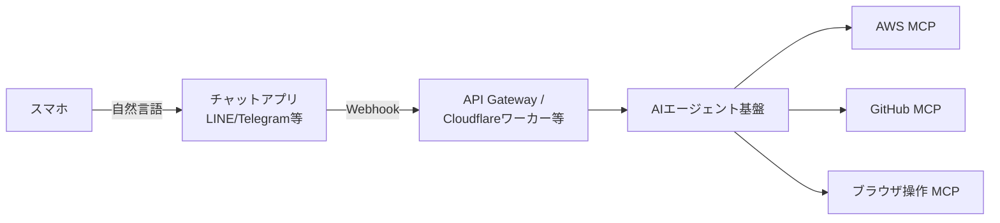

# AI・生成AI学習リソース総覧（Awesomeリスト・RAG・CRAG・カスタムAIエージェント設計）

> **対象**: 生成AI/LLM/RAG/AIエージェントを体系的に学びたい人向けのリンク集と設計メモ。
> **作成日**: 2026-08-15（JST） / **ステータス**: INFO（情報提供・学習リファレンス）
> **一次情報**: 各リポジトリの公式README、[LangChain公式ドキュメント](https://python.langchain.com/)、[LangGraph公式](https://docs.langchain.com/oss/python/langgraph/overview)、[Meta CRAG Benchmark](https://github.com/facebookresearch/CRAG)、[AWS re:Post RAG](https://docs.aws.amazon.com/ja_jp/) 等
> **元記事**: public2リポジトリ `ai/ai.md` `ai/crag.md` `ai/genu.md` `ai/rag.md` `ai/custom-ai-agent/design1.md` を再構成（内容はweb_searchで裏取りし加筆修正）

---

## 用語ミニ解説（初心者向け）

- **LLM（Large Language Model / 大規模言語モデル）**: 大量のテキストで学習し、文章生成や質問応答を行うAIモデル（例: GPT, Claude）。
- **RAG（Retrieval-Augmented Generation / 検索拡張生成）**: LLMが回答する前に外部データベースやドキュメントを検索し、その内容を踏まえて回答を生成する手法。LLM単体の「知識の古さ」「ハルシネーション（もっともらしい誤答）」を補う。
- **CRAG（Corrective RAG / 修正型RAG）**: RAGで検索した情報が「正しいか・不十分か・曖昧か」を自己評価し、必要なら再検索や補正を行う発展型の手法。2024年にMetaの研究チームが提案した概念。
- **MCP（Model Context Protocol）**: AIエージェントが外部ツール（GitHub、AWS、ブラウザ等）を標準化された方法で呼び出すためのプロトコル。Anthropicが提唱し、業界標準として普及が進んでいる。
- **AIエージェント（AI Agent）**: 単に質問応答するだけでなく、複数ステップの計画・ツール呼び出し・自律的な判断を行うAIシステム。

---

## 1. Awesomeリスト（学習・カタログ系まとめ）

生成AI/LLM関連の情報は玉石混交なので、信頼できる「まとめリポジトリ（Awesomeリスト）」から入るのが効率的。目的別に3系統に整理する。

| リポジトリ | 主な目的 | 向いている人 |
|---|---|---|
| [aishwaryanr/awesome-generative-ai-guide](https://github.com/aishwaryanr/awesome-generative-ai-guide) | 学習ロードマップ・無料コース・面接対策 | これから生成AIを学びたい人 |
| [steven2358/awesome-generative-ai](https://github.com/steven2358/awesome-generative-ai) | AIツール・モデルの網羅カタログ | 使えるツールを探したい人 |
| [filipecalegario/awesome-generative-ai](https://github.com/filipecalegario/awesome-generative-ai) | 研究・歴史・倫理を含む体系的理解 | 技術を深く理解したい人 |
| [e2b-dev/awesome-ai-agents](https://github.com/e2b-dev/awesome-ai-agents) | AIエージェントのフレームワーク比較 | エージェントを自作したい開発者 |
| [Arindam200/awesome-ai-apps](https://github.com/Arindam200/awesome-ai-apps) | 動くAIアプリのサンプル集 | 実例から学びたい初心者 |
| [punkpeye/awesome-mcp-servers](https://github.com/punkpeye/awesome-mcp-servers) | MCPサーバーの一覧 | MCPでツール連携したい人 |
| [ComposioHQ/awesome-claude-skills](https://github.com/ComposioHQ/awesome-claude-skills) | Claude Skills（Claudeの拡張機能）集 | Claudeを拡張したい人 |

### 学習ロードマップ（RAG/エージェントを学ぶ最短ルート）

1. **基礎**: [Microsoft Learn 生成AI](https://learn.microsoft.com/ja-jp/ai/)、[Google Cloud Learn Generative AI](https://cloud.google.com/learn/paths/generative-ai?hl=ja)、[OpenAI Cookbook](https://github.com/openai/openai-cookbook)
2. **実践**: [LangChain](https://python.langchain.com/)、[LlamaIndex](https://docs.llamaindex.ai/)、[Haystack](https://github.com/deepset-ai/haystack)
3. **RAGの発展形（CRAG）を理解**: 後述の第2章参照
4. **AIエージェントを作る**: 第3章参照

---

## 2. RAG・CRAG（検索拡張生成とその発展形）

### 2.1 RAGの精度を上げる観点

RAGは「検索」と「生成」の2段構成のため、精度改善は主に以下の観点で行う。

- **ナレッジ整備**: 不要・重複情報の削除、鮮度管理
- **検索方式**: キーワード検索 → ベクトル検索 → **ハイブリッド検索**（両方を組み合わせるのが現在の主流）
- **チャンク設計**: 文書を分割する際、文字数で機械的に切るのではなく意味のまとまり単位で分割する「セマンティックチャンキング」
- **プロンプト設計**: 役割・指示・出力形式を明確化する

### 2.2 CRAG（Corrective RAG）とは

CRAGは、検索した情報の品質（Correct / Incorrect / Ambiguous＝正しい／誤り／曖昧）をLLM自身が評価し、品質が低い場合は再検索や外部Web検索で補正してから回答を生成する手法。一次情報は [Meta Researchの CRAG Benchmark](https://github.com/facebookresearch/CRAG)（2024年発表）。

実装は「検索 → 自己評価 → 再検索 → 再構成」というループ構造を持つため、[LangGraph](https://github.com/langchain-ai/langgraph)（LangChainチームが開発する、状態遷移グラフでAIワークフローを組むフレームワーク）との相性が良い。日本語では [Zenn記事「Corrective RAG（CRAG）の概念と実装方法」](https://zenn.dev/egghead/articles/corrective-rag) が参考になる。

### 2.3 CRAGを学ぶ推奨ステップ

| ステップ | 内容 |
|---|---|
| Step 1: 基礎 | Microsoft Learn / Google Learn / OpenAI Cookbook |
| Step 2: 実践 | LangChain / LlamaIndex / Haystack |
| Step 3: CRAG理解 | Meta CRAG Benchmark / Zenn日本語記事 |
| Step 4: CRAG実装 | LangGraph / LlamaIndexのQuery Transform・GraphRAG / Haystackのハイブリッド検索 |

> ⚠️ **鮮度に関する注記**: 上記フレームワーク（LangChain・LlamaIndex等）はアップデートが非常に速い分野です。実装時は必ず公式ドキュメントの最新版を確認してください（本記事のコード例やAPI仕様は掲載時点のものです）。

---

## 3. AWS上の生成AI活用: Generative AI Use Cases (GenU)

[Generative AI Use Cases (GenU)](https://github.com/aws-samples/generative-ai-use-cases) は、AWS公式サンプル集（aws-samples）が提供する、Amazon Bedrock を使った生成AIユースケース集（チャット・RAG・要約・画像生成など）を手早くデプロイできるOSSプロジェクト。

- [GenU 概要（日本語）](https://aws-samples.github.io/generative-ai-use-cases/ja/ABOUT.html)
- [デプロイオプション](https://aws-samples.github.io/generative-ai-use-cases/ja/DEPLOY_OPTION.html)
- [生成AI体験ワークショップ](https://catalog.workshops.aws/generative-ai-use-cases-jp/ja-JP)

### 運用メモ: S3同期でのアップデート

GenUのようなCDK/CloudFormationベースのプロジェクトを更新する際、静的ファイルをS3に配置するなら `aws s3 sync` が定番。

```bash
# まずドライランで差分確認（超重要）
aws s3 sync ./local-dir s3://<bucket-name>/path \
  --exclude "*/node_modules/*" \
  --dryrun

# 問題なければ本番実行
aws s3 sync ./local-dir s3://<bucket-name>/path \
  --exclude "*/node_modules/*" \
  --exact-timestamps \
  --delete \
  --no-progress
```

| オプション | 意味 |
|---|---|
| `--dryrun` | 実際には転送せず「何が起きるか」だけ確認 |
| `--exact-timestamps` | タイムスタンプまで見て差分判定（rsyncに近い挙動） |
| `--delete` | S3側にあってローカルにないファイルを削除（デグレに注意） |
| `--no-progress` | CI/CDのログを簡潔にする |

GenUで整理すべき主なユースケース区分（有効化するかどうかは要件次第）:
- Agentチャット / リサーチエージェント / MCPチャット / AgentCore / AgentBuilder / ユースケースビルダー

---

## 4. カスタムAIエージェント基盤の設計（スマホ→AI基盤→MCP/CLI/API）

「スマホから自然言語でAWS/GitHub/ブラウザを操作したい」という要件に対する構成パターンを整理する。

### 4.1 全体アーキテクチャ



### 4.2 構成の選択肢

| 構成 | 特徴 | コスト |
|---|---|---|
| 商用LLM CLI（Claude Code, Codex CLI等）＋ MCPサーバー群 | MCPが標準化されており安全性が高い。セットアップが速い | 有料（サブスクまたは従量課金） |
| OSS（Ollamaでローカル LLM）＋ 各種CLIツール | 完全無料、ローカルで完結 | 無料（自前サーバー代のみ） |

> ⚠️ **鮮度に関する注記**: 元記事は特定のCLIツール名を挙げていましたが、この分野は変化が非常に速く、ツール自体が短期間で開発終了・後継移行するケースが多い領域です。導入時点で「MCP対応の主要AIコーディングエージェント」を改めて比較調査することを推奨します（2026年8月時点でHermes AgentもMCP標準に対応済み）。

### 4.3 セキュリティ上の要点（共通）

- IAMロールは最小権限で発行する
- GitHubのPersonal Access Token（PAT）は read/write を分離する
- ブラウザ操作系MCPはサンドボックス（隔離環境）で動かす
- API Gatewayなど外部公開する経路には認証（JWT等）を必ず設定する

---

## まとめ

- 生成AI学習は「Awesomeリストで全体像→公式ドキュメントで基礎→実践フレームワーク→CRAG等の発展手法」の順が効率的。
- RAGの精度向上は「ナレッジ整備・ハイブリッド検索・チャンク設計・プロンプト設計」の4点が基本。
- CRAGは「検索結果の自己評価→再検索」のループをLangGraph等で実装するのが定石。
- AWS上でAIユースケースを試すならGenU、自前のAIエージェント基盤を作るならMCP標準への準拠を軸に設計する。
- この分野はツール・フレームワークの変化が非常に速いため、実装時は必ず最新の公式ドキュメントを確認すること。

## Author and Ownership / 著作権と所属について

This project was created as a personal initiative and is not connected to any organization or group.
It is published as an individual creative work.

本プロジェクトは個人の活動として作成したものであり、特定の組織や団体の業務とは関係ありません。
個人の創作物として公開しています。
